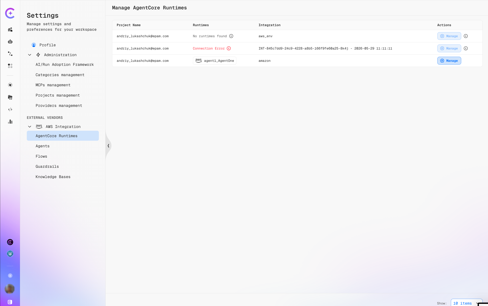
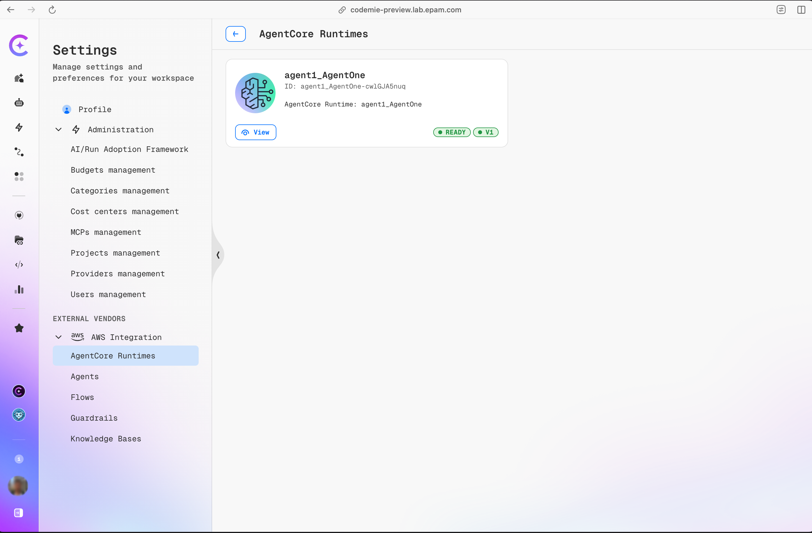
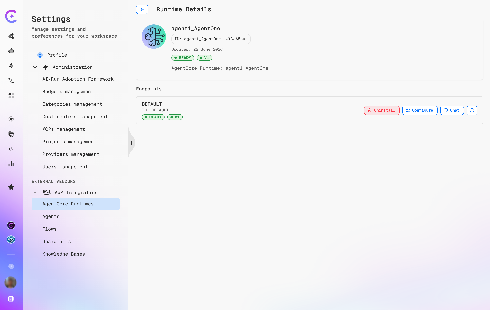
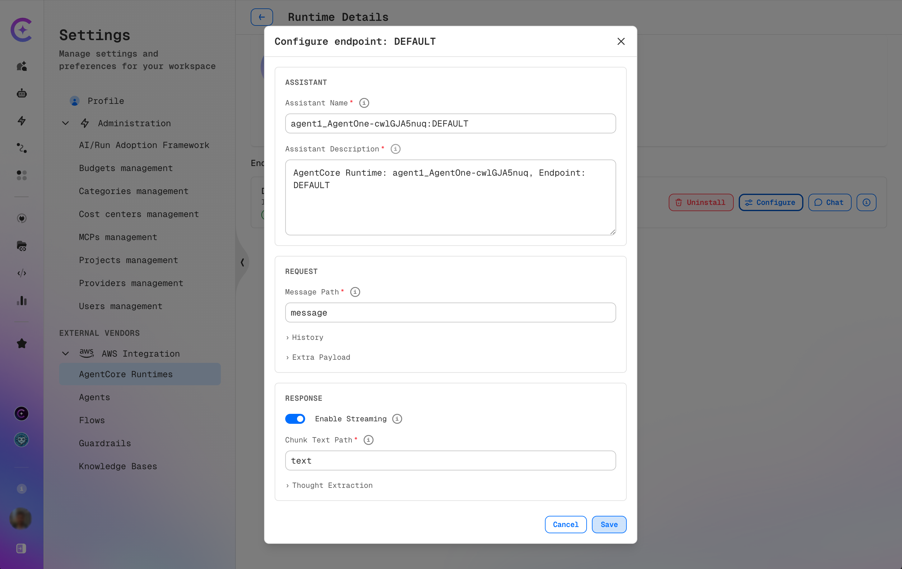

# AWS AgentCore

:::info Enterprise Feature
AWS AgentCore is an enterprise feature. Contact EPAM to verify it is enabled for the deployment.
:::

AWS AgentCore integration enables the discovery of AWS-hosted agent runtimes, browsing their endpoints, and installing those endpoints as assistants directly within the platform — without writing any integration code.

## Prerequisites

An active AWS integration must be configured before any AgentCore runtimes are visible. See the [AWS Integration](../../../../user-guide/tools_integrations/tools/aws.md) guide.

## Navigating to AgentCore Runtimes

To access AgentCore management, open **Settings** from the left navigation bar and navigate to **External Vendors → AWS Integration**.

Once an AWS integration is configured, the **Manage AgentCore Runtimes** table reflects its discovery status:



| Column           | Description                                                                                                                                                                                                                  |
| ---------------- | ---------------------------------------------------------------------------------------------------------------------------------------------------------------------------------------------------------------------------- |
| **Project Name** | The workspace user/project the integration belongs to.                                                                                                                                                                       |
| **Runtimes**     | Discovery result — shows a runtime name (with the AWS logo) when found, `No runtimes found` when the integration is healthy but returns nothing, or **Connection Error** (red) when credentials or region are misconfigured. |
| **Integration**  | The integration identifier and timestamp, or a friendly alias such as `aws_env` or `amazon`.                                                                                                                                 |
| **Actions**      | **Manage** — opens the integration configuration to update credentials or remove it. The **ⓘ** icon shows integration metadata.                                                                                              |

:::warning Connection Error
A **Connection Error** status means the platform cannot reach the AWS endpoint with the stored credentials. Re-open **Manage** and verify the access key, secret, and region.
:::

Click **AgentCore Runtimes** to open the runtime list for the active project.

## Browsing Runtimes



The **AgentCore Runtimes** page shows one card per runtime discovered from the connected AWS account.

Each card displays:

| Field                 | Meaning                                                           |
| --------------------- | ----------------------------------------------------------------- |
| **Name**              | Human-readable runtime name as defined in AWS.                    |
| **ID**                | Stable unique identifier for the runtime.                         |
| **AgentCore Runtime** | The underlying AgentCore resource name in AWS.                    |
| **Status badge**      | Lifecycle state — `READY` means the runtime is accepting traffic. |
| **Version badge**     | The runtime schema/protocol version.                              |

Click **View** on any card to open the Runtime Details page.

## Viewing Runtime Details



The **Runtime Details** page provides a full view of a single runtime and all its endpoints.

### Header

| Field            | Description                                 |
| ---------------- | ------------------------------------------- |
| **Name**         | Runtime name as defined in AWS.             |
| **ID**           | Stable unique runtime identifier.           |
| **Last updated** | Date the runtime record was last refreshed. |
| **Status**       | Lifecycle state of the runtime.             |
| **Version**      | Protocol version.                           |
| **Source label** | `AgentCore Runtime: <runtime-name>`         |

### Endpoints

Each runtime exposes one or more named endpoints. For each endpoint the table shows:

| Column      | Meaning                                                         |
| ----------- | --------------------------------------------------------------- |
| **Name**    | Endpoint label as defined in AWS (can be environment-specific). |
| **ID**      | Stable endpoint identifier.                                     |
| **Status**  | Whether this specific endpoint is live.                         |
| **Version** | Protocol version of the endpoint.                               |

#### Endpoint Actions

| Button        | Description                                                                                                         |
| ------------- | ------------------------------------------------------------------------------------------------------------------- |
| **Uninstall** | Removes the assistant previously installed from this endpoint. Visible only when the endpoint is already installed. |
| **Configure** | Opens the Configure endpoint dialog to install or update the assistant mapping.                                     |
| **Chat**      | Opens a quick chat session directly against this endpoint for testing.                                              |
| **ⓘ**         | Shows raw endpoint metadata (IDs, ARNs, region info).                                                               |

## Installing an Endpoint as an Assistant



Clicking **Configure** on any endpoint opens the **Configure endpoint: `<ENDPOINT_NAME>`** dialog. Saving this dialog installs — or reconfigures — the endpoint as a named assistant available across the workspace.

### Assistant

| Field                     | Required | Default                    | Description                              |
| ------------------------- | -------- | -------------------------- | ---------------------------------------- |
| **Assistant Name**        | No       | `<runtimeId>:<endpointId>` | Display name in the assistant picker.    |
| **Assistant Description** | No       | Auto-generated             | Description shown in the assistant list. |

### Request

**Message Path**

| Field            | Required | Default   | Description                                                                                                                                                                                 |
| ---------------- | -------- | --------- | ------------------------------------------------------------------------------------------------------------------------------------------------------------------------------------------- |
| **Message Path** | No       | `message` | Dot-notation path where the user message is placed in the request body. For example, `message` produces `{ "message": "Hello" }`; `input.text` produces `{ "input": { "text": "Hello" } }`. |

**History** _(expandable)_

Omit this section entirely to never send conversation history to the endpoint.

| Field              | Required | Default     | Description                                                            |
| ------------------ | -------- | ----------- | ---------------------------------------------------------------------- |
| **History Path**   | Yes      | —           | Dot-notation path where the turns array is injected (e.g. `messages`). |
| **Role Path**      | No       | `role`      | Field name for the role inside each turn object.                       |
| **Message Path**   | No       | `content`   | Field name for the message text inside each turn object.               |
| **User Role**      | No       | `user`      | Role label used for user turns.                                        |
| **Assistant Role** | No       | `assistant` | Role label used for all non-user turns.                                |

**Extra Payload** _(expandable)_

A static JSON object whose keys are merged into every request body. Useful for runtime-specific parameters such as `session_id`, `locale`, or model overrides. Must be a flat or nested object — arrays and scalar values are rejected.

### Response

| Field                  | Required                 | Default | Description                                                                                                                                             |
| ---------------------- | ------------------------ | ------- | ------------------------------------------------------------------------------------------------------------------------------------------------------- |
| **Enable Streaming**   | No                       | Off     | When enabled, the platform reads the response as an SSE stream and displays tokens incrementally. When disabled, the platform reads a single JSON body. |
| **Response Text Path** | Yes (when streaming off) | —       | Dot-notation path to the answer text in the full response body (e.g. `output`).                                                                         |
| **Chunk Text Path**    | Yes (when streaming on)  | —       | Dot-notation path to the answer text in each SSE chunk (e.g. `delta.content`).                                                                          |

**Thought Extraction** _(expandable)_

If the AgentCore runtime surfaces chain-of-thought reasoning separately from the final answer, configure extraction here.

| Field             | Required           | Description                                                                                                  |
| ----------------- | ------------------ | ------------------------------------------------------------------------------------------------------------ |
| **Text Path**     | Yes                | Dot-notation path to the thought text.                                                                       |
| **Thoughts Path** | No (non-streaming) | Path to an array of thought objects; Text Path, Name Path, and Args Path are resolved per item in the array. |
| **Name Path**     | No                 | Path to the tool or agent name within each thought object.                                                   |
| **Args Path**     | No                 | Path to the tool arguments within each thought object.                                                       |

### Saving

Click **Save** to apply. The endpoint status on the Runtime Details page reflects the installed assistant immediately. To update an already-installed endpoint, click **Configure** again — the dialog reopens pre-populated with the current values. Click **Cancel** to discard changes.

## AgentCore Agent Implementation Examples

The examples below show the exact request and response shapes the AgentCore agent must implement for each configuration.

### Streaming — with history and thought extraction

**Configure endpoint settings**

| Field                            | Value                   |
| -------------------------------- | ----------------------- |
| Message Path                     | `message`               |
| History Path                     | `messages`              |
| Role Path                        | `role`                  |
| History Message Path             | `content`               |
| User Role                        | `user`                  |
| Assistant Role                   | `assistant`             |
| Enable Streaming                 | On                      |
| Chunk Text Path                  | `delta.text`            |
| Thought Extraction — Text Path   | `delta.thinking`        |
| Thought Extraction — Active Path | `delta.thinking_active` |

**Request body sent to AgentCore**

```json
{
  "message": "What is the capital of France?",
  "messages": [
    { "role": "user", "content": "Hi there" },
    { "role": "assistant", "content": "Hello! How can I help?" }
  ]
}
```

**SSE chunks the agent must return**

```json
{ "delta": { "text": null, "thinking": "User is asking geography.", "thinking_active": true } }
{ "delta": { "text": null, "thinking": null, "thinking_active": false } }
{ "delta": { "text": "The capital of France is Paris.", "thinking": null, "thinking_active": false } }
```

---

### Non-streaming — with history and thought extraction

**Configure endpoint settings**

| Field                              | Value             |
| ---------------------------------- | ----------------- |
| Message Path                       | `input.text`      |
| History Path                       | `input.history`   |
| Role Path                          | `role`            |
| History Message Path               | `content`         |
| User Role                          | `human`           |
| Assistant Role                     | `bot`             |
| Enable Streaming                   | Off               |
| Response Text Path                 | `output.answer`   |
| Thought Extraction — Thoughts Path | `output.thoughts` |
| Thought Extraction — Text Path     | `content`         |
| Thought Extraction — Name Path     | `tool`            |
| Thought Extraction — Args Path     | `input`           |

**Request body sent to AgentCore**

```json
{
  "input": {
    "text": "What is the capital of France?",
    "history": [
      { "role": "human", "content": "Hi there" },
      { "role": "bot", "content": "Hello! How can I help?" }
    ]
  }
}
```

**Response body the agent must return**

```json
{
  "output": {
    "answer": "The capital of France is Paris.",
    "thoughts": [
      { "tool": "knowledge_base", "input": { "query": "capital France" }, "content": "Retrieved: Paris is the capital." },
      { "tool": null, "input": null, "content": "Sufficient confidence, no further lookup needed." }
    ]
  }
}
```
