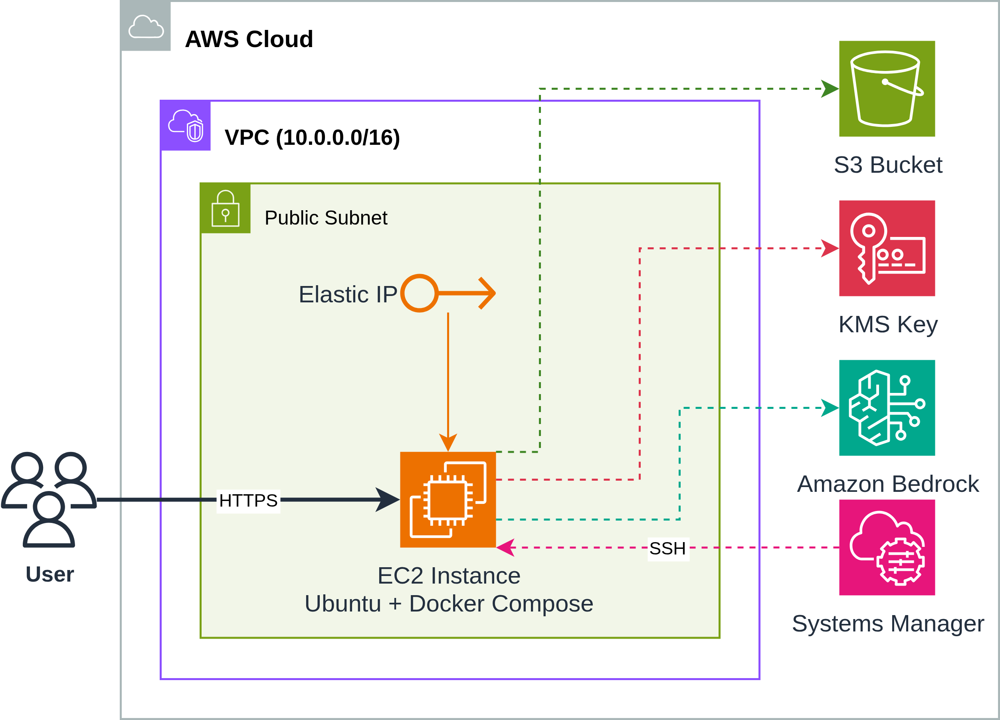
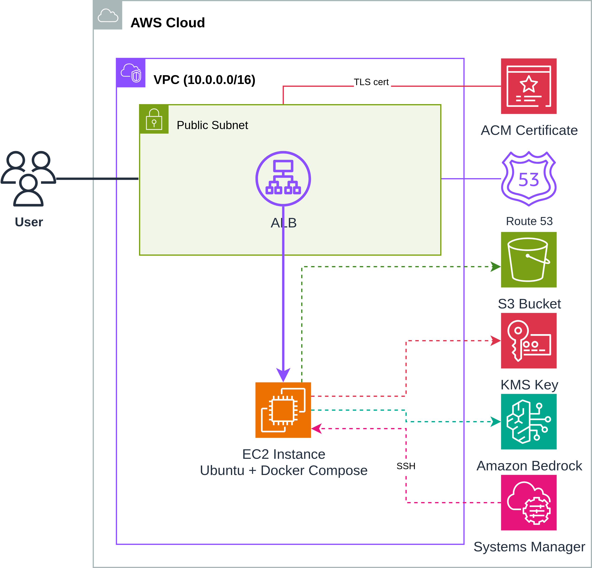
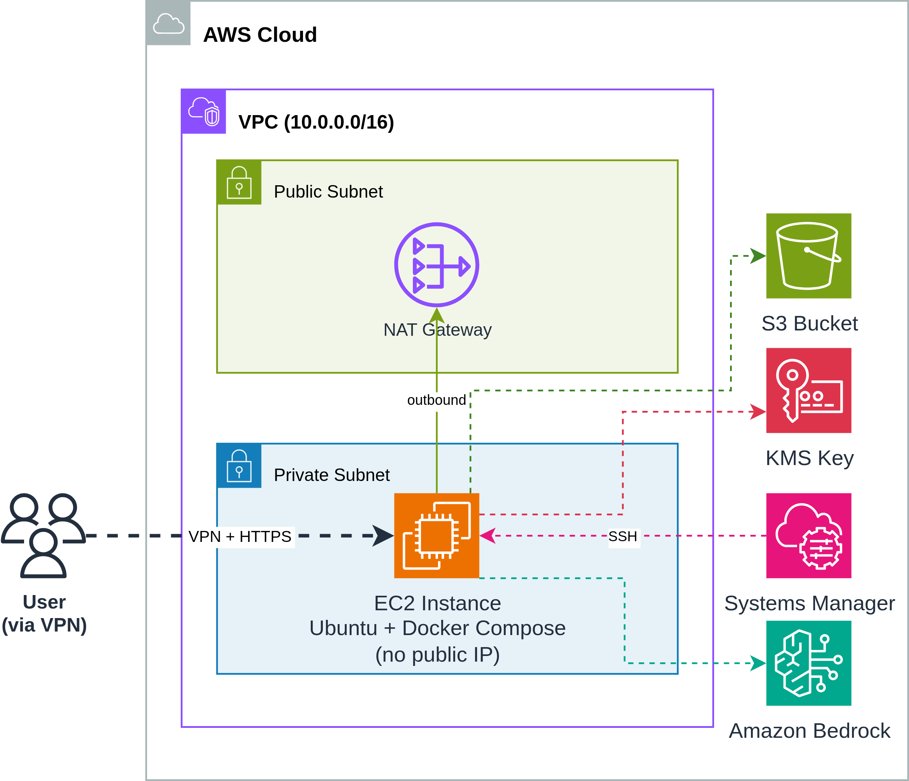

# On VM Deployment Architecture

This page describes the infrastructure and application architecture of CodeMie On VM.

## Infrastructure Overview

CodeMie On VM runs on a single EC2 instance with supporting AWS services. Terraform provisions the following resources depending on the network mode:

import Tabs from '@theme/Tabs';
import TabItem from '@theme/TabItem';

<Tabs>
  <TabItem value="ip" label="IP Mode (default)" default>
    Direct access to the EC2 instance via Elastic IP:

    

  </TabItem>
  <TabItem value="domain" label="Domain Mode (ALB + ACM)">
    When `TF_VAR_platform_domain_name` is configured, an ALB with trusted TLS certificate is created:

    

  </TabItem>
  <TabItem value="private" label="Private IP Mode">
    When `TF_VAR_private_ip_only=true`, EC2 is placed in a private subnet with NAT Gateway for outbound traffic. Access is via VPN, AWS Workspaces, or some other available VM:

    

  </TabItem>
</Tabs>

### AWS Resources

| Resource                 | Purpose                                                               |
| ------------------------ | --------------------------------------------------------------------- |
| **VPC**                  | Isolated network with public subnets (+ private if `private_ip_only`) |
| **EC2 Instance**         | Single instance running Docker Compose (Ubuntu, r5.xlarge default)    |
| **Elastic IP**           | Static public IP for the EC2 instance                                 |
| **S3 Bucket**            | Persistent storage for user data (repos, files)                       |
| **KMS Key**              | Encryption key for S3 data at rest                                    |
| **ALB**                  | Application Load Balancer with TLS (if domain configured)             |
| **ACM Certificate**      | Trusted TLS certificate for the domain (if domain configured)         |
| **Route 53 Record**      | DNS A record pointing to ALB (if domain configured)                   |
| **SSM Parameter**        | Stores EC2 SSH private key securely                                   |
| **Security Groups**      | Controls inbound traffic to ALB and EC2                               |
| **IAM Instance Profile** | Grants EC2 access to Bedrock, S3, KMS, SSM                            |

### Network Modes

| Mode                    | Configuration                               | Access                            |
| ----------------------- | ------------------------------------------- | --------------------------------- |
| **Public IP** (default) | `TF_VAR_private_ip_only=false`              | EC2 gets EIP, direct HTTPS access |
| **Domain + ALB**        | `TF_VAR_platform_domain_name="example.com"` | ALB with ACM cert, Route 53 DNS   |
| **Private IP**          | `TF_VAR_private_ip_only=true`               | No public IP, access via VPN only |

## Application Architecture

All CodeMie services run as Docker containers on the EC2 instance, orchestrated by Docker Compose.

### Services by Profile

**Shared services** (both profiles):

| Service       | Image                       | Purpose                                           |
| ------------- | --------------------------- | ------------------------------------------------- |
| postgres      | pgvector/pgvector:pg17      | Primary database for application data             |
| elasticsearch | elasticsearch:8.x           | Document storage and search for Data Sources      |
| kibana        | kibana:8.x                  | Log visualization and analytics for Elasticsearch |
| mcp-connect   | codemie-mcp-connect-service | Connector for MCP servers                         |
| nginx         | nginx:1.31-alpine           | Reverse proxy, TLS termination                    |

**OSS profile:**

| Service        | Purpose                                       |
| -------------- | --------------------------------------------- |
| codemie-oss    | API server with built-in local authentication |
| codemie-ui-oss | Web frontend                                  |

**Enterprise profile:**

| Service           | Purpose                                        |
| ----------------- | ---------------------------------------------- |
| codemie           | API server                                     |
| codemie-ui        | Web frontend                                   |
| keycloak          | Identity provider (SSO, OIDC)                  |
| oauth2-proxy      | Authentication proxy in front of nginx         |
| litellm           | LLM proxy for model routing and key management |
| nats              | Messaging for plugin engine                    |
| nats-auth-callout | NATS authentication service                    |
| mermaid-server    | Diagram rendering                              |

## Resource Requirements

### Minimum EC2 Instance

| Resource | Minimum | Recommended   |
| -------- | ------- | ------------- |
| vCPU     | 4       | 4 (r5.xlarge) |
| RAM      | 16 GB   | 32 GB         |
| Disk     | 50 GB   | 100 GB (gp3)  |

## Next Steps

- [Deployment](../deployment/) — Deploy CodeMie On VM with Terraform
