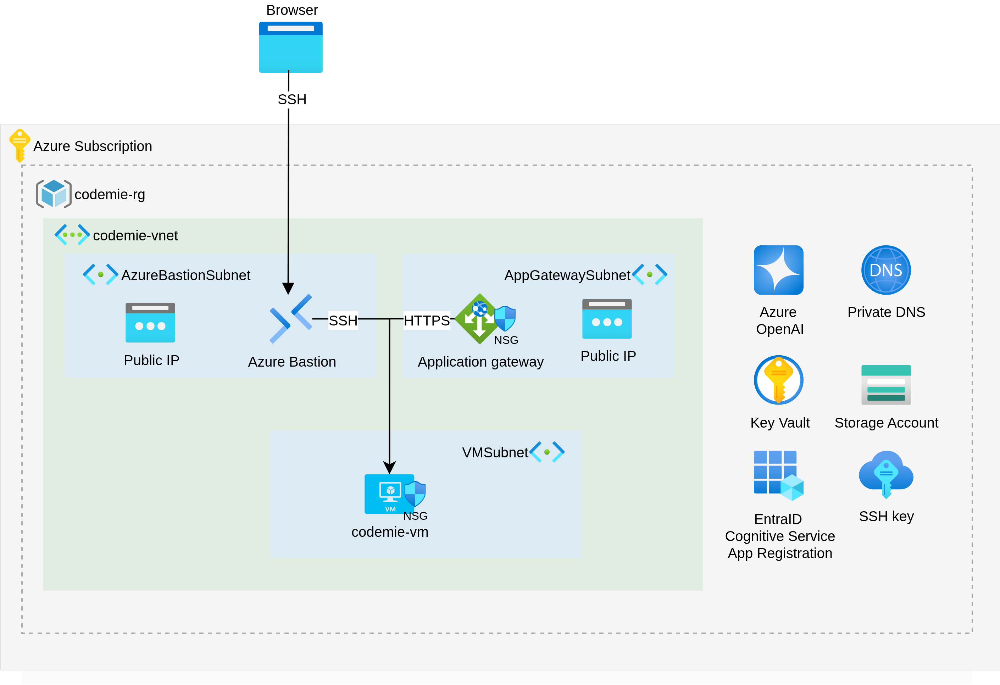
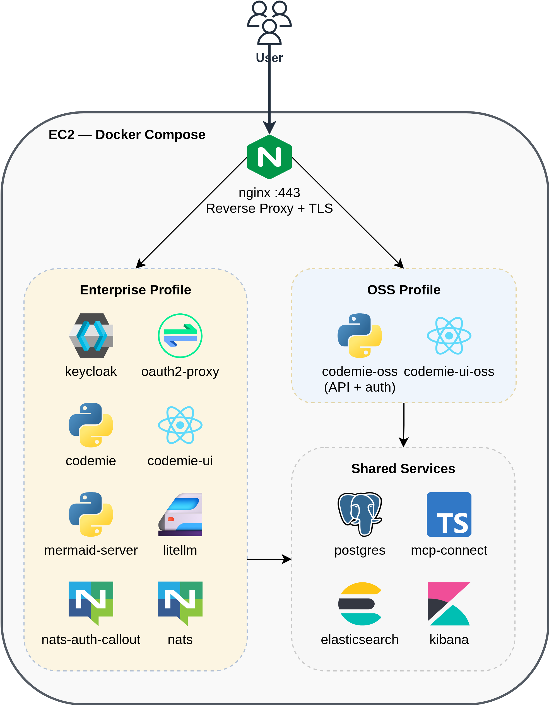

# On VM Deployment Architecture (Azure)

This page describes the infrastructure and application architecture of CodeMie On VM on Azure.

## Infrastructure Overview

CodeMie On VM runs on a single Azure VM with supporting Azure services. Terraform provisions the following resources:

| Resource                       | Purpose                                                              |
| ------------------------------ | -------------------------------------------------------------------- |
| **Azure VM (Standard_E4s_v5)** | Single VM running Docker Compose (4 vCPU, 32 GB RAM)                 |
| **Virtual Network / Subnet**   | Isolated network for the VM                                          |
| **Network Security Group**     | Controls inbound/outbound traffic to the VM                          |
| **Azure Storage Account**      | Persistent storage for user data (repos, files)                      |
| **Azure Key Vault**            | Encryption key management for storage data                           |
| **Private DNS Zone**           | Custom domain resolution (when `TF_VAR_platform_domain_name` is set) |
| **Azure Bastion**              | Secure SSH access to the VM without exposing a public IP             |

### Network Modes

| Mode                     | Configuration                                   | Access                                    |
| ------------------------ | ----------------------------------------------- | ----------------------------------------- |
| **Private IP** (default) | `TF_VAR_platform_domain_name` empty             | VM private IP, access via VPN or Bastion  |
| **Domain**               | `TF_VAR_platform_domain_name="private.lab.com"` | Creates private DNS zone, access via name |

## Application Architecture

All CodeMie services run as Docker containers on the Azure VM, orchestrated by Docker Compose.

### Services by Profile

**Shared services** (both profiles):

| Service       | Image                       | Purpose                                           |
| ------------- | --------------------------- | ------------------------------------------------- |
| postgres      | pgvector/pgvector:pg17      | Primary database for application data             |
| elasticsearch | elasticsearch:8.x           | Document storage and search for Data Sources      |
| kibana        | kibana:8.x                  | Log visualization and analytics for Elasticsearch |
| mcp-connect   | codemie-mcp-connect-service | Connector for MCP servers                         |
| nginx         | nginx:1.31-alpine           | Reverse proxy, TLS termination                    |

**OSS profile:**

| Service        | Purpose                                       |
| -------------- | --------------------------------------------- |
| codemie-oss    | API server with built-in local authentication |
| codemie-ui-oss | Web frontend                                  |

**Enterprise profile:**

| Service           | Purpose                                        |
| ----------------- | ---------------------------------------------- |
| codemie           | API server                                     |
| codemie-ui        | Web frontend                                   |
| keycloak          | Identity provider (SSO, OIDC)                  |
| oauth2-proxy      | Authentication proxy in front of nginx         |
| litellm           | LLM proxy for model routing and key management |
| nats              | Messaging for plugin engine                    |
| nats-auth-callout | NATS authentication service                    |
| mermaid-server    | Diagram rendering                              |

## Resource Requirements

### Minimum Azure VM

| Resource | Minimum | Recommended         |
| -------- | ------- | ------------------- |
| vCPU     | 4       | 4 (Standard_E4s_v5) |
| RAM      | 16 GB   | 32 GB               |
| Disk     | 50 GB   | 100 GB              |

## Next Steps

- [Deployment](../deployment/) — Deploy CodeMie On VM with Terraform
