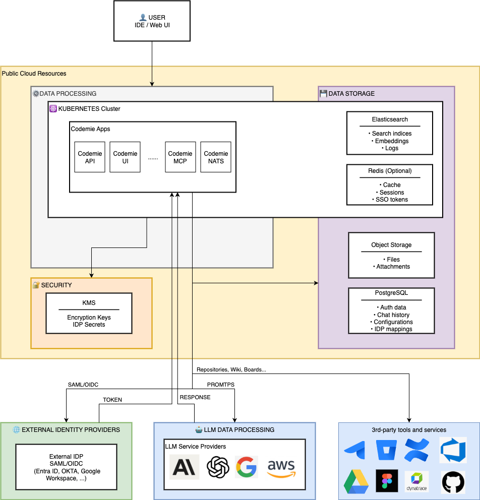
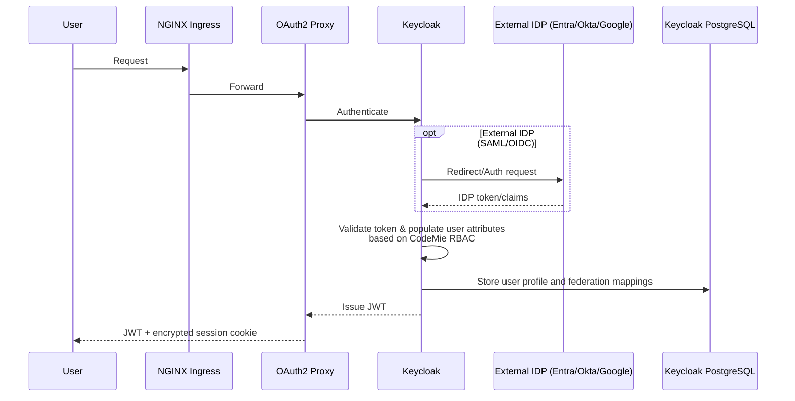
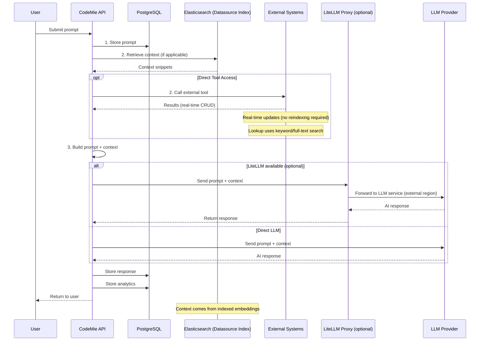
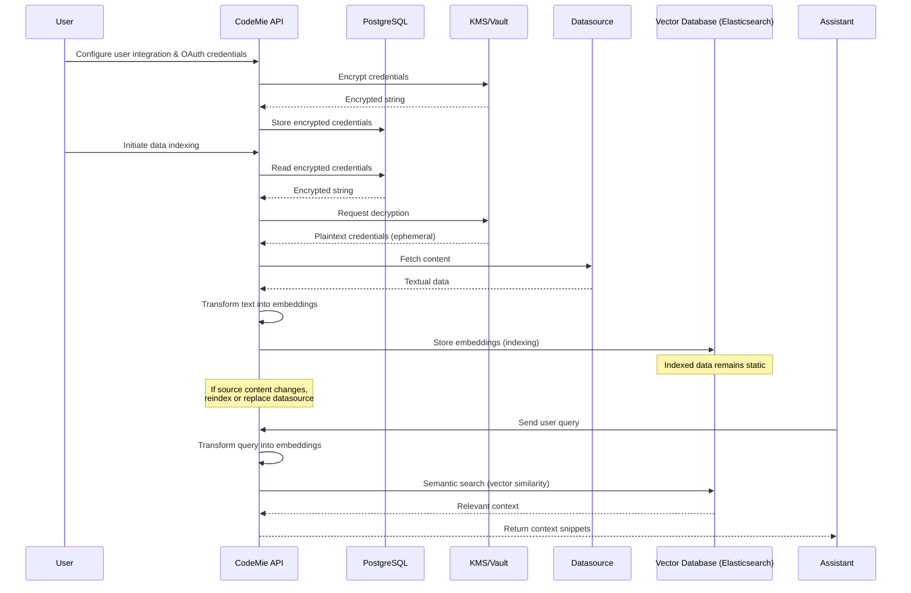
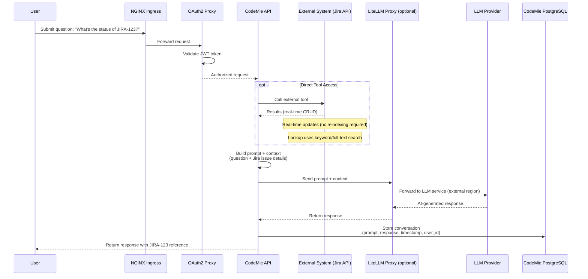

# CodeMie Platform - Data Processing & Storage Architecture

## Overview

The CodeMie platform is an AI-powered coding assistant that processes user conversations and integrates with external services while maintaining data sovereignty and security through configurable regional deployment.

## Core Principles

**1. Regional Data Isolation**

- Persistent storage regions are independently configurable – PostgreSQL (Keycloak), PostgreSQL (CodeMie), Object Storage, and KMS/Vault can be deployed in the same region or distributed across different regions based on customer requirements
- In-cluster components (Elasticsearch, NATS, and other in-cluster services) run within the Kubernetes cluster region
- AI processing regions are configurable per LLM provider – customers can select specific regions for each model based on compliance and latency requirements
- PostgreSQL (Keycloak) is deployed in the same region as the Kubernetes cluster in default configuration, but can be configured to use an external managed PostgreSQL instance in a different region if required

**2. Data Encryption**

- Data at rest: Encrypted using KMS/Vault (AES-256)
- Data in transit: TLS 1.2+ for all external communications

**3. External Data Isolation**

- External service data (Jira, GitHub, etc.) is fetched via integration/datasource; for retrieval-based features it is normalized, embedded, and indexed locally in Elasticsearch
- Some tools can query external datasources directly and return results to chat without indexing
- LLM providers do not train on customer data under their enterprise agreements. Refer to the provider documentation for details:
  - **Azure OpenAI**: [Data Privacy](https://learn.microsoft.com/en-us/azure/ai-foundry/responsible-ai/openai/data-privacy?view=foundry-classic)
  - **AWS Bedrock**: [Service Terms](https://aws.amazon.com/service-terms/) and [Third-Party Models](https://aws.amazon.com/legal/bedrock/third-party-models/)
  - **Google Vertex AI**: [Data Governance](https://docs.cloud.google.com/generative-ai-app-builder/docs/data-governance)
  - **Anthropic Claude**: [Data Training](https://privacy.claude.com/en/articles/7996868-is-my-data-used-for-model-training)
  - **OpenAI**: [Enterprise Data Privacy](https://openai.com/enterprise-privacy/)
  - etc.
- Integration/datasource credentials are never sent to LLMs, and LLM models cannot access them

:::info LLM Provider
LLM Provider refers to external AI model services such as AWS Bedrock, Azure OpenAI, Google Vertex AI, OpenAI, Anthropic Claude, etc.
:::

## Data Storage Layers

### Persistent Storage

**PostgreSQL (Cloud SQL / RDS / Azure Database) – Data Stored**

- **Data Types**:
  - **Authorization Data**: Role permissions, user-role mappings
  - **Conversation Data**: Chat history, prompts, AI responses
  - **Configuration Data**: Datasource configs, model preferences, system prompts, assistants, workflows, integration/datasource credentials (KMS/Vault-encrypted strings)
- **Storage & Security**:
  - **Encryption at rest**: Data encrypted with KMS/Vault-managed keys
  - **Encryption in transit**: SSL/TLS connections required

:::info User Authentication Storage
Keycloak uses a dedicated PostgreSQL cluster in Kubernetes that stores SSO federation mappings, IDP client secrets, and local user credentials. When SSO is enabled, user authentication (passwords, MFA) is managed by the external IDP (Entra ID, Okta, Google) rather than stored in Keycloak.
:::

**Object Storage (GCS / S3 / Azure Blob) – Data Stored**

- **Data Types**:
  - **User Files**: Uploaded attachments, documents, images
- **Storage & Security**:
  - **Retention**: Configurable based on customer requirements
  - **Access**: Managed identities/service accounts only, no public access
  - **Encryption at rest**: Server-side KMS/Vault encryption

### In-Cluster Storage

**Elasticsearch**

- **Vector Embeddings**: Semantic search vectors (generated by embeddings models)
- **Platform Components Logs**: Logs from core platform services (see [Core Components](../deployment/aws/components-deployment/manual-deployment/core-components))

## Data Processing Flows

### 1. User Authentication Flow

**Data Stored:**

- User profile (email, name, roles) in Keycloak PostgreSQL (GKE/AKS/EKS)
- External IDP configuration in Keycloak PostgreSQL (GKE/AKS/EKS)
- OAuth2 Proxy secrets (client-secret, cookie-secret) in K8s Secrets (encrypted at-rest via etcd)
- Session data: Encrypted browser cookie (no server-side storage, TLS 1.2+ in-transit)

:::info OAuth2 Proxy Security
OAuth2 Proxy operates in **stateless mode** using encrypted browser cookies with HTTPS-only transmission and CSRF protection.
:::

### 2. Chat Conversation Flow

**Data Stored:**

- Conversation data: PostgreSQL (Cloud SQL/RDS/Azure Database)
- Context snippets: Retrieved from Elasticsearch (GKE/AKS/EKS)
- Analytics: PostgreSQL (Cloud SQL/RDS/Azure Database)

### 3. Datasource Indexing Flow

**Data Stored:**

- **Integration/Datasource Credentials**: PostgreSQL (encrypted string via KMS/Vault, plaintext never persisted)
- **Indexed Data (Embeddings)**: Elasticsearch (vector database; GKE/AKS/EKS)
- **Metadata**: PostgreSQL (Cloud SQL/RDS/Azure Database) — datasource config, indexing status, timestamps

:::info Credential Security
Integration/datasource credentials are stored as KMS/Vault-encrypted strings in PostgreSQL. Decryption happens on-demand via KMS/Vault APIs, and plaintext credentials exist only in memory for the duration of the API call, never persisted to disk.
:::

:::tip Supported Datasources
For a complete list of supported datasource types and configuration details, see [Data Source Overview](../../user-guide/data-source/data-source-overview/index.md#supported-data-source-types).
:::

## Regional Data Distribution

| Component                 | Data Type                | Storage                                         | Region                                    | Encryption                             |
| ------------------------- | ------------------------ | ----------------------------------------------- | ----------------------------------------- | -------------------------------------- |
| **PostgreSQL (Keycloak)** | User auth, SSO mappings  | K8s cluster (optionally Cloud SQL/RDS/Azure DB) | GKE/AKS/EKS Region (or managed DB region) | StorageClass encryption + TLS          |
| **PostgreSQL (CodeMie)**  | Chat, Config, Roles      | Cloud SQL/RDS/Azure DB                          | Cloud SQL/RDS/Azure Database Region       | KMS/Vault (at rest) + TLS (in transit) |
| **Elasticsearch**         | Knowledge Base, Indices  | K8s Persistent Volume                           | GKE/AKS/EKS Region                        | StorageClass encryption + TLS          |
| **Object Storage**        | Files, Attachments       | GCS/S3/Azure Blob                               | GCS/S3/Azure Blob Region                  | KMS/Vault (server-side)                |
| **KMS/Vault**             | Encryption Keys, Secrets | KMS/Vault                                       | KMS/Vault Region (configurable)           | HSM-backed                             |
| **LLM Services**          | Prompt Processing        | External API                                    | LLM Provider Region                       | TLS                                    |
| **External IDPs**         | Authentication           | External SaaS                                   | Customer tenant                           | TLS + SAML/OIDC                        |
| **External Services**     | Source Data              | External SaaS/Self-hosted                       | Managed by customer                       | TLS + OAuth 2.0                        |

## Data Processing Principles

### AI Model Interaction

- **Input**: User prompt + locally indexed context (from Elasticsearch)
- **Processing**: External LLM Provider service – data leaves platform boundary
- **Output**: AI-generated response stored in PostgreSQL (Cloud SQL/RDS/Azure DB)
- **External Data Usage**: External service data is indexed locally for retrieval; some tools can access external sources directly when requested
- **Embeddings**: Generated by AI models but stored in Elasticsearch (GKE/AKS/EKS)

### Datasource Data

- **Fetch**: CodeMie API pulls data via OAuth 2.0 authenticated APIs
- **Transform**: Data cleaned, chunked, and prepared for indexing
- **Index**: Elasticsearch stores searchable indices with vector embeddings
- **Cache**: Optional raw data cache in object storage

### Authentication & Authorization

- **SSO Federation**: Keycloak acts as SAML/OIDC broker, user data stored locally after federation
- **API Keys**: Integration/datasource credentials stored in PostgreSQL (Cloud SQL/RDS/Azure DB) as KMS/Vault-encrypted strings, never exposed to users
- **JWT Tokens**: Issued by Keycloak, validated by CodeMie API for each request
- **Role-Based Access**: Permissions stored in PostgreSQL, enforced at API layer

## Data Retention & Compliance

| Data Category                       | Default Retention | Configurable         | Compliance Notes                            |
| ----------------------------------- | ----------------- | -------------------- | ------------------------------------------- |
| Chat History (PostgreSQL CodeMie)   | Indefinite        | No                   | Right to erasure supported                  |
| User Profiles (PostgreSQL Keycloak) | Indefinite        | No                   | Deleted on user account deletion            |
| Elasticsearch Indices               | Indefinite        | Yes (if ILM enabled) | Can be rebuilt from sources                 |
| Object Storage Files                | Indefinite        | Yes                  | Can be configured according to requirements |
| PostgreSQL Backups (Keycloak)       | 7 days            | Yes                  | K8s PGO point-in-time recovery              |
| PostgreSQL Backups (CodeMie)        | 7 days            | Yes                  | Cloud SQL/RDS/Azure DB backups              |
| KMS/Vault Keys                      | Indefinite        | Yes                  | Rotation disabled by default                |

## Security & Privacy

**Data Minimization**

- Only necessary data sent to AI models (prompt + relevant context, not entire databases)
- External service credentials scoped to minimum required permissions
- User data isolated by tenant/organization

**Audit & Monitoring**

Cloud-specific audit logging configurations:

- **Azure**: Log Analytics workspace with Container Insights and Key Vault audit events
- **GCP**: PostgreSQL DDL statement logging, default GKE logging
- **AWS**: Application logs via Fluent Bit to Elasticsearch (CloudWatch and CloudTrail could be configured)

## Example: End-to-End Flow

**Scenario**: Authenticated user asks "What's the status of JIRA-123?"

**Data Movement:**

- Jira data: External → CodeMie API → Tools (real-time)
- Prompt: User → API → PostgreSQL (Cloud SQL/RDS/Azure DB region) → LLM service
- Response: LLM service → API → PostgreSQL (Cloud SQL/RDS/Azure DB region) → User
- Credentials: KMS/Vault (configurable region) → CodeMie API (ephemeral memory)

## Summary

The CodeMie platform follows a **local-first data architecture** where:

- Persistent storage regions are independently configurable – PostgreSQL (Keycloak), PostgreSQL (CodeMie), Object Storage, and KMS/Vault can be deployed in the same region or distributed across different regions based on customer requirements
- External service data is indexed locally for retrieval; some tools can access external sources directly when requested
- AI processing regions are configurable per LLM provider – customers can select specific regions for each model based on compliance and latency requirements (optional)
- Encryption keys can be geo-separated from data for compliance
- External customer services (IDP, datasources) authenticate via OAuth 2.0/SAML/OIDC; cloud infrastructure (compute,databases, storage, LLM services, etc.) uses IAM/managed identities; all communications encrypted with TLS 1.2+

This architecture supports **data sovereignty** and **multi-region AI processing** while maintaining security and performance.

:::tip Data Residency Configuration
Configure regional settings during deployment to match your organization's data residency and compliance requirements. PostgreSQL (CodeMie), Object Storage, and KMS/Vault regions can be set independently from each other and from the Kubernetes cluster region. PostgreSQL (Keycloak) is deployed in the same region as the Kubernetes cluster by default and can be configured otherwise according to customer requirements.
:::
