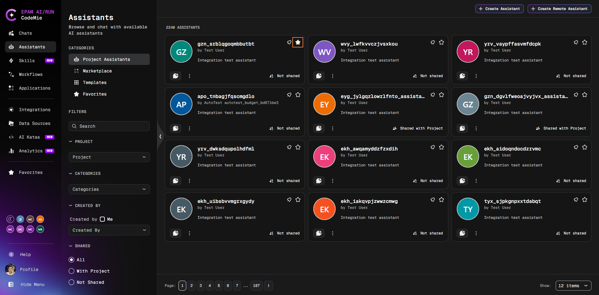
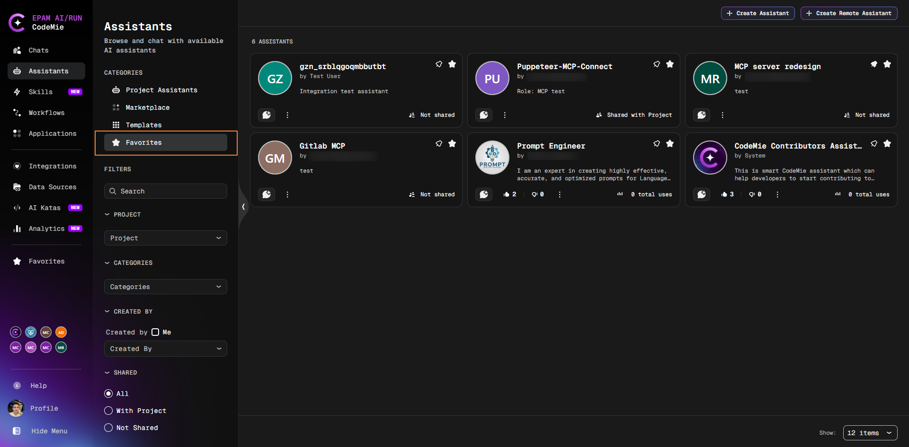
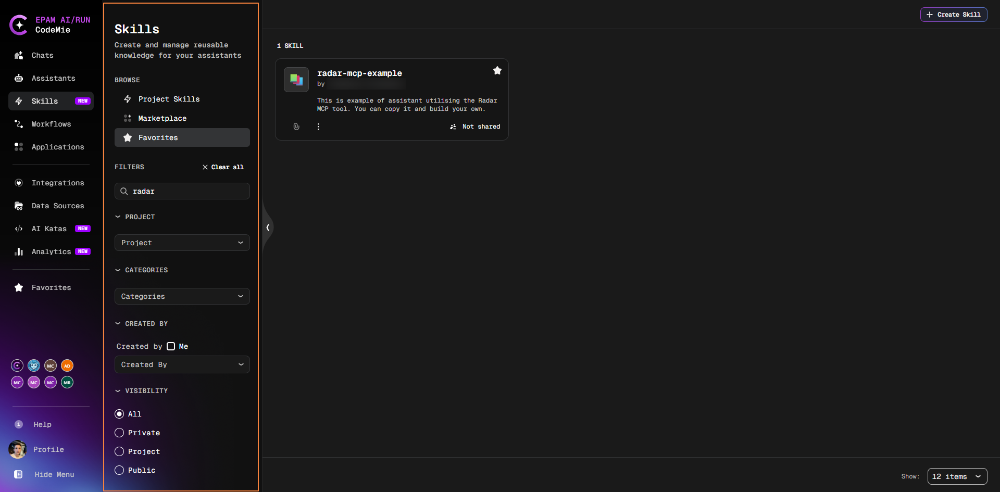
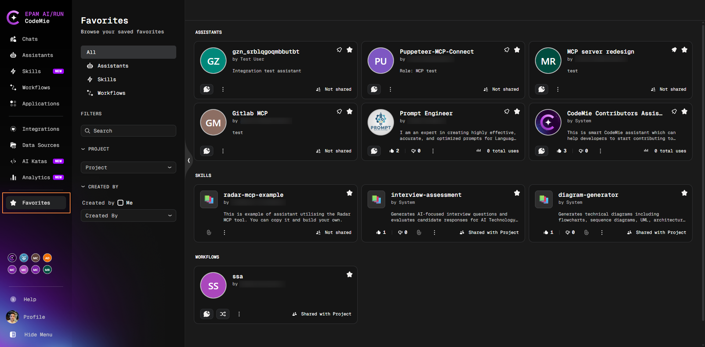
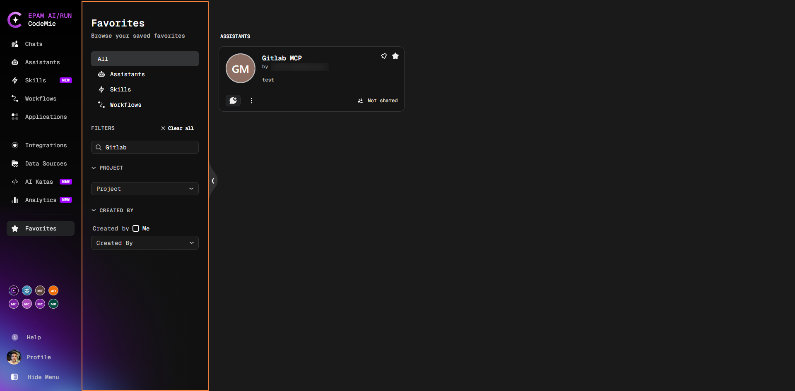

# Favorites

Mark assistants, skills, and workflows as favorites to quickly access them without searching through the full list.

## Mark an Item as a Favorite

You can favorite items from the following tabs:

- **Assistants** — **Project Assistants** or **Marketplace** tabs
- **Skills** — **Project Skills** or **Marketplace** tabs
- **Workflows** — **My Workflows** or **All Workflows** tabs

Each card has a **star icon** in the top-right corner. Click it to mark the item as a favorite:

The star icon fills in to confirm the item is saved. Click it again to remove the item from favorites.

:::tip
Favorites are personal — only you see your favorite items.
:::

## View Favorites Within a Section

Each section (**Assistants**, **Skills**, **Workflows**) has a **Favorites** tab in the left filter panel under **Browse**. Click it to show only your favorite items in that section:

You can combine the Favorites tab with other filters (Project, Categories, Created By) to narrow results further:

## Favorites Page

The **Favorites** page in the navigation sidebar collects all your favorite assistants, skills, and workflows in one place:

:::info
The Favorites page is available when enabled by your administrator.
:::

### Filter by Type

Use the type tabs in the left panel to view a specific category:

| Tab            | Shows                    |
| -------------- | ------------------------ |
| **All**        | All favorite items       |
| **Assistants** | Only favorite assistants |
| **Skills**     | Only favorite skills     |
| **Workflows**  | Only favorite workflows  |

You can also use the search box and additional filters (Project, Created By) to narrow the results:

### Actions on Favorite Items

On the Favorites page you can use the same actions as on the main section pages:

| Item type  | Available actions                                                                      |
| ---------- | -------------------------------------------------------------------------------------- |
| Assistants | Start chat, edit, share, and other assistant actions via the card menu                 |
| Skills     | View details, attach to assistant, and other skill actions                             |
| Workflows  | Start Chat, Start Execution, open card, and other workflow actions via the 3-dots menu |

## Remove a Favorite

Click the filled star icon on any card — in the original section, on the **Favorites** tab, or on the **Favorites** page. The item is removed immediately and remains accessible in its original section.

## Administrator Configuration

The favorites feature is controlled by the administrator. See [Customer Feature Configuration](../../admin/configuration/codemie/customer-feature-configuration.md) for the `features:favorites` and `features:favoritesPage` settings.
