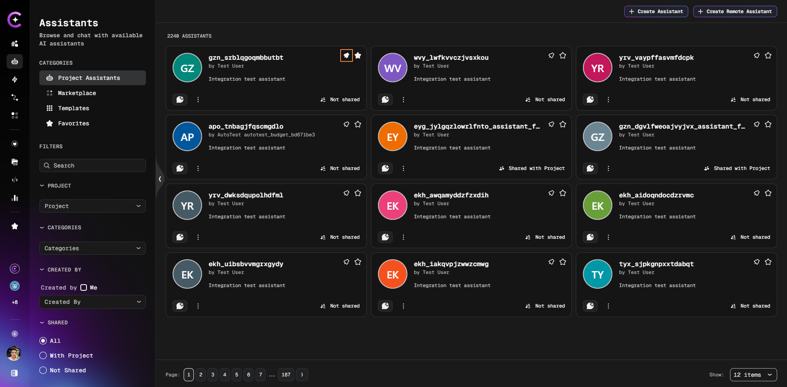
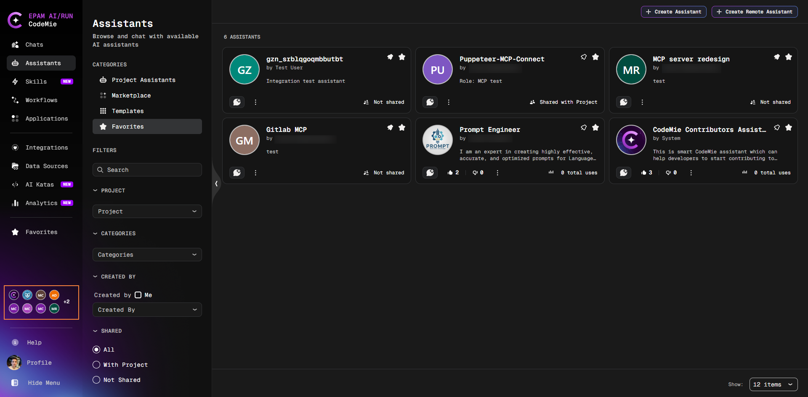
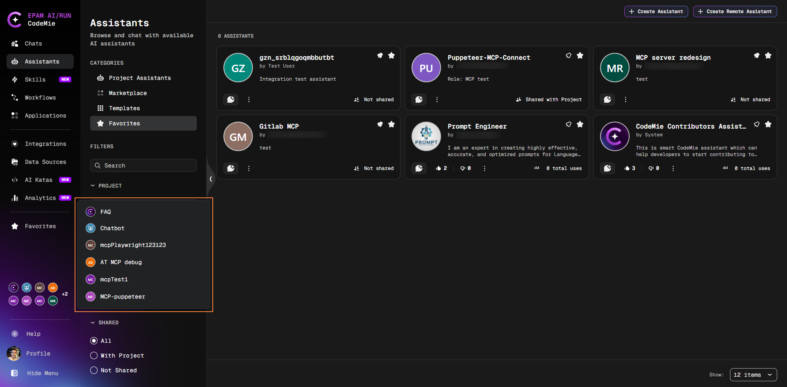

# Pinned Assistants

Pin assistants to the navigation sidebar to open a new chat in one click, without navigating to the Assistants list.

## Pin an Assistant

You can pin an assistant from any of these locations:

- **Assistants** → **Project Assistants** or **Marketplace** — click the **Pin** button (pin icon) on the assistant card
- **Favorites** tab or **Favorites** page — click the **Pin** button on a favorite assistant card
- **Assistant Details** page — click the **Pin** button on the details page

A confirmation toast appears automatically. The assistant is added to the **Pinned** section in the navigation sidebar.

## Access Pinned Assistants

Pinned assistants appear as a row of avatar icons in the navigation sidebar:

- **Click an individual avatar** — opens a new chat with that assistant immediately
- **Click the pinned section block** — opens a dropdown listing all your pinned assistants

### Dropdown

The dropdown gives you full access to all pinned assistants and two actions per entry:

- **Start a chat** — click the assistant name
- **Unpin** — click the unpin option next to the assistant name and confirm the popup that appears

### +N Button (Collapsed Menu)

When the navigation menu is collapsed, the pinned section shows a **+N** button instead of the row. Click it to open the same dropdown.

:::info
Pinned assistant names and avatars update automatically when you rename the assistant — no need to re-pin after renaming.
:::

## Unpin an Assistant

You can unpin an assistant from any of these locations:

- **Navigation sidebar dropdown** — click the pinned section block (or the **+N** button when collapsed) to open the dropdown, then click the unpin option next to the assistant name
- **Assistants** → **Project Assistants** or **Marketplace** — click the **Pin** button on the card (toggles off)
- **Favorites** tab or **Favorites** page — click the **Pin** button on the card
- **Assistant Details** page — click the **Pin** button on the details page

Unpinning requires confirmation in a popup. The assistant is removed from the navigation sidebar and remains available in the Assistants list.
