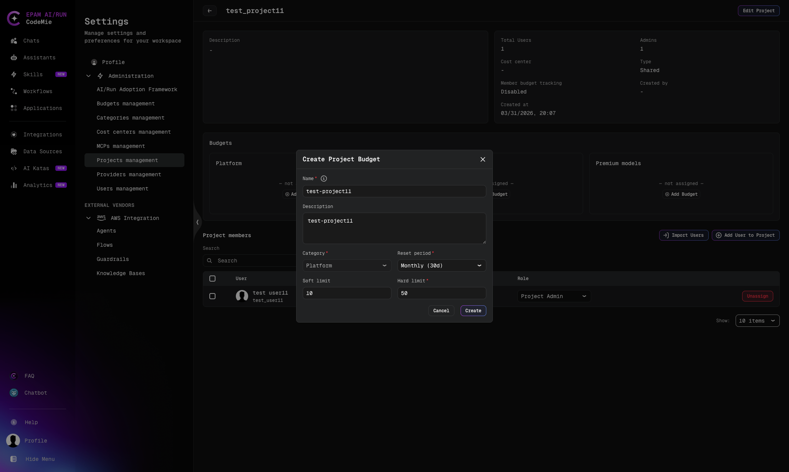

import EnterpriseFeature from '@site/src/components/EnterpriseFeature';

# Budget Management

<EnterpriseFeature />

The budgeting system manages and controls costs for LLM model usage. Budgets operate through integration with LiteLLM Proxy, which serves as the single point of cost tracking and enforcement.

Every LLM request is automatically routed through LiteLLM Proxy, which checks the user's current spending against the configured limits. When a limit is reached, the user receives a notification and requests are blocked until the budget period resets.

:::warning
The budgeting system requires LiteLLM Proxy to be deployed. For platform configuration and environment variables, see [Project Budget Management](../../admin/configuration/codemie/project-budget-management).
:::

## Budget Types

| Type         | Description                                                                                                                                                                                                                                                                                                                                                 |
| ------------ | ----------------------------------------------------------------------------------------------------------------------------------------------------------------------------------------------------------------------------------------------------------------------------------------------------------------------------------------------------------- |
| **Default**  | A pre-configured budget created automatically at platform startup from [YAML configuration](../../admin/configuration/codemie/project-budget-management). Applied to every user who has no personal budget assigned — each user gets their own independent spending counter. Can be created separately for each category: Platform, CLI, and Premium Models |
| **Personal** | Assigned to a specific user manually. Overrides the default budget for that user                                                                                                                                                                                                                                                                            |
| **Project**  | Limits spending within a specific project. Automatically distributed among project members                                                                                                                                                                                                                                                                  |

:::info
The default budget is not a shared pool for all users. When the default budget is set to $100 — each employee has their own independent $100.
:::

## Budget Categories

Each budget belongs to one of three independent categories:

| Category           | When Applied                                                                           |
| ------------------ | -------------------------------------------------------------------------------------- |
| **Platform**       | All requests from the browser UI to non-premium models                                 |
| **CLI**            | Requests from codemie-code, codemie-claude, and other CLI agents to non-premium models |
| **Premium Models** | Any requests to premium models — regardless of source: both UI and CLI                 |

:::info
Only one budget is charged per request:

- Premium model → Premium Models budget (regardless of whether the source is UI or CLI)
- Non-premium model + CLI request → CLI budget
- Non-premium model + UI request → Platform budget
  :::

Category is resolved automatically per request. If a project budget exists for the resolved category, it takes precedence over the user's global budget.

## Budget Parameters

| Parameter        | Required | Description                                                                                       |
| ---------------- | -------- | ------------------------------------------------------------------------------------------------- |
| **Name**         | Yes      | Human-readable label for the budget                                                               |
| **Description**  | No       | Optional note on the budget's purpose                                                             |
| **Category**     | Yes      | `Platform`, `CLI`, or `Premium Models`                                                            |
| **Reset period** | Yes      | How often spend counters reset (e.g., `Monthly (30d)`, `Weekly (7d)`)                             |
| **Soft limit**   | No       | Warning threshold in USD. Requests are not blocked at this threshold, but alerts can be triggered |
| **Hard limit**   | Yes      | Enforcement cap in USD. Requests are blocked once this amount is reached. Must be `> 0`           |

## Pre-configured Budgets

Default budgets are created automatically at platform startup from [YAML configuration](../../admin/configuration/codemie/project-budget-management). One default budget per category can be created: Platform, CLI, and Premium Models. Such budgets are marked with the **Preconfigured** flag in the UI.

**Restrictions**: cannot be modified via UI or API, cannot be deleted. Changes take effect only after updating the configuration and restarting the platform.

For configuration details, see [LiteLLM Budget Configuration](../../admin/configuration/extensions/litellm-proxy/budget-configuration).

## Access

Path: **Profile → Settings → Administration → Budgets**

Users with the **Admin** or **Maintainer** role can view the budget list. Creating, editing, deleting, and syncing budgets is available to **Maintainer** only. Users with the Admin role (without Maintainer) can only view the list.

Budget management is a unique role. Project Admin cannot manage budgets in any project — neither their own nor others'.

| Action                              | Maintainer | Admin | Project admin |
| ----------------------------------- | ---------- | ----- | ------------- |
| Create / update / delete any budget | Yes        | No    | No            |
| View budget list                    | Yes        | Yes   | No            |
| View own project budget             | Yes        | Yes   | Yes           |
| Override a member's allocation      | Yes        | No    | No            |

:::info
For details on roles, see [Roles & RBAC](../../admin/security/roles-rbac).
:::

## Working with Budgets

### Budget Priority

```
User request
      │
      ▼
Is the model premium?
(LITELLM_PREMIUM_MODELS_ALIASES)
      │
 ┌────┴──────────────────────────────┐
 │ YES                               │ NO
 ▼                                   ▼
Premium Models budget      Request source?
(regardless of source)            │
                       ┌──────────┴──────────┐
                       │ CLI                 │ Web UI
                       ▼                     ▼
                  CLI budget          Platform budget
```

For each category, the first matching budget is applied in the following priority order:

1. **Project budget** — if the user's project has a budget configured for this category
2. **Personal budget** — if the user has a personal budget explicitly assigned for this category
3. **Default budget** — if neither project nor personal budget is assigned

:::info
If the user has no project budget for a given category — the personal or default budget applies, as if there were no project.
:::

### Personal Budgets

#### Creating a Budget

1. Click **+ Create Budget**
2. Fill in Name, Category, Reset period, Soft/Hard limit

Budget ID is generated automatically from the name.

:::warning
It is not possible to create a budget with `budget_id = "default"` through the UI — only through platform configuration.
:::

#### Editing a Budget

Name, description, Soft/Hard limit, and reset period can be modified. Limit changes are synced with LiteLLM. Preconfigured budgets cannot be edited through the UI.

:::warning
The category of a budget cannot be changed if there are active user assignments linked to it — this is a data integrity protection. To change the category, all assignments must be removed first.
:::

#### Assigning a Personal Budget to a User

Path: **Profile → Settings → Administration → User Management → select a user**

Each user can be assigned a separate personal budget for each category (Platform / CLI / Premium Models). When an assignment is removed, the user automatically falls back to the default budget for the corresponding category (if configured).

### Project Budgets

Path: **Profile → Settings → Administration → Projects → select a project → Budgets tab**

#### Creating a Project Budget

Only Maintainers can create project budgets.

1. Click your **Profile** icon in the bottom-left corner and select **Settings**.
2. Go to **Administration → Projects Management** and select the project.
3. In the **Budgets** section, locate the category card that shows **— not assigned —** and click **Add Budget**.
4. Fill in the budget form (see [Budget Parameters](#budget-parameters) for field descriptions):



5. Click **Create**.

The budget is provisioned and synchronized with LiteLLM. The category card updates to show the configured limits, reset schedule, and the number of members with allocations.

:::warning
No more than one budget per category per project.
:::

#### Viewing Project Budgets and Member Allocations

After a budget is created, the project page shows up to three category cards and a **Project members** table.


Each budget card displays:

- **Hard limit** and **Soft limit** in USD
- **Reset period** and next **Resets** date/time
- **Members X / $Y.YY** — the number of members with this budget and each member's current allocation

The **Project members** table includes a **Budget Allocations** column showing each member's category and allocated amount.

#### Budget Distribution: Enforce Member Spend Limits

This is the key parameter that controls how the budget is distributed among members.

**Enforce member spend limits = off** (default)

The budget acts as a shared team pool. Individual shares are calculated and stored in CodeMie, but no per-user hard limit is enforced in LiteLLM:

- One member may spend $5, another $50 — nobody is blocked until the team collectively exhausts the full limit
- If a member has a personal budget (e.g. $20), it is still irrelevant — the shared project limit applies to the whole team

**Enforce member spend limits = on**

Each member receives a hard individual limit in LiteLLM:

- Spending beyond one's quota is not possible — LiteLLM blocks requests
- With a $100 budget for 10 members → each member gets $10
- If one member has an Override of $20 → the remaining 9 members split the remainder: ($100 − $20) / 9 ≈ $8.89 each

#### Override: Individual Limit for a Member

Allows setting a fixed limit for a member, different from the equal distribution.

1. In the **Project members** table, click the budget allocation badge next to the member's name.
2. The **Budget Override** popup opens.


3. Set the member's **Hard limit** and **Soft limit** values.
4. Optionally enter an **Override reason** for audit purposes.
5. Click **Save Override**.

The member is switched to fixed allocation mode. Their amount is locked, and the remaining project budget is re-divided equally among all members still in equal mode.

| Enforce member spend limits state | Override behavior                                                                                                                               |
| --------------------------------- | ----------------------------------------------------------------------------------------------------------------------------------------------- |
| **On**                            | Override sets a hard personal limit in LiteLLM. The remaining budget is recalculated and redistributed among members without an override        |
| **Off**                           | Override records the calculated share in CodeMie DB, but no real per-user restriction exists — all members work through the shared project pool |

To remove an override — click **Clear Override** → the member returns to equal distribution and the remaining budget is recalculated.

#### Rebalance: Recalculating Distribution

Rebalance recalculates the budget distribution among project members and syncs the result with LiteLLM.

:::warning
When a new member is added to a project, they receive a copy of the current equal share of existing members. The total allocated amount increases, and no automatic redistribution across all members occurs.

Example: a project with 3 members and a $100 budget → each member has $33. When a 4th member is added — they receive $33, bringing the total allocated to $132 against a $100 limit. A manual Rebalance is required for a correct redistribution ($25 each).
:::

Rebalance is triggered **automatically** when:

- An Override is set or removed
- The **Enforce member spend limits** setting is changed
- A member is removed from the project

:::info
When the Reset period expires, spending counters in LiteLLM reset automatically. However, Rebalance of quota distribution among members is not triggered — member shares are not recalculated as part of the reset.
:::

Manual Rebalance is required:

- After adding new members to the project
- After changing the total project budget size
- When accumulated uneven distribution needs to be corrected

:::warning
When a project budget is modified (recreated), LiteLLM creates a new key with a new spending counter. The spending counter for the previous key in LiteLLM is reset; however, all historical spending is preserved in the platform analytics (Elasticsearch). Total expenditure will not exceed the combined sum of both keys.
:::

### Viewing User Budget Spend (Administrators)

The **Users Management** panel in Administration shows a consolidated **Budgets** column for every user.

Path: **Profile → Settings → Administration → User Management**


The column shows:

- **Total** spend / total budget across all categories
- Per-category breakdown: **CLI**, **Platform**, and **Premium models**
- Format: `$spent / $limit` (a dash indicates no budget assigned for that category)

Use the **Budget** filter and **Search** field to quickly locate users by budget assignment.

## Usage Scenarios

### Basic Scenarios

| #   | Configuration                                          | Platform                                          | CLI                        | Premium              |
| --- | ------------------------------------------------------ | ------------------------------------------------- | -------------------------- | -------------------- |
| 1   | Default Platform budget only                           | ✅ Default Platform (individual counter per user) | ❌ Blocked — no CLI budget | ❌ Blocked           |
| 2   | Default Platform + CLI + Premium                       | ✅ Default Platform                               | ✅ Default CLI             | ✅ Default Premium   |
| 3   | Personal Platform only                                 | ✅ Personal Platform                              | ❌ No CLI budget           | ❌ No Premium budget |
| 4   | Personal Platform + default CLI                        | ✅ Personal Platform                              | ✅ Default CLI             | ❌ No Premium budget |
| 5   | Project Platform + personal Platform                   | ✅ Project (priority)                             | ❌ No CLI budget           | ❌ No Premium budget |
| 6   | Project CLI + default Platform + CLI                   | ✅ Default Platform                               | ✅ Project CLI (priority)  | ❌ No Premium budget |
| 7   | Project with no budget for category + default Platform | ✅ Default Platform                               | ❌ No CLI budget           | ❌ No Premium budget |
| 8   | All three defaults + personal Premium                  | ✅ Default Platform                               | ✅ Default CLI             | ✅ Personal Premium  |

### Webhooks and Workflows

LLM usage triggered by a Webhook or Workflow is charged to the budget of the user who created the integration.

:::info
**Key takeaways:**

- If no budget exists for a category — requests for that category are blocked
- Configuring only a default Platform budget means users will not be able to use CLI
- Project budget has the highest priority and always overrides personal and default budgets
- When a project budget is active, the user's personal budget is not affected and is not charged
  :::

## Spending Data Update Frequency

Spending data comes from two independent sources with different update frequencies.

### Analytics Tab

| Data Type                 | Source                           | Update Frequency                                       |
| ------------------------- | -------------------------------- | ------------------------------------------------------ |
| Tokens, requests, history | Elasticsearch                    | Real-time — each LLM request is written to ES directly |
| Spending in $             | LiteLLM → ES via Spend Collector | Scheduled — once per day by default                    |

### User Profile (Personal Budget / Spending)

Data is fetched directly from LiteLLM in near real-time, subject to the LiteLLM customer cache (default delay up to 5 minutes).

:::info
Analytics display delays have no effect on budget blocking — enforcement and statistics are two independent mechanisms.
:::

## Budget Enforcement and Cache Overshoot

Hard limits are enforced in real time, but due to two-level caching, requests sent within a cache window after the limit is reached may still be processed. This is expected behavior — a deliberate architectural trade-off between performance and enforcement precision.

### How enforcement works on each request

```
LLM Request
    │
    ▼
CodeMie Backend
    │
    ├─ 1. check_user_budget(user_id)
    │       │
    │       ├─ CACHE HIT?  → use cached spend
    │       │               ← does NOT query LiteLLM for current value
    │       └─ CACHE MISS? → GET /customer/info → refresh cache
    │
    └─ 2. If spend < max_budget → forward request to LiteLLM
              │
              ▼
         LiteLLM Proxy
              │
              └─ Secondary enforcement here, also with internal cache
```

### Two levels of caching delay

**Level 1 — `customer_cache` in CodeMie Backend**

When CodeMie checks the user's budget, it reads a cached spend value. The TTL is controlled by `LITELLM_CUSTOMER_CACHE_TTL` (default: 5 minutes). Requests sent during this window after the actual limit is reached will still pass — because the cached value shows the balance as under-limit.

**Level 2 — LiteLLM internal cache**

LiteLLM also caches budget and customer state internally. Spend counter updates after request completion happen asynchronously, adding a second window of potential overshoot.

### Why the limit may be exceeded by a small amount (example)

| Time | Action                                        | Cached spend        | Actual spend        |
| ---- | --------------------------------------------- | ------------------- | ------------------- |
| T+0  | Cache refreshed: spend = $8.70, limit = $10   | $8.70               | $8.70               |
| T+1  | Request 1 ($0.40) → check: OK                 | $8.70 (cache valid) | $9.10               |
| T+2  | Request 2 ($0.45) → check: OK                 | $8.70 (cache valid) | $9.55               |
| T+3  | Request 3 ($0.50) → check: OK                 | $8.70 (cache valid) | $10.05 ← over limit |
| T+4  | Request 4 ($0.30) → check: OK                 | $8.70 (cache valid) | $10.35 ← overshoot  |
| T+5  | Cache expires → query LiteLLM                 | $10.35 (refreshed)  | $10.35              |
| T+6  | Request 5 → check: $10.35 > $10 → **BLOCKED** |                     |                     |

The actual overshoot depends on the cost and number of requests processed within the cache TTL window after the actual limit was reached.

:::info
This is not a bug. Enforcement precision is bounded by `LITELLM_CUSTOMER_CACHE_TTL` (default: 5 minutes). The maximum possible overshoot equals the total spend of all requests processed during that window. To reduce overshoot exposure, set a hard limit slightly below your actual budget ceiling.
:::

## Behavior When a Limit Is Reached

1. The UI displays the notification: "Budget limit has been reached. Please contact your administrator."
2. All LLM requests for that category are blocked until the period resets or an administrator manually resets the counter
3. **Manual reset**: Profile → Settings → Administration → User Management → user card → **Reset Budget** (Maintainer only)

## Recommendations

| Goal                                                  | Recommendation                                                                                                                                               |
| ----------------------------------------------------- | ------------------------------------------------------------------------------------------------------------------------------------------------------------ |
| Getting started                                       | Create default budgets for all three categories (Platform, CLI, Premium) — otherwise users without a personal budget will be blocked in uncovered categories |
| Team cost control without blocking individual members | Create a project budget with **Enforce member spend limits = off** — the overall limit is controlled at the team level without blocking individual members   |
| Strict per-user control within a project              | Enable **Enforce member spend limits** — each member receives a fixed quota with blocking on overspend                                                       |
| VIP users / team leads                                | Use Override with **Enforce member spend limits** enabled to individually increase a specific member's quota                                                 |
| Adding new members to a project                       | After adding members, run a manual **Rebalance** — the budget is not recalculated automatically on member addition                                           |
| Premium models                                        | Create a separate default Premium Models budget and specify the model list in the platform configuration                                                     |
| Emergency unblocking                                  | **Reset Budget** on the user card — resets the spending counter (Maintainer only)                                                                            |

## Platform Limitations

The following summarizes known constraints in the current version of the budgeting system.

- Default budgets are created only through YAML configuration; one per category (Platform, CLI, Premium Models). Cannot be modified via UI
- One budget per category per project
- The category of a budget cannot be changed if there are active user assignments — all assignments must be removed first
- Budget ID is generated automatically from the name and cannot be edited after creation
- Budget creation, modification, and deletion require the Maintainer role; Project Admin cannot manage budgets
- No global platform-wide spending cap across all projects
- Direct budget configuration via the LiteLLM API is not recommended — it may cause unpredictable platform behavior
- When a project budget is recreated, the LiteLLM spending counter resets; historical spend in analytics (Elasticsearch) is preserved
- Enforcement precision is bounded by `LITELLM_CUSTOMER_CACHE_TTL` (default: 5 minutes); a small overshoot past the hard limit is expected

## See Also

- [Project Budget Management](../../admin/configuration/codemie/project-budget-management) — platform configuration, environment variables, and Helm setup
- [LiteLLM Budget Configuration](../../admin/configuration/extensions/litellm-proxy/budget-configuration) — predefined global budgets and enforcement flags
- [Roles & RBAC](../../admin/security/roles-rbac) — role definitions and access control
