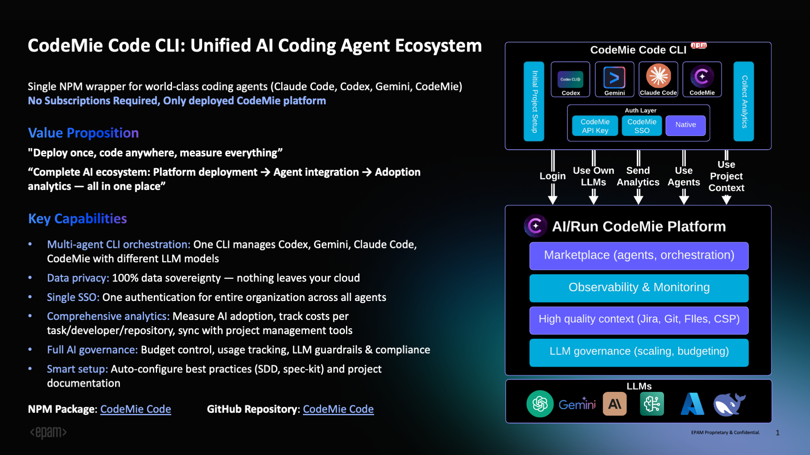

import EnterpriseFeature from '@site/src/components/EnterpriseFeature';

# CodeMie CLI: Unified AI Coding Agent Ecosystem

<EnterpriseFeature />



## Overview

CodeMie CLI is a unified command-line interface that provides access to multiple AI coding assistants through a single NPM package. It serves as a wrapper for popular AI coding agents including Claude Code, Gemini CLI, OpenCode, and a built-in agent powered by LangGraph.

### Key Capabilities

**Multi-Agent Orchestration**: Manage multiple AI coding agents from one CLI - Claude Code, Gemini, OpenCode, and the built-in CodeMie agent. Each agent can be powered by different LLM models, allowing developers to choose the appropriate assistant for each task: Claude Code for complex refactoring, Gemini for rapid prototyping, or the built-in agent for file operations and planning.

**Profile Management**: Maintain separate configurations for different contexts (work, personal, team projects). Each profile can be configured with its own provider (Azure OpenAI, AWS Bedrock, or LiteLLM), enabling seamless switching between environments.

**Enterprise Features**: Built-in support for SSO authentication via CodeMie platform, comprehensive analytics and usage tracking, audit logging with session management, secrets scanning via Gitleaks, budget controls, and governance policies.

**Data Sovereignty**: All data remains within your infrastructure. AI interactions stay in your cloud environment, supporting compliance with security and data protection requirements.

**Analytics and Monitoring**: Track session count, duration, token usage, cost estimates, tool usage statistics, cache hit rates, and language statistics. All analytics data is stored locally for complete control.

## Why Choose CodeMie CLI?

### No Subscriptions Required

CodeMie CLI operates on a **bring-your-own-infrastructure** model. For enterprises, there are **no subscriptions or licenses required** - you only need:

1. **CodeMie Platform**: Deployed in your cloud environment (AWS, GCP, or Azure)
2. **LiteLLM Proxy**: Installed as part of your CodeMie platform for unified model access - see the [LiteLLM Proxy Deployment Guide](../../admin/deployment/extensions/litellm-proxy/)
3. **LLM Models**: Access to AI models through your existing cloud provider:
   - **AWS**: Bedrock models (Claude, Titan, etc.)
   - **Azure**: Azure OpenAI Service
   - **GCP**: Vertex AI models

**No per-developer fees, no seat licenses** - just your infrastructure costs and model API usage. Your organization maintains full control over data, costs, and governance.

### Enterprise Benefits

**Complete Data Control**: Your code never leaves your infrastructure. All AI interactions are routed through your deployed CodeMie platform and LiteLLM Proxy, ensuring 100% data sovereignty and compliance with enterprise security policies.

**Unified Authentication**: Single sign-on (SSO) via CodeMie platform eliminates API key management. One authentication with your CodeMie credentials gives developers access across all agents, with secure credential storage in system keychains.

**Cost Management**: Track and control AI spending with detailed analytics showing costs per task, developer, and repository. Set budget limits and receive alerts when thresholds are approached.

**Governance and Compliance**: Implement LLM guardrails, audit logging with session tracking, secrets scanning for credential leaks, and usage reporting for compliance requirements.

### For Individual Developers and Teams

**Flexibility**: Switch between different AI models and providers based on task requirements. Use Claude for complex reasoning, GPT for speed, or Gemini for multimodal tasks.

**Productivity**: Built-in planning tools, task management, and integrated analytics help track productivity gains and optimize AI usage patterns.

**Team Standardization**: Standardize on a unified CLI across the team with consistent workflows, reducing onboarding time and ensuring best practices.

## Installation

### Prerequisites

- **Node.js**: 20.0.0 or higher
- **npm**: Bundled with Node.js
- **CodeMie Platform**: Deployed instance with LiteLLM Proxy configured (for SSO authentication)
- **LLM Access**: One of the following:
  - AWS Bedrock with model access
  - Azure OpenAI Service
  - Google Cloud Vertex AI

### Global Installation

```bash
npm install -g @codemieai/code
```

### Setup Configuration

Run the interactive setup wizard to configure authentication and model selection:

```bash
codemie setup
```

Configuration steps:

1. **Profile Creation**: Name your configuration (e.g., "work", "personal")
2. **Provider Selection**: Choose from Azure OpenAI, AWS Bedrock, LiteLLM, or CodeMie SSO
3. **Authentication**: Configure API keys or CodeMie platform credentials
4. **Model Selection**: Pick your preferred LLM model with real-time availability checking
5. **Verification**: Test your configuration with a health check

### Install Agents

After setup, install the agents you want to use:

```bash
# Install Claude Code (latest supported version)
codemie install claude --supported

# Install Gemini CLI
codemie install gemini --supported

# Install OpenCode
codemie install opencode --supported

# Verify installation
codemie doctor
```

The built-in agent (`codemie-code`) is available immediately after setup without installation.

:::info Additional Documentation
For detailed configuration, authentication methods, troubleshooting, and advanced usage, see the [CodeMie CLI GitHub Repository](https://github.com/codemie-ai/codemie-code).
:::

## Commands

### Core Commands

**Profile Management**

```bash
codemie profile                      # List all profiles
codemie profile switch <name>        # Switch active profile
codemie profile delete <name>        # Remove a profile
```

**Agent Installation**

```bash
codemie install claude --supported   # Install Claude Code
codemie install gemini --supported   # Install Gemini CLI
codemie install opencode --supported # Install OpenCode
codemie uninstall <agent>            # Remove an agent
```

**System Commands**

```bash
codemie setup                        # Configuration wizard
codemie setup assistants             # Register CodeMie assistants in Claude Code
codemie setup skills                 # Register CodeMie skills as slash commands
codemie doctor                       # Health check and diagnostics
codemie --version                    # Show version
codemie --help                       # Show help
```

### Agent Shortcuts

**Run AI Assistants**

All agents support two modes:

```bash
# Interactive mode (stays open for conversation)
codemie-code                         # Built-in CodeMie agent
codemie-claude                       # Claude Code agent
codemie-gemini                       # Gemini CLI agent
codemie-opencode                     # OpenCode agent

# Single task mode (executes and exits)
codemie-code --task "<prompt>"       # Built-in CodeMie agent
codemie-claude --task "<prompt>"     # Claude Code agent
codemie-gemini --task "<prompt>"     # Gemini CLI agent
codemie-opencode --task "<prompt>"   # OpenCode agent
```

**Common Options:**

- `--task "<prompt>"`: Execute single task and exit
- `--profile <name>`: Use specific profile
- `--model <model>`: Override default model
- `--help`: Show agent-specific help

**Example Workflows**

```bash
# Code review (single task)
codemie-code --task "Review this PR for security issues and performance bottlenecks"

# Bug fixing
codemie-claude --task "Fix the authentication bug in src/auth.ts"

# Test generation
codemie-gemini --task "Generate comprehensive unit tests for the API endpoints"

# Documentation
codemie-code --task "Document the functions in utils/helpers.js with JSDoc comments"

# Multi-profile usage
codemie-claude --profile work --task "Review company codebase"
codemie profile switch personal
codemie-code --task "Help with my open source project"

# Interactive mode for exploratory work
codemie-claude
> Review my authentication code
> Now refactor it to use JWT tokens
> Add error handling
> exit
```

### Analytics and Monitoring

**View Analytics**

```bash
codemie analytics                    # Show all analytics
codemie analytics --agent claude     # Filter by agent
codemie analytics --last 7d          # Last 7 days
codemie analytics --export json      # Export to JSON
```

**Log Management**

```bash
codemie log                          # Show recent logs
codemie log --level error            # Show only errors
codemie log follow                   # Real-time monitoring (tail-like)
codemie log session <id>             # View specific session details
```

Tracked metrics include:

- Session count, duration, and token usage (input/output/total)
- Cost estimates based on model pricing
- Tool usage statistics with success/failure rates
- Cache hit rates and efficiency metrics
- Language statistics (lines added, files created/modified)

## Resources

- **GitHub Repository**: [https://github.com/codemie-ai/codemie-code](https://github.com/codemie-ai/codemie-code)
- **NPM Package**: [https://www.npmjs.com/package/@codemieai/code](https://www.npmjs.com/package/@codemieai/code)
- **Issue Tracker**: [https://github.com/codemie-ai/codemie-code/issues](https://github.com/codemie-ai/codemie-code/issues)
- **Documentation**: See repository for detailed configuration, authentication, and architecture guides
