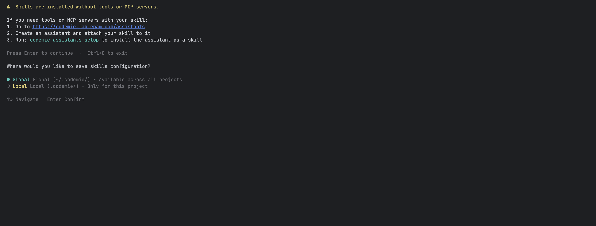
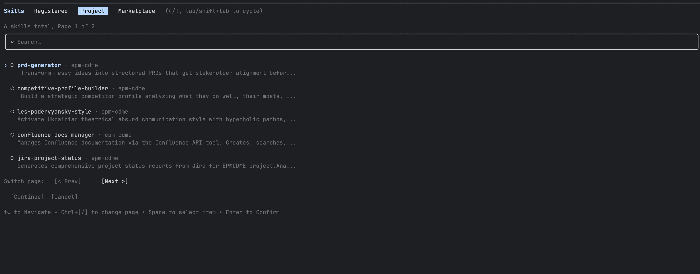
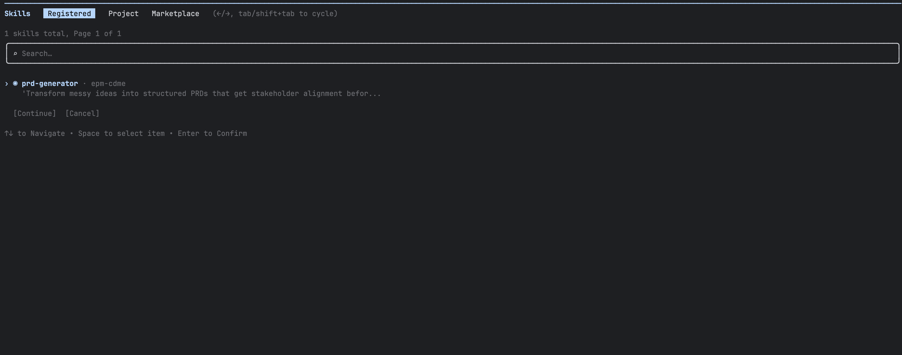
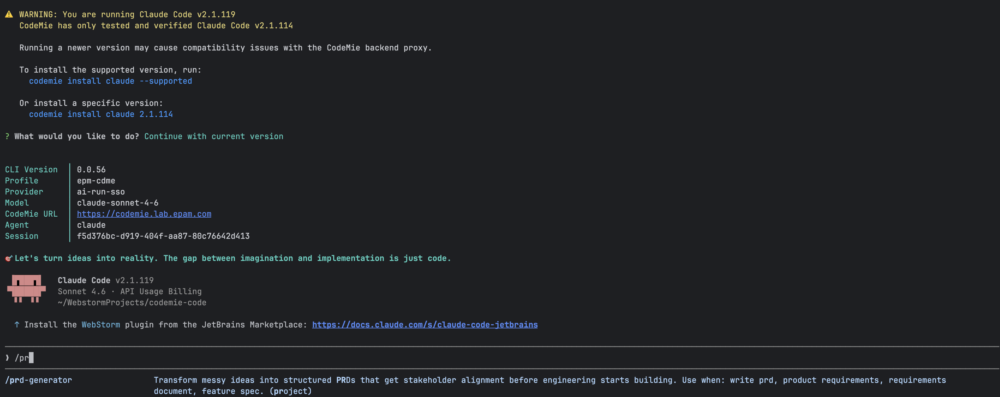

import EnterpriseFeature from '@site/src/components/EnterpriseFeature';

# Access CodeMie Skills from CLI

<EnterpriseFeature />

CodeMie CLI lets you install any CodeMie skill into Claude Code so you can invoke it directly
as a slash command from your coding session. You can also run skills directly from the terminal
at any time using `codemie skill run`.

## Prerequisites

- CodeMie CLI installed and configured (`codemie setup` completed)

## Step 1: Register Skills

Run the setup wizard to select which skills you want to use:

```bash
codemie setup skills
```

### Read the Disclaimer

The wizard opens with an important notice:



:::warning
Skills are installed without tools or MCP servers. If your skill requires tools or MCP
servers, attach it to an assistant instead and use `codemie setup assistants`.
:::

If you need tools or MCP servers with your skill:

1. Go to your CodeMie platform and create an assistant
2. Attach your skill to that assistant
3. Run `codemie setup assistants` to install the assistant as a skill

Press **Enter** to continue or **Ctrl+C** to exit.

### Choose Scope

After the disclaimer, select where to save the skills configuration:

| Scope      | Saved to                             | Use when                                   |
| ---------- | ------------------------------------ | ------------------------------------------ |
| **Global** | `~/.codemie/codemie-cli.config.json` | Skills should be available in all projects |
| **Local**  | `./.codemie/codemie-cli.config.json` | Skills are specific to this repository     |

Local configuration overrides global for the current directory.

Use `↑`/`↓` to navigate, **Enter** to confirm.

### Select Skills

A selection screen lists all available skills across four tabs:



- **Skills** — all skills available to you
- **Registered** — skills you have already set up
- **Project** — skills shared within your project
- **Marketplace** — skills available from the marketplace

Use `←`/`→` to switch between tabs, `↑`/`↓` to move through the list, **Space** to select or
deselect, and **Enter** to confirm.

After confirming, the CLI registers the selected skills and shows a summary:

```
✓ Registered 1 skill(s)

Skills saved to: global (~/.codemie/codemie-cli.config.json)
Skills are available in Claude Code as /skill-name commands.
```

## Step 2: Use Skills in Claude Code

Once registered, the skill appears in the **Registered** tab and is available as a slash command:



Launch Claude Code as usual:

```bash
codemie-claude
```

Then invoke a skill by typing `/` followed by its name:

```
/prd-generator Transform my feature idea into a structured PRD
```



:::tip
Not sure of the skill's name? Re-run `codemie setup skills` and check the **Registered** tab,
or type `/` in Claude Code to see all available slash commands.
:::

## Step 3: Run a Skill from the Terminal

You can also execute skills directly from the terminal without opening Claude Code.

### Single-Message Mode

Pass the skill ID and message as arguments to get a single response:

```bash
codemie skill run "<skill-id>" "Help me write a PRD for this feature"
```

Only the skill's response is printed — useful in scripts or when called from other tools.

### Pipe a message from stdin

```bash
echo "Summarize this pull request" | codemie skill run "<skill-id>"
cat prompt.txt | codemie skill run "<skill-id>"
```

**Options:**

| Flag                     | Short | Description                                                                                                                               |
| ------------------------ | ----- | ----------------------------------------------------------------------------------------------------------------------------------------- |
| `--conversation-id <id>` |       | Continue a previous conversation. History is stored in `~/.codemie/sessions/`. Also accepts the `CODEMIE_SESSION_ID` environment variable |
| `--verbose`              | `-v`  | Enable debug output                                                                                                                       |

:::tip
Not sure of the skill's ID? It is embedded in the generated `SKILL.md` file at
`~/.claude/skills/<skill-slug>/SKILL.md` (global) or `.claude/skills/<skill-slug>/SKILL.md` (local).
:::

## Managing Registered Skills

Re-run `codemie setup skills` at any time to add or remove skills. To remove a skill, open
the wizard again and deselect it — this removes it from the list and cleans up its
configuration files.

:::note
Skills registered via `codemie setup skills` are always exposed as slash commands
(`/skill-name`). If you need a skill available as a subagent (`@name`), attach it to an
assistant and use [`codemie setup assistants`](./assistants-integration.md) instead.
:::
