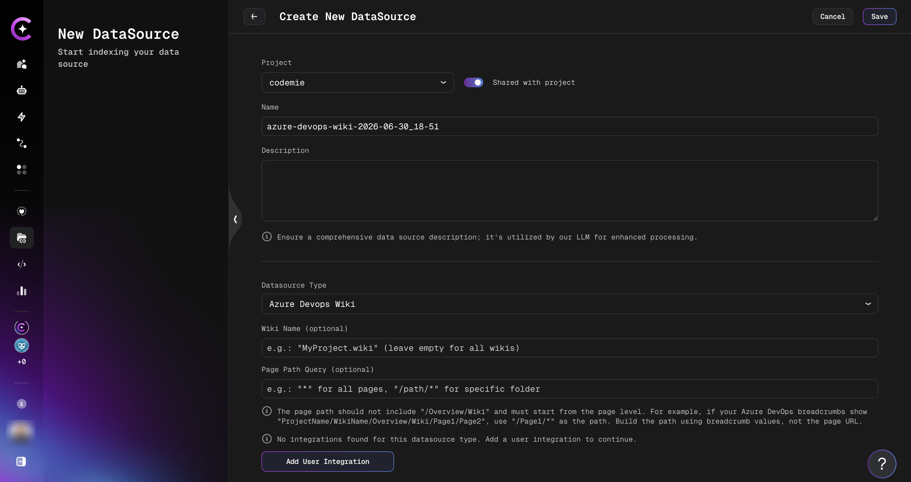

# Add and Index Azure DevOps Wiki Data Source

Connect and index Azure DevOps Wiki pages, comments, and attachments as a data source.

An Azure DevOps Wiki data source lets assistants search and retrieve content from your wiki — including page text, discussion comments, and attached files. This guide walks you through the process of adding and indexing an Azure DevOps Wiki.

## Prerequisites

:::note Required Integration
This data source requires you to have at least one Azure DevOps integration added to AI/Run CodeMie. For more details, please refer to the [Integrations Overview](../../tools_integrations/integrations/index.md) guidelines.
:::

Before adding an Azure DevOps Wiki data source, ensure you have:

- Configured an Azure DevOps integration with a Personal Access Token
- Access to the Azure DevOps project and wiki you want to index
- Read permissions on wiki pages, comments, and attachments

## Adding an Azure DevOps Wiki Data Source

### Step-by-Step Process

#### 1. Preparation

Before adding a new data source, create an Azure DevOps integration on the **Integrations** tab.

Refer to the [Integrations Overview](../../tools_integrations/integrations/index.md) guidelines for detailed integration setup instructions.

#### 2. Navigate to Data Sources

Navigate to the **Data Sources** section in AI/Run CodeMie.

#### 3. Create New Data Source

Click the **+ Create Datasource** button.

#### 4. Configure the Data Source

Fill in the required fields:

- **Select Project**: Choose the CodeMie project to associate with this data source.
- **Name**: A short alias for quick identification in the data source list.
- **Description**: Optional description of what this data source contains.
- **Choose Datasource Type**: Select **Azure DevOps Wiki**.

Configure the Azure DevOps Wiki-specific fields:

| Field                         | Required | Description                                                                                        |
| ----------------------------- | -------- | -------------------------------------------------------------------------------------------------- |
| **Wiki Name**                 | Optional | Name of the wiki to index (e.g., `MyProject.wiki`). Leave empty to index all wikis in the project. |
| **Page Path Query**           | Optional | Filter pages by path (e.g., `*` for all pages, `/Architecture/*` for a specific folder).           |
| **Integration**               | Required | Select your Azure DevOps integration.                                                              |
| **Model used for embeddings** | Required | Embedding model for indexing the content.                                                          |

:::info Page Path Format
The path must start from the page level — do not include the `/Overview/Wiki` prefix shown in Azure DevOps breadcrumbs. For example, if breadcrumbs show `ProjectName/WikiName/Overview/Wiki/Page1/Page2`, use `/Page1/*` as the path.
:::

#### 5. Configure Reindex Schedule (Optional)

In the **Reindex Type** section, configure automatic reindexing:

- **No schedule (manual only)** — Default, requires manual reindexing
- **Every hour** — For wikis with frequent updates
- **Daily at midnight** — For wikis with regular daily changes
- **Weekly on Sunday at midnight** — For less active wikis
- **Monthly on the 1st at midnight** — For archived wikis
- **Custom cron expression** — Enter a custom schedule (e.g., `0 */4 * * *` for every 4 hours)

#### 6. Create Data Source

Click the **+ Create** button. Indexing begins automatically.

## What Gets Indexed

The data source indexes three types of content from each wiki page:

### Page Content

The full markdown content of each wiki page is indexed as a separate document.

### Comments

All discussion comments on each wiki page are indexed. Each comment includes the author's name, timestamp, and text. Comments from a single page are grouped into one document.

### Attachments

Files attached to wiki pages are downloaded, text is extracted, and indexed. Supported file types:

| File Type                          | Extraction Method           |
| ---------------------------------- | --------------------------- |
| Images (JPEG, PNG, GIF, BMP, WebP) | OCR via multimodal AI model |
| PDF                                | Text extraction             |
| Word (`.docx`, `.doc`)             | Text and image extraction   |
| Excel (`.xlsx`, `.xls`)            | Markdown tables             |
| PowerPoint (`.pptx`, `.ppt`)       | Text extraction             |
| Outlook (`.msg`)                   | Text extraction             |

:::note
Image OCR and image-embedded document processing require a multimodal AI model to be configured in your CodeMie instance. If no multimodal model is available, image attachments are skipped.
:::

## Using the Azure DevOps Wiki Data Source in Assistants

After creating and indexing the data source, connect it to an assistant to enable wiki search.

1. Navigate to the **Assistants** section.
2. Click **+ Create Assistant** or edit an existing one.
3. In the **Data Source Context** section, select your Azure DevOps Wiki data source.
4. Save the assistant configuration.

Your assistant can now answer questions using indexed wiki content, comments, and attachments.

:::tip
For active interaction with wiki pages (creating, editing, searching), use the [Azure DevOps Wiki tool](../../tools_integrations/tools/azure-devops/azure-devops-wiki.md) in addition to the data source.
:::
