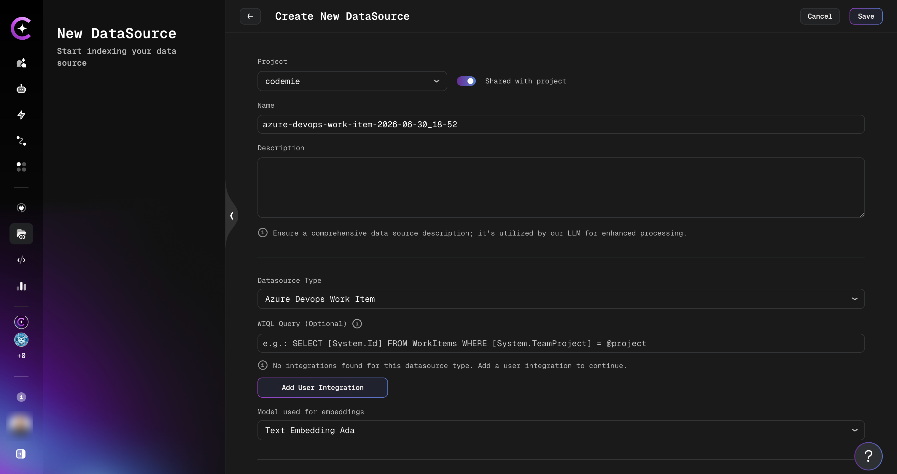

# Add and Index Azure DevOps Work Items Data Source

Connect and index Azure DevOps Work Items — including field content, discussion comments, and file attachments — as a data source.

An Azure DevOps Work Items data source lets assistants search and retrieve full context from the project's work items: core fields, discussion threads, and attached files. This guide walks through the process of adding and indexing an Azure DevOps Work Items data source.

## Prerequisites

:::note Required Integration
This data source requires you to have at least one Azure DevOps integration added to AI/Run CodeMie. For setup instructions, see [Azure DevOps — Configure Integration](../../tools_integrations/tools/azure-devops/index.md#configure-integration-in-codemie).
:::

Before adding an Azure DevOps Work Items data source, ensure you have:

- Configured an Azure DevOps integration with a Personal Access Token
- Access to the Azure DevOps project containing the work items to be indexed
- Read permissions on work items, their comments, and their attachments

## Adding an Azure DevOps Work Items Data Source

### Step-by-Step Process

#### 1. Preparation

Before adding a new data source, create an Azure DevOps integration on the **Integrations** tab.

Refer to the [Azure DevOps — Configure Integration](../../tools_integrations/tools/azure-devops/index.md#configure-integration-in-codemie) guidelines for detailed integration setup instructions.

#### 2. Navigate to Data Sources

Navigate to the **Data Sources** section in AI/Run CodeMie.

#### 3. Create New Data Source

Click the **+ Create Datasource** button.

#### 4. Configure the Data Source

Fill in the required fields:

- **Select Project**: Choose the CodeMie project to associate with this data source.
- **Name**: A short alias for quick identification in the data source list.
- **Description**: Optional description of what this data source contains.
- **Choose Datasource Type**: Select **Azure DevOps Work Items**.

Configure the Azure DevOps Work Items-specific fields:

| Field                         | Required | Description                                                                                                                                                                 |
| ----------------------------- | -------- | --------------------------------------------------------------------------------------------------------------------------------------------------------------------------- |
| **WIQL Query**                | Optional | Filter work items using a WIQL query (e.g., `SELECT [System.Id] FROM WorkItems WHERE [System.TeamProject] = @project`). Leave empty to index all work items in the project. |
| **Integration**               | Required | Select your Azure DevOps integration.                                                                                                                                       |
| **Model used for embeddings** | Required | Embedding model for indexing the content.                                                                                                                                   |

#### 5. Configure Reindex Schedule (Optional)

In the **Reindex Type** section, configure automatic reindexing:

- **No schedule (manual only)** — Default, requires manual reindexing
- **Every hour** — For projects with frequent work item updates
- **Daily at midnight** — For projects with regular daily changes
- **Weekly on Sunday at midnight** — For less active projects
- **Monthly on the 1st at midnight** — For archived projects
- **Custom cron expression** — Enter a custom schedule (e.g., `0 */4 * * *` for every 4 hours)

#### 6. Create Data Source

Click the **+ Create** button. Indexing begins automatically.

## What Gets Indexed

The data source indexes three types of content from each work item:

### Work Item Fields

Core work item fields are indexed as a single document per item, including title, description, type, state, priority, and other standard fields.

### Comments

All discussion comments on each work item are indexed. Each comment includes the author's name, timestamp, and text. Comments from a single work item are grouped into one document.

### Attachments

Files attached to work items are downloaded, text is extracted, and indexed. Supported file types:

| File Type                          | Extraction Method                                          |
| ---------------------------------- | ---------------------------------------------------------- |
| Images (JPEG, PNG, GIF, BMP, WebP) | OCR via multimodal AI model                                |
| PDF                                | Text extraction; OCR via AI vision for image-only PDFs     |
| Word (`.docx`)                     | Text extraction                                            |
| Excel (`.xlsx`, `.xls`)            | Sheet content as text                                      |
| PowerPoint (`.pptx`)               | Slide text extraction                                      |
| Text files                         | UTF-8 text (`.txt`, `.md`, `.json`, `.csv`, `.yaml`, etc.) |

:::note
Image OCR and image-embedded document processing require a multimodal AI model to be configured in your CodeMie instance. If no multimodal model is available, image attachments are skipped.
:::

:::info Unsupported attachments
Attachment types not listed above are handled gracefully — the indexing job records metadata only and continues without failing.
:::

## Using the Azure DevOps Work Items Data Source in Assistants

After creating and indexing the data source, connect it to an assistant to enable work item search.

1. Navigate to the **Assistants** section.
2. Click **+ Create Assistant** or edit an existing one.
3. In the **Data Source Context** section, select your Azure DevOps Work Items data source.
4. Save the assistant configuration.

The assistant can now answer questions using indexed work item fields, comments, and attachments.

:::tip
For active interaction with work items (creating, updating, searching, linking), use the [Azure DevOps Work Items tool](../../tools_integrations/tools/azure-devops/azure-devops-work-items.md) in addition to the data source.
:::
