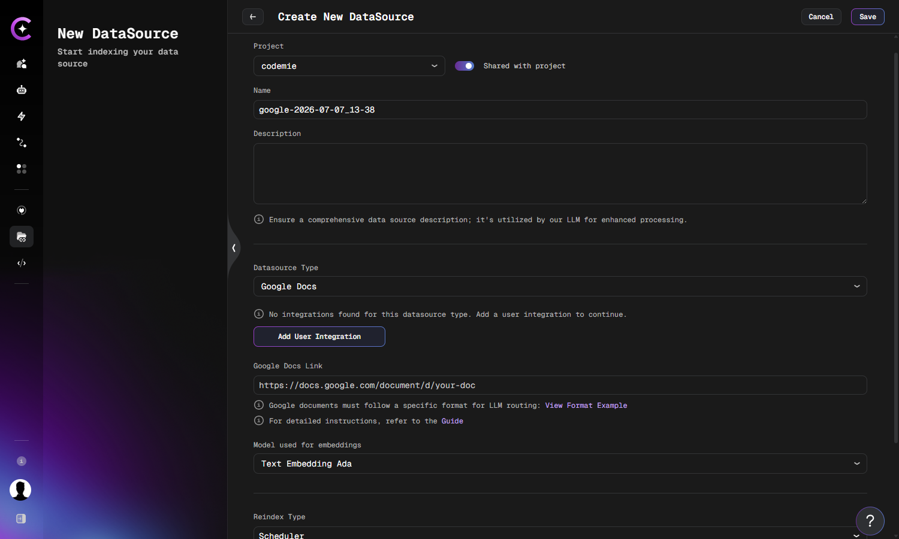

# Add and Index Google Data Source

Connect and index Google Documents as data sources.

Google Documents are a valuable knowledge source in AI/Run CodeMie, enabling assistants to access structured documentation and FAQs. This guide walks you through the process of adding and indexing Google Docs.

## Overview

Google Documents are indexed by connecting your Google account through a Google OAuth integration. The document must be formatted in a specific way, such as FAQs, to be compatible with the platform's parsing and LLM routing capabilities.

## Prerequisites

:::note Administrator Setup Required
The Google OAuth integration requires administrator configuration before users can sign in with Google. See [Google OAuth](../../../admin/configuration/codemie/api-configuration.md#google-oauth) in the API Configuration guide.
:::

Before adding a Google Docs data source, ensure you have:

- A Google Document formatted according to AI/Run CodeMie requirements
- A Google OAuth integration created in AI/Run CodeMie (see [Setting Up a Google OAuth Integration](#setting-up-a-google-oauth-integration) below)
- Viewer access to the Google Document with your Google account

:::danger Strict Format Required
Google Docs must follow the triple numeration format (1.1.1.) with Heading 3 style. Documents without this format will fail to parse correctly.
:::

## Required Document Format

Google documents should be created in a specific format to allow AI/Run CodeMie to parse it and use it for LLM routing efficiently instead of traditional semantic search.

### Format Structure

The document format should follow these guidelines:

**1. Titles with triple numeration**

- Use format: `1.1.1.` (numbered sections)
- Apply text style: **Heading 3**
- This creates a hierarchical structure for easy navigation

**2. Content text**

- Use text style: **Normal** for all content inside sections
- Keep content clear and concise
- Structure information logically

### Example Structure

```
1.1.1. What is AI/Run CodeMie?
AI/Run CodeMie is a platform for...

1.1.2. How do I get started?
To get started with AI/Run CodeMie...

1.2.1. Creating your first assistant
Follow these steps to create...
```

:::info Why This Format?
The triple numeration format enables AI/Run CodeMie to create a semantic hierarchy of your content, improving search accuracy and LLM routing efficiency.
:::

:::tip Example Document
For a complete example of the correct format, refer to [this example Google Document](https://docs.google.com/document/d/19EXgnFCgJontz0ToCAH6zMGwBTdhi5X97P9JIby4wHs/edit#heading=h.b01c2ig0adfg).
:::

## Setting Up a Google OAuth Integration

A Google OAuth integration links your Google account to AI/Run CodeMie. You only need to create it once and can reuse it for multiple Google Docs datasources.

### Steps

1. In the AI/Run CodeMie main menu, click **Integrations**.
2. Click **+ Create** and select **Create User Integration**.
3. In the **Credential Type** dropdown, select **Google OAuth**.
4. Click the **Sign in with Google** button.
5. A browser popup opens. Select your Google account and grant the requested permissions (read-only access to Google Documents).
6. Once sign-in is complete, the button shows **Re-authenticate** and **Signed in as: `<your-email>`** above it.

:::tip
If you use Google Docs across multiple projects, enable the **Global** toggle when creating the integration. This makes the integration available in all projects where you are onboarded, so you only need to authenticate once.
:::

## Adding a Google Data Source

Follow these detailed steps to add a Google Document as a data source:



### Configuration Steps

1. Navigate to **Data Sources** section in AI/Run CodeMie
2. Click **+ Create Datasource**
3. Fill in required fields:
   - **Project**: Select target project
   - **Name**: Provide a descriptive name for the data source
   - **Description**: Add details about the document content
   - **Datasource Type**: Select **Google Docs**
   - **Google Auth Integration**: Select your Google OAuth integration from the dropdown or click **Add User Integration**
   - **Google Docs Link**: Paste the Google Document URL (e.g., `https://docs.google.com/document/d/your-doc-id`)
   - **Model used for embeddings**: Select embedding model

4. **Configure Reindex Schedule (Optional)**

   In the **Reindex Type** section, configure automatic reindexing:
   - **Scheduler**: Choose your preferred reindexing schedule
     - **No schedule (manual only)** - Default, requires manual reindexing
     - **Every hour** - For frequently updated documentation
     - **Daily at midnight** - Recommended for most Google Docs
     - **Weekly on Sunday at midnight** - For stable documents
     - **Monthly on the 1st at midnight** - For rarely updated documents
     - **Custom cron expression** - Enter custom cron expression (e.g., `0 8 * * *` for daily at 8 AM)

5. Click **+ Create** to create the data source

## Using Google Data Source in Assistants

After successfully creating and indexing your Google data source, you can connect it to any assistant to provide access to your Google Docs content.

### Adding Data Source to Assistant

1. Navigate to **Assistants** section
2. Click **+ Create Assistant** or edit an existing assistant
3. In the **Data Source Context** section, click the dropdown menu
4. Select your Google data source from the list
5. Save the assistant configuration

Now your assistant can access and analyze content from the indexed Google Documents, enabling it to:

- Answer questions about document content
- Summarize sections and key points
- Extract specific information
- Compare information across multiple documents
- Provide context-aware responses based on your documentation

Your Google Documents are now configured and ready to enhance your assistants with collaborative documentation knowledge.
