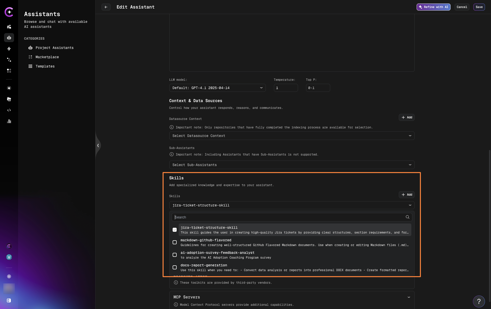
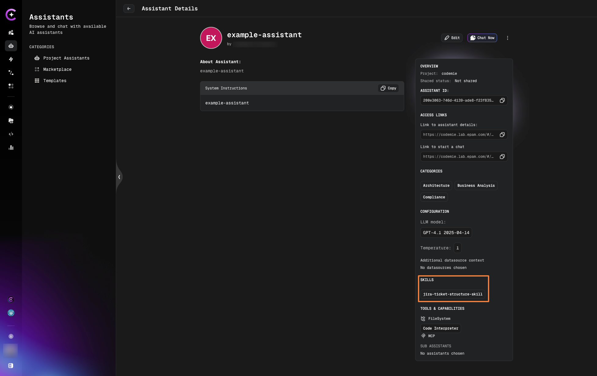

import Tabs from '@theme/Tabs';
import TabItem from '@theme/TabItem';

# Attach Skills to Assistants

Learn how to attach skills to assistants to automatically inherit instructions and required tools.

## Ways to Attaching Skills to Assistants

<Tabs>
  <TabItem value="assistant" label="From Assistant Page" default>

You can attach skills when creating a new assistant or editing an existing one.

**Step 1: Open Assistant Configuration**

- **For new assistant:** Navigate to **Assistants** → **Create Assistant**
- **For existing assistant:** Navigate to **Assistants** → Select assistant → **Edit**

**Step 2: Select Skills**

1. Find the **Skills** section in the assistant configuration
2. Click **Add** or select from dropdown
3. Select one or more skills from the list



4. Click **Save** or **Create Assistant**

The assistant now has the selected skills attached. You can view attached skills in the assistant details:



  </TabItem>
  <TabItem value="skill" label="From Skill Details">

Attach a skill to multiple assistants directly from the Skill Details page.

**Step 1: Open Skill Details**

1. Navigate to **Skills** → **Project Skills**
2. Click on a skill to open details page

**Step 2: Attach to Assistants**

1. Scroll to **Attach to Assistants** section
2. Select assistants from the dropdown
3. Click on assistants to attach the skill


The skill is now attached to the selected assistants.

  </TabItem>
  <TabItem value="chat" label="In Chat">

Dynamically attach skills to a specific conversation without modifying the assistant.

**Step 1: Open Chat**

Start or open an existing chat with an assistant.

**Step 2: Attach Skills**

1. Click the **Skills** button (input field)
2. In the **Attach Skills** modal:
   - Browse your **Project Skills**
   - Or explore **Marketplace Skills**
   - Select one or more skills to add
3. Click **Confirm**


The modal shows all available skills from both your project and the marketplace, making it easy to quickly find and attach the skills you need.

The selected skills are now active for this chat session only.

  </TabItem>
</Tabs>

## Skill Loading Behavior

### Automatic Loading Based on Relevance

Attached skills load automatically when they're relevant to your request. The assistant determines relevance based on the skill's description.

**Example:**

You have an assistant with these skills:

- JIRA Ticket Structure
- Find Duplicate Tickets
- Release Planning

**When you ask:** "Create a draft story for the new feature"

The assistant loads the `JIRA Ticket Structure` skill because your request involves creating a ticket. The skill wasn't used before this request - it loads on-demand when needed.

**When you ask:** "Find existing tickets about login issues"

The assistant loads the `Find Duplicate Tickets` skill. This skill wasn't previously attached to the assistant permanently, since it shouldn't be used every time a ticket is created. You can add it dynamically in the chat without modifying the assistant itself. The skill will attach to this chat and load on demand, following the same logic as the assistant's skills.

:::tip
Skills load on-demand based on your query and the skill's description. The assistant automatically determines which skills are relevant for each request.
:::

## Working with Multiple Skills

### Composing Assistant Capabilities

Build powerful assistants by combining focused skills:

**Example: Business Analyst Assistant**

```yaml
Assistant: BA Pro
System Prompt: You are a senior business analyst assistant.

Skills:
  - JIRA Ticket Structure # Loads when creating tickets
  - Find Duplicate Tickets # Loads when searching
  - Release Planning # Loads for releases
  - Sprint Management # Loads for sprint work
  - Stakeholder Communication # Loads for updates

Inherited Tools:
  - JIRA (from multiple skills)
  - Confluence (from Release Planning, Sprint Management)
  - Elasticsearch (from Find Duplicate Tickets)
  - Slack (from Stakeholder Communication)
```

**Benefits:**

- **Specialized knowledge** - Each skill handles specific tasks
- **Automatic context** - Right instructions load at right time
- **Simplified maintenance** - Update one skill, affects all assistants
- **Reduced token usage** - Only relevant skills load

### Skill Priority and Conflicts

If multiple skills apply to the same query:

- **All relevant skills load** - The assistant can use instructions from multiple skills
- **No conflicts** - Skills are additive, not exclusive
- **Clear separation** - Design skills with distinct purposes to minimize overlap

**Example:**

```
User: "Create a ticket and check for duplicates"

System loads:
  - JIRA Ticket Structure (for creation)
  - Find Duplicate Tickets (for search)

Both skills apply simultaneously.
```

## Removing Skills from Assistants

### Detach a Skill

To remove a skill from an assistant:

1. Navigate to **Assistants**
2. Edit the assistant
3. Find the **Skills** section
4. Click **X** or **Remove** next to the skill
5. Click **Save Changes**

**Effects:**

- Skill is removed from assistant
- Skill instructions no longer available
- Inherited tools from that skill are removed (unless manually added or from other skills)
- Other assistants using the skill are unaffected

## Next Steps

- [Skills in Chat](./skills-in-chat.md) - Dynamic skill attachment during conversations
- [Manage Skills](./manage-skills.md) - Edit and maintain your skills
