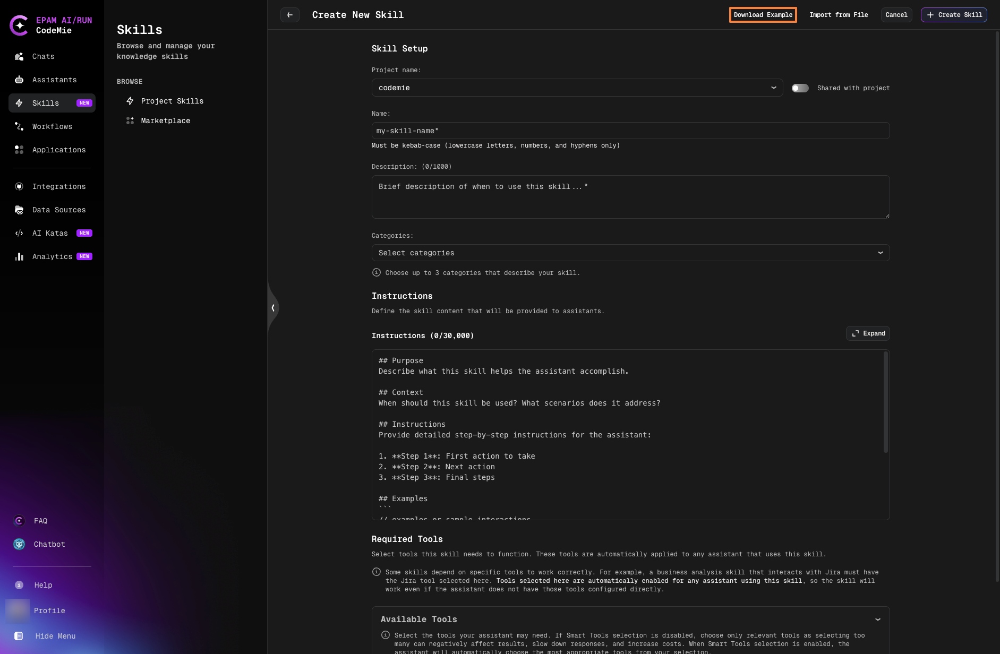
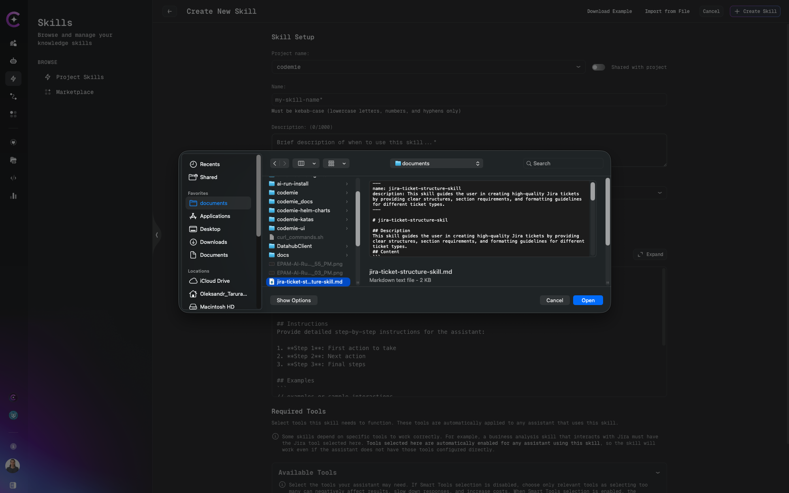
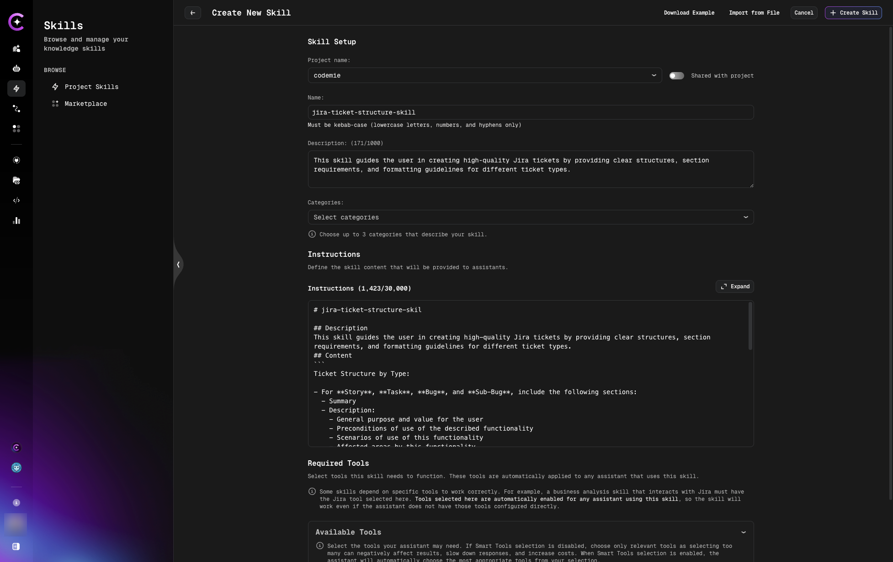
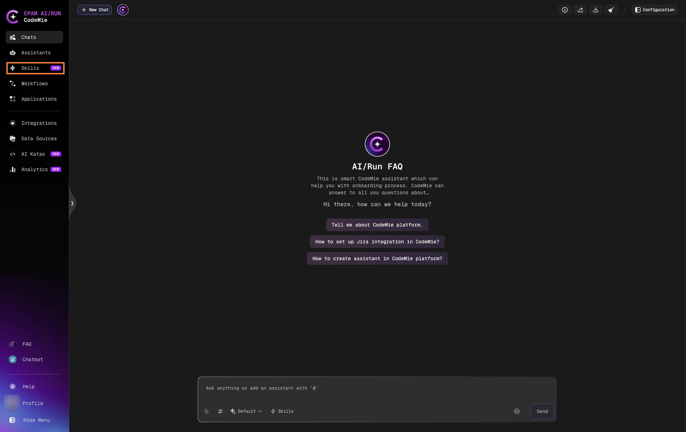
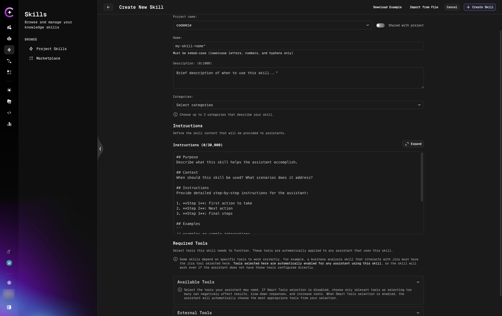
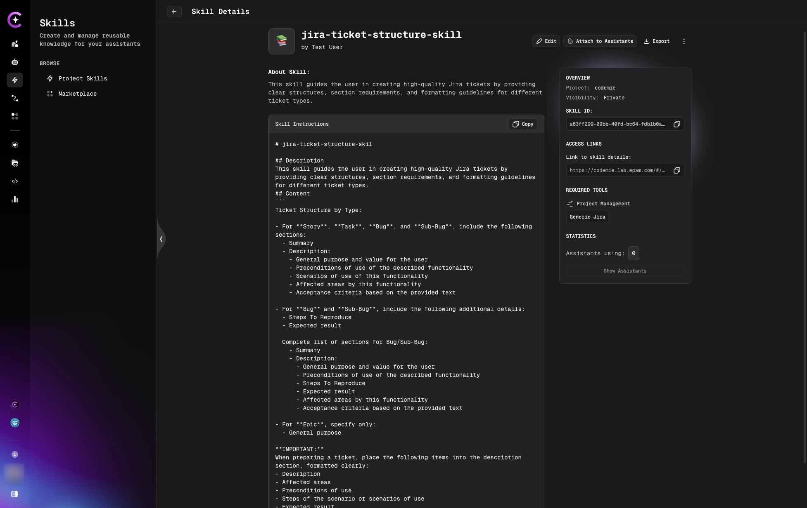

import Tabs from '@theme/Tabs';
import TabItem from '@theme/TabItem';

# Creating Skills

Learn how to create custom skills manually, import from files, or use GitHub repositories as skill sources.

:::info Skill Format
Skills are **markdown-based knowledge units** that get loaded into assistant context on-demand. They support:

- ✅ **Markdown content** (up to 300KB) - instructions, code examples, best practices
- ✅ **Tool references** - specify which tools the skill requires
- ❌ **No support for**: external scripts, file attachments, binary assets, or embedded images

All skill content must be text-based markdown.
:::

## Creating a Skill

<Tabs>
  <TabItem value="file" label="Import from File" default>

**Supported Format**

Markdown files with YAML metadata header.

:::tip
You can download an example skill file from the Import from File dialog to use as a template.
:::



**Template structure:**

```markdown
---
name: example-skill
description: A brief description of what this skill helps with
---

# Example Skill

## Description
This is an example skill that demonstrates the markdown format for importing skills.

## Content
Your skill content goes here. This can include:
- Instructions for the AI assistant
- Code examples
- Best practices
- Any other relevant information

Example:
When the user asks for help with code review, follow these steps:
1. Analyze the code structure
2. Check for common issues
3. Provide constructive feedback

You can use markdown formatting including:
- **Bold text**
- *Italic text*
- Lists
- Code blocks
- Links and more
```

**Import Process**

1. Click **Create Skill** button
2. Click **Import from File**
3. Click **Select file from your local machine**
4. Choose your `.md` file



5. Review auto-populated fields:
   - Description field
   - Instructions field



6. Adjust if needed
7. Click **Create Skill**

:::tip
The import process automatically parses markdown structure and populates the Description and Instructions fields.
:::

  </TabItem>
  <TabItem value="github" label="Import from GitHub">

**Public GitHub Repositories**

You can use public GitHub repositories with pre-built skills.

**Popular skill repositories:**

- [Claude Skills](https://github.com/anthropics/skills/tree/main/skills) - Official Anthropic skills collection

**To import from GitHub:**

1. Browse the repository
2. Find the skill file (`.md` format)
3. Download or copy the raw content
4. Use **Import from File** method with the downloaded file

  </TabItem>
  <TabItem value="manual" label="Create Manually">

**Step 1: Navigate to Skills Page**

1. Open CodeMie
2. Click **Skills** in the left navigation panel and click **Create Skill** button



**Step 2: Fill Required Fields**



On the Create New Skill page, provide the following fields. **Name**, **Description**, and **Instructions** are required:

| Field               | Required | Description                                                                  |
| ------------------- | -------- | ---------------------------------------------------------------------------- |
| **Project name**    | Yes      | Select target project or leave default                                       |
| **Skill Name**      | Yes      | Descriptive name (kebab-case (lowercase letters, numbers, and hyphens only)) |
| **Sharing**         | No       | Control visibility (private, project)                                        |
| **Description**     | Yes      | Detailed information when we need to use this skill                          |
| **Instructions**    | Yes      | Step-by-step directions, context, and procedures                             |
| **Available Tools** | No       | Select tools needed for this skill                                           |
| **External tools**  | No       | These toolkits are provided by third-party vendors                           |

### Enable Tool if Relevant

:::important
A Skill may include an associated tool, or it may not require one. When a Skill includes a tool, that tool will be activated and used together with the Skill during execution. If the Skill includes a tool, ensure that the corresponding tool integration (if required) is properly configured.
:::

**How to select tools:**

1. In the **Available Tools** field, select internal CodeMie tools if your skill needs them
2. In the **External tools** field, select third-party tools (MCP servers, etc.)
3. Leave empty if the skill only provides instructions without requiring specific tools

**Example:**

```
Skill Name: JIRA Ticket Structure Guidelines

Description:
Use this skill when creating, editing, or reviewing JIRA tickets to ensure
they follow company standards for formatting, completeness, and quality.

Instructions:
# JIRA Ticket Structure

## Title Format
- Use pattern: [TYPE] Brief description
- Types: STORY, BUG, TASK, EPIC
- Keep under 80 characters
- Example: [STORY] Add user authentication

## Description Template
**Problem:**
[What problem are we solving?]

**Solution:**
[How will we solve it?]

**Acceptance Criteria:**
- [ ] Criterion 1
- [ ] Criterion 2

## Labels
Required: component, priority, team
```

**Step 3: Save the Skill**

Click **Create Skill** to save.

  </TabItem>
</Tabs>

## Result

After creating a skill using any method, it will appear in your **Project Skills** list:


Click on the skill to view its details page:



The created skill can now be:

- Attached to assistants
- Edited or exported
- Published to marketplace
- Used in chat conversations

## Next Steps

After creating skills:

- [Manage Skills](./manage-skills) - Edit, export, or delete skills
- [Attach to Assistants](./attach-skills-to-assistants) - Use skills with assistants
- [Publish to Marketplace](./marketplace-skills) - Share skills with community
