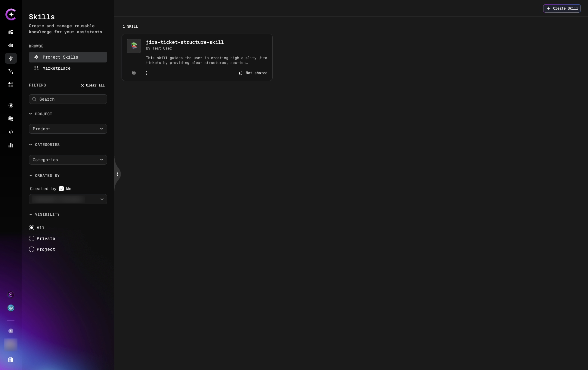
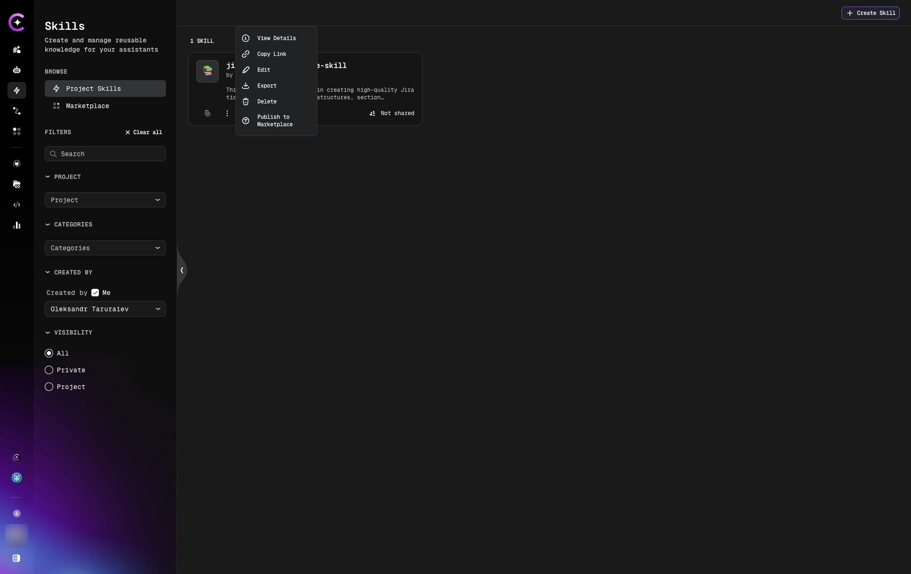
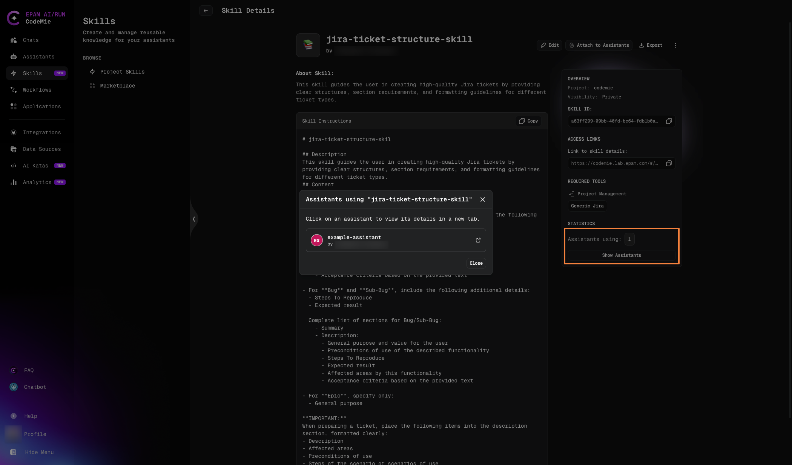
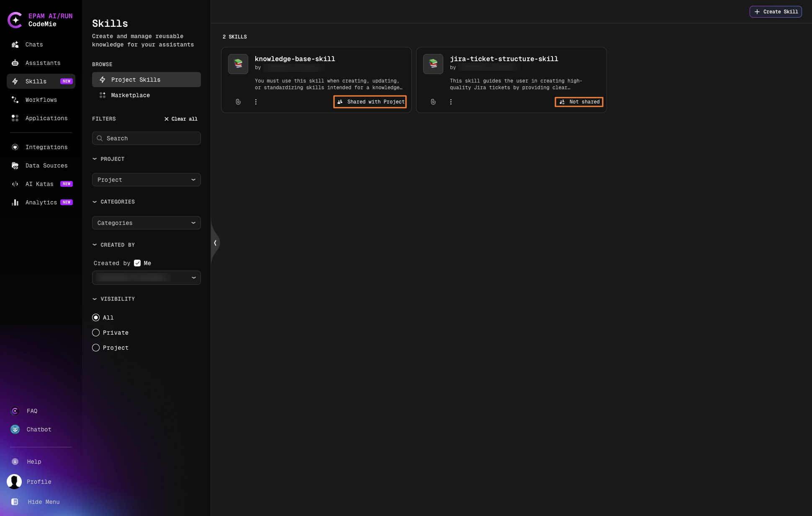

# Managing Skills

Learn how to edit, export, delete, and organize your skills.

## Viewing Skills

### Project Skills

1. Navigate to **Skills** in the left panel
2. Select **Project Skills** tab
3. View all skills in your current project

**Skills list shows:**

- Skill name
- Description preview
- Sharing status (private, project, marketplace)



**Filter skills using the following options:**

#### Search

Enter keywords in the search field to find skills by name.

- Search works in real-time as you type
- Matches skill names
- Examples: "jira", "ticket", "deployment"

#### PROJECT

Filter skills by project:

- Dropdown list of available projects
- Shows current project by default
- Select a different project to view its skills

#### CATEGORIES

Filter skills by categories:

- Multi-select dropdown (select one or multiple categories)
- Shows only skills matching selected categories

#### CREATED BY

Filter skills by author:

- **"Created by ☑ Me" checkbox** - Quick filter to show only your skills
- **User dropdown** - Select a specific user to see their skills
- Only one user can be selected at a time

#### VISIBILITY

Filter skills by access level:

- **⦿ All** (Default) - Show all skills
- **○ Private** - Only private skills (visible to owner only)
- **○ Project** - Only project-level skills (shared with project members)

#### Clear All

Click **× Clear all** to reset all filters to their default values

### Marketplace Skills

1. Navigate to **Skills** → **Marketplace** tab
2. Browse public skills shared by the community
3. Filter by category or search by name

## Editing Skills

### Edit Skill Content

1. Navigate to **Skills** → **Project Skills**
2. Find the skill to edit
3. Click the **three dots menu** (⋮)
4. Select **Edit**



On the edit page, you can modify:

- **Name** - Update skill title
- **Description** - Refine when-to-use guidance
- **Instructions** - Update step-by-step directions
- **Required Tools** - Add or remove tools
- **Project** - Change project assignment
- **Sharing** - Update visibility settings

5. Click **Save Changes**

:::tip
When you update a skill, all assistants using that skill immediately inherit the changes.
:::

### Update Required Tools

To change tools for a skill:

1. Edit the skill
2. Scroll to **Tools** section
3. Add or remove tools from the list
4. Save changes

**Effect on assistants:**

- Assistants using this skill will inherit the updated tool list
- Newly added tools become available to those assistants
- Removed tools are no longer inherited (unless manually added to assistant)

## Exporting Skills

### Export to Markdown

Skills can be exported in markdown format for:

- Backup and version control
- Sharing with team members
- Documentation purposes
- Importing into other projects

**Export steps:**

1. Navigate to **Skills** → **Project Skills**
2. Find the skill
3. Click **three dots menu** (⋮)
4. Select **Export**
5. File downloads to your local machine

### Use Cases for Export

**Version Control:**

```bash
# Store skills in Git
git clone your-skills-repo
cd skills/
# Export skill
# Save to repository
git add jira-ticket-structure.md
git commit -m "Update JIRA ticket skill"
git push
```

**Team Sharing:**

- Export skill as `.md` file
- Send to team members
- They import into their projects

**Documentation:**

- Export all skills
- Include in project documentation
- Share with stakeholders

## Deleting Skills

### Delete a Skill

:::warning
Deleting a skill is permanent and cannot be undone.
:::

1. Navigate to **Skills** → **Project Skills**
2. Find the skill
3. Click **three dots menu** (⋮)
4. Select **Delete**
5. Confirm deletion in the popup

**Effects:**

- Skill is permanently removed
- Assistants using this skill lose access
- Skill is removed from all assistants
- Inherited tools may be removed from assistants (if not manually added)

:::tip Before Deleting
Check which assistants are using the skill before deleting. Consider exporting the skill first as a backup.
:::

### Check Skill Usage

Before deleting, verify where the skill is used:

1. Navigate to **Skills** → **Project Skills**
2. Click on the skill to open details page
3. Scroll to **Attach to Assistants** section
4. View the list of assistants using this skill



The dropdown shows all assistants where this skill is currently attached. Update or remove the skill from these assistants before deletion if needed.

## Organizing Skills

### Project Assignment

Skills belong to projects. To move a skill to another project:

1. Edit the skill
2. Change **Project** dropdown
3. Save changes

The skill moves to the new project and becomes available to assistants in that project.

## Sharing and Publishing

### Sharing Settings

Control who can see and use your skill:

| Sharing Status  | Visibility                 | How to Set                    |
| --------------- | -------------------------- | ----------------------------- |
| **Private**     | Only you                   | Default (Project toggle off)  |
| **Project**     | All members of the project | Enable Project sharing toggle |
| **Marketplace** | Public - all CodeMie users | Publish skill to Marketplace  |

The current sharing status is shown as a badge on each skill card — either **Not Shared** (private) or **Shared with Project**:



To share with your project:

1. Edit the skill
2. Enable **Project** sharing toggle
3. Save changes

### Publishing to Marketplace

To share a skill with the community:

1. Edit the skill
2. Select **Publish** to **Marketplace**
3. Select **mandatory skill categories** (e.g., Business Analysis, DevOps, Development)
4. Save changes

The skill becomes available in the Skills Marketplace for all users.

[Learn more about Marketplace →](./marketplace-skills)

## Troubleshooting

### Skill Not Appearing in Assistant

**Problem:** After creating/editing a skill, it doesn't show in assistant's skill dropdown.

**Solutions:**

1. Verify skill is in the same project as the assistant
2. Check sharing settings - must be project-level or higher
3. Refresh the page
4. Verify skill was saved successfully

## Next Steps

- [Attach Skills to Assistants](./attach-skills-to-assistants) - Learn how to use skills
- [Marketplace Skills](./marketplace-skills) - Publish and discover public skills
- [Skills in Chat](./skills-in-chat) - Dynamic skill attachment
