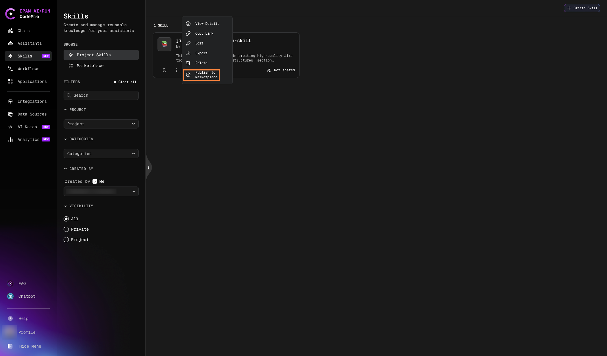
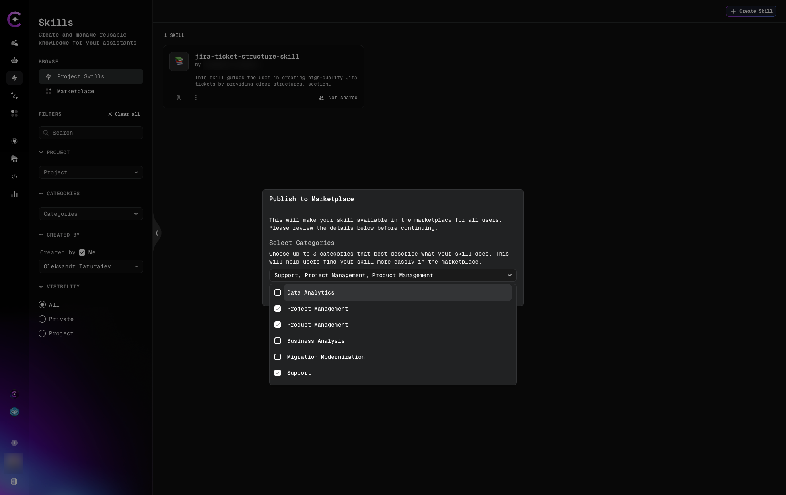
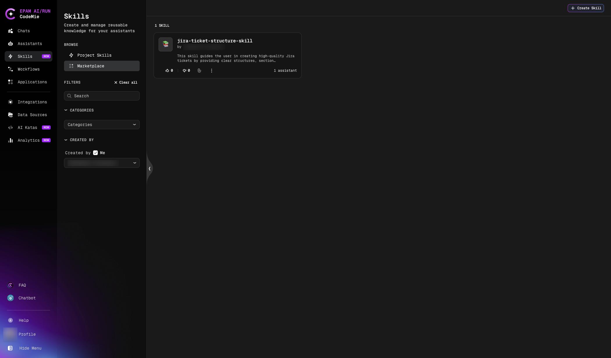
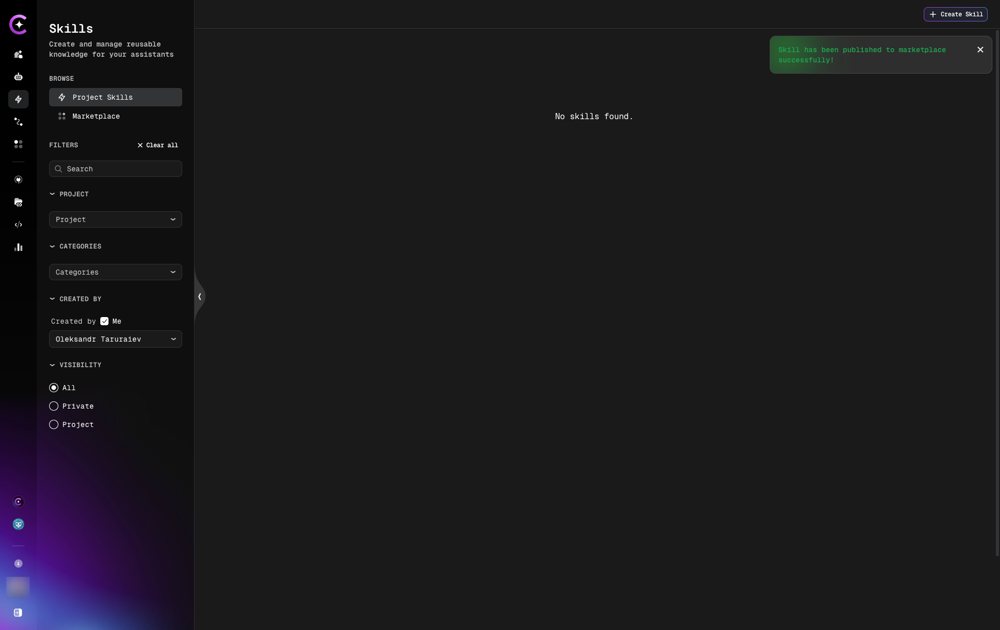
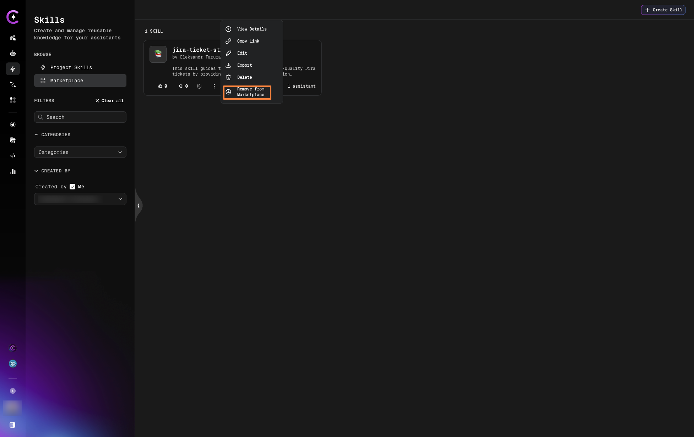
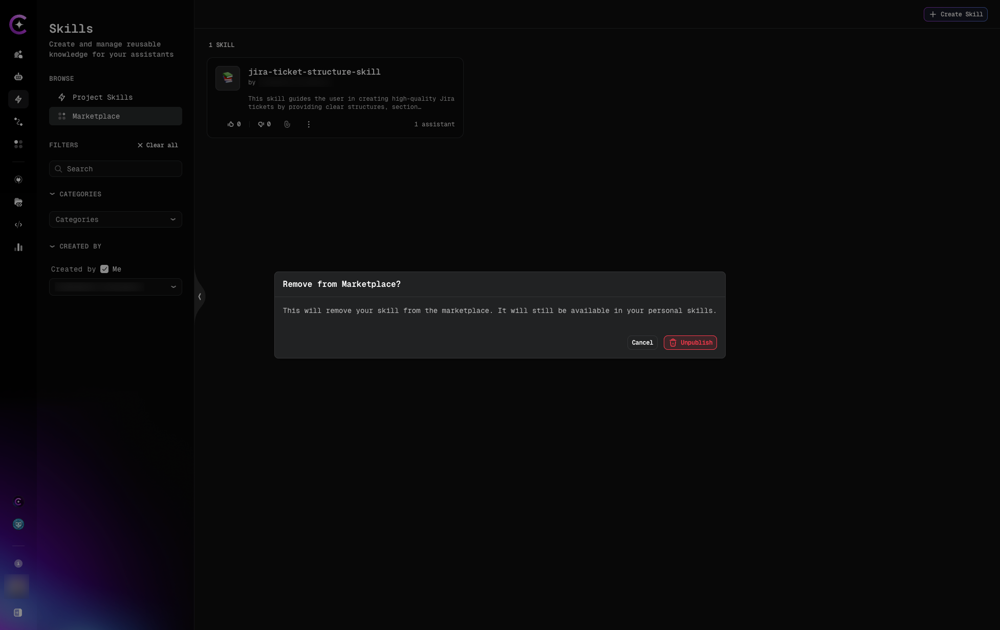

# Skills Marketplace

The Skills Marketplace is a community-driven repository where users can discover, share, and reuse pre-built skills for common use cases.

## Overview

**What is the Marketplace?**

A central hub for:

- **Discovering** public skills created by the community
- **Publishing** your own skills to share with others
- **Reusing** proven patterns and best practices
- **Collaborating** on standardized procedures

**Benefits:**

- ✅ **Faster setup** - Use existing skills instead of creating from scratch
- ✅ **Best practices** - Learn from community expertise
- ✅ **Consistency** - Adopt standardized approaches across organizations
- ✅ **Knowledge sharing** - Contribute your expertise to help others

## Browsing the Marketplace

### Access the Marketplace

1. Navigate to **Skills** in the left panel
2. Select the **Marketplace** tab
3. Browse available public skills

### Skill Categories

Skills in the marketplace are organized by category.

Categories are managed at the platform level. Users with admin permissions can create, edit, and delete categories. [Learn more about Categories Management](../assistants/assistant-categories-management.md).

### Search and Filter

The Marketplace provides filtering options to help you find relevant skills quickly.

#### Search by Name

Enter keywords in the search box to find skills:

- Search works in real-time as you type
- Searches skill names and descriptions
- Examples: "JIRA", "AWS", "deployment", "testing", "data analysis"
- Useful for finding specific tools or use cases

**Tips:**

- Use specific keywords for better results
- Try different variations (e.g., "deploy", "deployment", "deploying")
- Combine with category filters to narrow results

#### Filter by Category

Select one or more categories to view skills in specific domains:

- **Multi-select dropdown** - Choose multiple categories at once
- Shows only skills belonging to selected categories
- Useful for browsing skills in your area of expertise

#### Clear Filters

Click **× Clear filters** to reset all filters and view the complete marketplace catalog

## Using Marketplace Skills

### Add Marketplace Skill to Assistant

1. Navigate to **Assistants** and open the assistant you want to update
2. Click **Edit**
3. Scroll to the **Skills** section
4. Open the dropdown and select a skill from the **Marketplace** group
5. Click **Save**

The skill is now attached to the assistant and will load automatically when relevant to the user's request.

### Use a Marketplace Skill in Chat

You can also attach marketplace skills directly in a chat session without modifying the assistant:

1. Open a chat with any assistant
2. Click the **Skills** button in the chat input toolbar
3. In the **Attach Skills** modal, switch to the **Marketplace Skills** tab
4. Select the skill and click **Confirm**

The skill is active for the current conversation only. Other chats with the same assistant are not affected.

:::tip
Use chat-level attachment to try a marketplace skill before permanently adding it to an assistant.
:::

## Publishing Skills to Marketplace

### Preparation

Before publishing, ensure your skill:

- ✅ Has a clear, descriptive name
- ✅ Provides detailed description explaining when to use it
- ✅ Includes comprehensive, step-by-step instructions
- ✅ Declares all required tools
- ✅ Uses generic examples (not company-specific secrets)
- ✅ Follows best practices and coding standards

### Publishing Process

**Step 1: Open Publish Dialog**

1. Navigate to **Skills** → **Project Skills**
2. Find the skill to publish
3. Click the **three dots menu** (⋮)
4. Select **Publish to Marketplace**

**Step 2: Select Categories**

In the **Publish to Marketplace** dialog, select at least one category:

**Step 3: Confirm Publication**

1. Click **Publish** in the modal
2. The skill is published to the marketplace

A confirmation notification appears when the skill is successfully published:

The skill now appears in the Marketplace and is available for other users to discover and use.

## Marketplace Skill Quality

### Rating

Users can:

- **Rate skills** (if rating feature enabled)

### Updating Published Skills

To update a marketplace skill you published:

1. Navigate to **Skills** → **Marketplace** tab
2. Find your published skill
3. Edit the skill
4. Make changes
5. Save

Changes are reflected in the marketplace immediately.

:::warning Marketplace Updates
Updates to published skills affect all users who are using the skill. Make changes carefully and consider versioning strategies.
:::

### Unpublishing Skills

To remove a skill from the marketplace:

**Step 1: Open Remove Menu**

1. Navigate to **Skills** → **Marketplace** tab
2. Find the published skill
3. Click the **three dots menu** (⋮)
4. Select **Remove from Marketplace**

**Step 2: Confirm Removal**

A confirmation modal will appear.

Click **UNPUBLISH** to confirm.

**Result:** The skill is removed from the marketplace.

## Next Steps

- [Skills in Chat](./skills-in-chat.md) - Learn about dynamic skill attachment
- [Create Skill](./create-skill.md) - Build skills to publish
- [Attach to Assistants](./attach-skills-to-assistants.md) - Use marketplace skills
