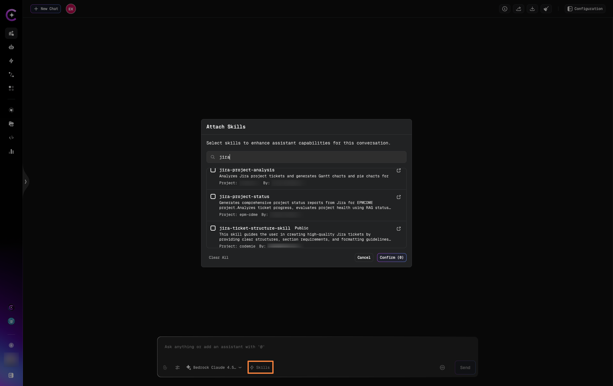
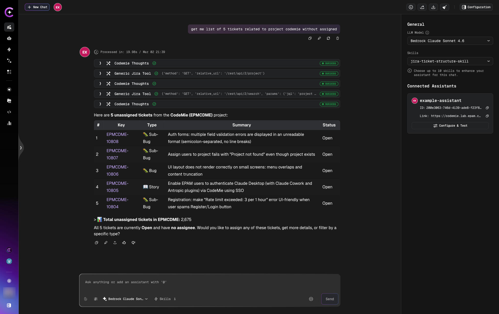
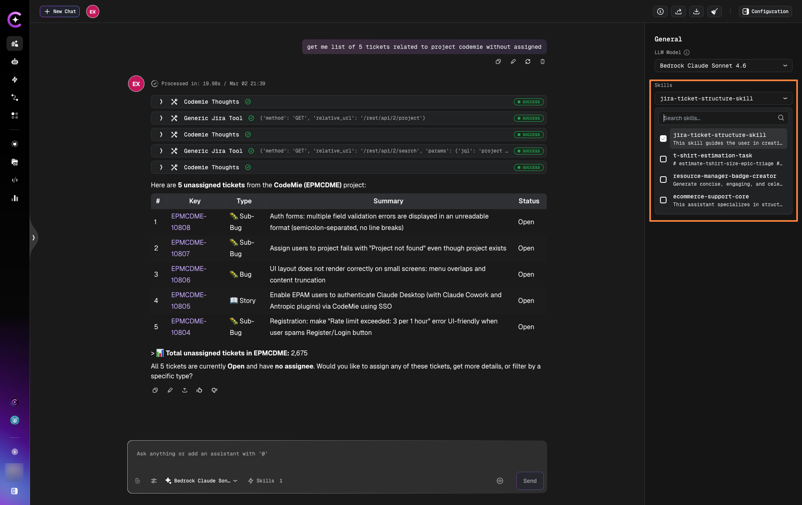

# Skills in Chat

Learn how to dynamically attach and use skills during conversations without modifying the assistant itself.

## Adding Skills in Chat

**Step 1: Open Skills Panel**

1. Start or open a chat with an assistant
2. Click the **Skills** button (input field)

**Step 2: Select Skills**

1. In the **Attach Skills** modal, browse and search for skills:
   - **Project Skills** - Your personal skills
   - **Marketplace Skills** - Community-shared skills
2. Select one or more skills from the list



3. Click **Confirm** to attach skills to this chat session

**Step 3: Use the Skills**

The skills are now available for this conversation:

- Load automatically when relevant
- Provide instructions and guidance
- Inherit required tools (same as assistant-level)



The chat shows loaded skills and connected assistants in the right panel during the conversation.

:::tip
Skills attached in chat persist for the current chat session but don't modify the assistant itself.
:::

## Dynamic Loading Behavior

### On-Demand Activation

Skills attached to chat load based on relevance, just like assistant-level skills:

**Example:**

```yaml
Assistant: BA Helper (no skills attached at assistant level)

Chat Configuration:
  Dynamically Attached Skills:
    - JIRA Ticket Structure
    - Find Duplicate Tickets
```

**Conversation:**

```
User: "Create a story for user authentication"

System:
  - Detects request is about creating tickets
  - Loads "JIRA Ticket Structure" skill
  - Applies skill instructions
Assistant (uses JIRA Ticket Structure):
I'll create a story following our ticket structure guidelines...
```

### Scope of Dynamic Skills

Skills attached in chat:

- **Chat-specific** - Apply only to current conversation
- **Not permanent** - Don't modify the assistant's base configuration
- **Other chats unaffected** - Other conversations with same assistant don't have this skill

## Removing Skills from Chat

To detach a dynamically attached skill:

1. Click the **Skills** button in chat
2. View the list of attached skills
3. Uncheck the checkbox next to the skill you want to remove



The chat shows loaded skills in the right panel. Simply uncheck skills to remove them from the current conversation.

**Effects:**

- Skill no longer loads for this conversation
- Inherited tools from skill are removed
- Other chats unaffected
- Assistant's base configuration unchanged

## Next Steps

- [Skills Overview](./skills-overview) - Learn more about Skills concepts
- [Create Skill](./create-skill) - Build skills for dynamic use
- [Attach to Assistants](./attach-skills-to-assistants) - Permanent skill attachment
