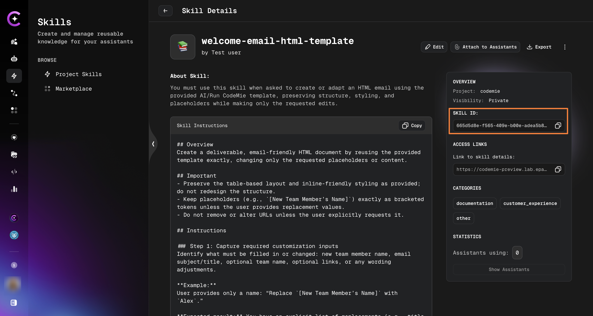
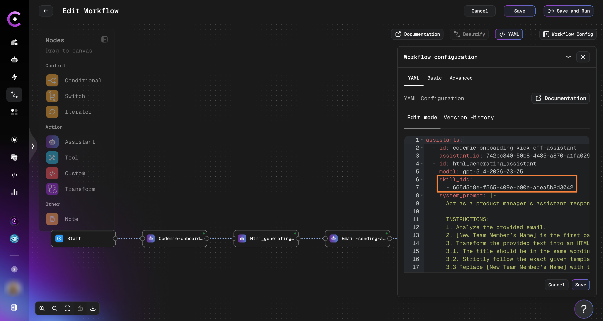
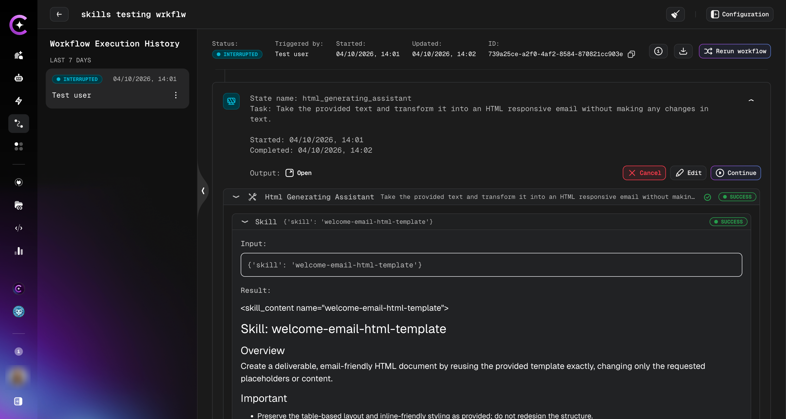

# Skills in Workflow

Attach skills to assistants defined in workflow YAML to extend their capabilities during workflow execution.

## Finding a Skill ID

Each skill has a unique ID required for YAML configuration.

**Step 1: Open Skill Details**

Navigate to **Skills** → **Project Skills** and click on the skill.

**Step 2: Copy the Skill ID**

Find the **Skill ID** field in the right panel and copy the value.



## Configuring Skills in Workflow YAML

**Step 1: Open Workflow Configuration**

Open your workflow in the builder and click **Workflow Config** → **YAML** tab.

**Step 2: Add the `skills` field to the assistant**

Add a `skills` list under the assistant definition, using the skill IDs you copied:

```yaml
assistants:
  - id: html_generating_assistant
    model: gpt-5.2
    system_prompt: |
      Act as a product manager's assistant responsible for creating HTML emails.
    skill_ids:
      - skill-id
```



**Step 3: Save and run the workflow**

Click **Save**, then **Save and Run**. The assistant will load the configured skills on demand during execution.

:::tip
You can attach multiple skills to a single assistant by adding multiple IDs to the `skill_ids` list.
:::

## Viewing Skill Usage in Execution Logs

After the workflow runs, open the execution details to see which skills were invoked.

Navigate to **Workflows** → select your workflow → click **view** button.

Each assistant step shows the skills it loaded, including the full skill content used during that run.



## Related

- [Create a Skill](./create-skill) — Build a new skill from scratch
- [Skills Marketplace](./marketplace-skills) — Discover publicly shared skills
- [Attach Skills to Assistants](./attach-skills-to-assistants) — UI-based skill attachment for regular assistants
- [Workflow Configuration Reference](../workflows/configuration/configuration-reference) — Full YAML reference
