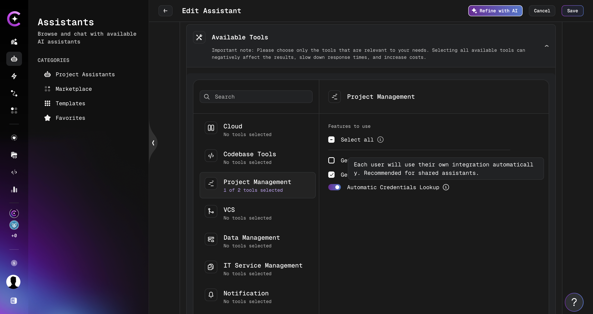
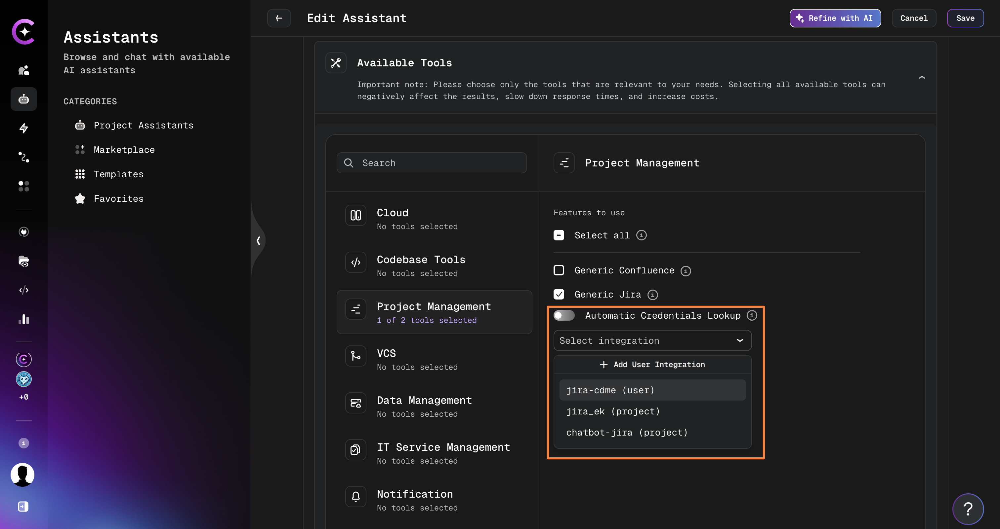
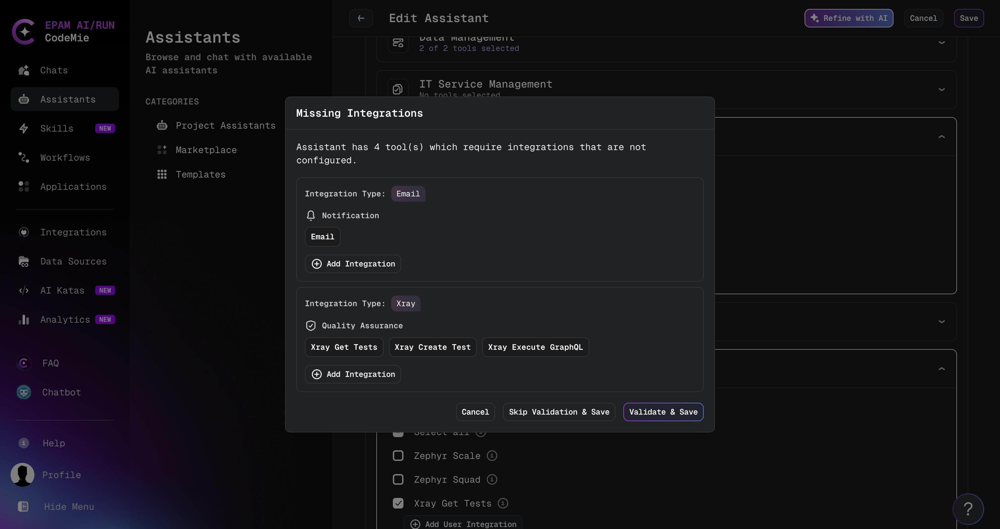
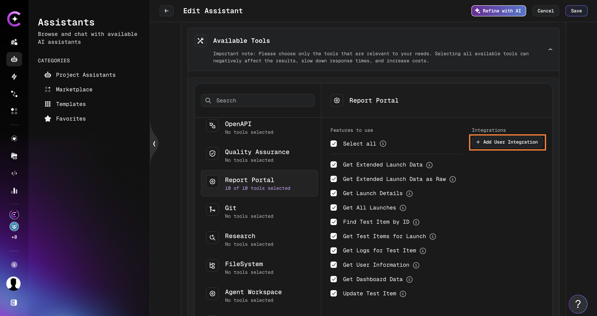

# Integrations

There are three types of integrations, distinguished by scope and who can create them. If you don't explicitly select an integration, CodeMie picks one automatically — see [How the Default Integration Is Selected](#how-the-default-integration-is-selected) below.

- **User Integration**: Personal configuration scoped to the current project. Available only to you.
- **User Global Integration**: Personal integration with the **Global** toggle enabled. Available to you across all projects where you are onboarded.
- **Project Integration**: Shared configuration available to all project members. Requires the `isAdmin` or `applications_admin` role.

:::note
To create a **Project Integration**, you need the `isAdmin` or `applications_admin` role. To request `applications_admin` access, submit a Support ticket. See [Project & User Management](../../project-user-management/index.mdx) for details on managing roles.
:::

## How the Default Integration Is Selected

When a tool requires an integration and no specific one has been chosen, CodeMie picks it automatically. **User Integration always takes priority over Project Integration.**

| Priority | Type                        | Created in                                               | Visible to                                        |
| -------- | --------------------------- | -------------------------------------------------------- | ------------------------------------------------- |
| 1        | **User Integration**        | **User** tab, current project                            | You only, in this project                         |
| 2        | **User Global Integration** | **User** tab, **Global** toggle enabled                  | You only, in all projects where you are onboarded |
| 3        | **Project Integration**     | **Project** tab (`isAdmin` or `applications_admin` only) | All project members                               |

If no matching integration is found at any level, the action requiring it will fail.

### When does this matter?

**One integration of a type** — it is always used automatically. Nothing to configure.

**Multiple integrations of the same type** — the priority above applies unless a specific one is selected manually in the assistant form.

### Tips

- Use **User Global Integration** if you use the same credentials across multiple projects — configure once, use everywhere.
- **Project Integration** acts as a shared fallback for team members who haven't set up their own.
- If a tool is using unexpected credentials, go to **Integrations → User** and check whether a User Integration is overriding the project-level one.

## Automatic Credentials Lookup

When adding a tool to an assistant, each tool that has at least one configured integration displays an **Automatic Credentials Lookup** toggle.

| Toggle state     | Behavior                                                                                                                                                                |
| ---------------- | ----------------------------------------------------------------------------------------------------------------------------------------------------------------------- |
| **On** (default) | CodeMie selects the integration automatically using the priority order above. Each user of the assistant uses their own integration. Recommended for shared assistants. |
| **Off**          | A specific integration must be selected from the dropdown. Other users of the assistant may not have access to that integration. Not recommended for shared assistants. |

When the toggle is **On**, the integration dropdown is hidden — no manual selection is needed:

When the toggle is **Off**, the dropdown becomes visible and a specific integration can be chosen:

:::tip
Leave **Automatic Credentials Lookup** on for shared assistants. This ensures each team member uses their own credentials automatically, without requiring the assistant owner to share their personal integration.
:::

:::warning
If **Automatic Credentials Lookup** is turned off and a specific integration is selected, other users who do not have access to that integration will not be able to use the tool.
:::

## Setting Up Integrations

1. In the AI/Run CodeMie main menu, click the **Integrations** tab:

   

2. In the Integrations menu, click **User** or **Project** and then click the **+ Create** button:

   

3. Select the desired tool from the **Credential Type** dropdown and specify the credentials, then click **Save**:

   

:::note
Most of the tools require you to specify the URL, token, and alias. Alias is the name of the setting that will be displayed in the integrations list.
:::

:::tip
The **Credential Type** dropdown is sorted alphabetically and includes a scrollbar, making it easy to locate the required credential type even when many options are available.
:::

## Integration Validation During Assistant Save

When you save or publish an assistant, the platform automatically checks whether all
selected tools have the required integrations configured. If any are missing, a
**Missing Integrations** modal appears before saving.

The modal lists every integration type that needs to be set up, grouped by type, and shows
which tools depend on each one. For each missing integration you have two options:

- Click **Add Integration** — opens the Create User Integration page for that type. After
  saving the integration, return to the assistant and save again.
- Leave it as-is and click **Skip Validation & Save** — saves the assistant without the
  missing integrations. Tools without integrations will not work until you set them up.

**Modal action buttons:**

| Button                     | Behavior                                                                 |
| -------------------------- | ------------------------------------------------------------------------ |
| **Validate & Save**        | Re-checks integrations and saves if all required ones are now configured |
| **Skip Validation & Save** | Saves immediately, bypassing the validation check                        |
| **Cancel**                 | Closes the modal and returns to the assistant form without saving        |

:::warning
An assistant saved with missing integrations will fail at runtime for any tool that
requires those integrations. Configure all required integrations before publishing.
:::

## Alternative Ways to Create Integrations

As an alternative way of getting to the Integrations page, you can click the **Add User Integration** button in front of the desired tool when creating/editing your assistant:

This link will also lead to the Create User Integration page. Note that this link appears only if no such tools are configured by the users.

If you have two or more integrations related to one tool, you can specify the needed one when adding/editing assistants.

## Creating Integration from Data Source Page

For Datasource you can create user integration from data source page:

1. Navigate or create a new datasource.

2. Click **Select integration** for.

3. Click the **Add User Integration** button.

   
   

4. After saving, the new integration appears in the existing list without requiring a page reload or navigation away.

## Filter Integrations

As you work with AI/Run CodeMie, the number of integrations will increase. To simplify navigation between integrations, use the filters. You can filter integrations by:

- **NAME**
- **PROJECT**
- **TYPE**
- **GLOBAL**
