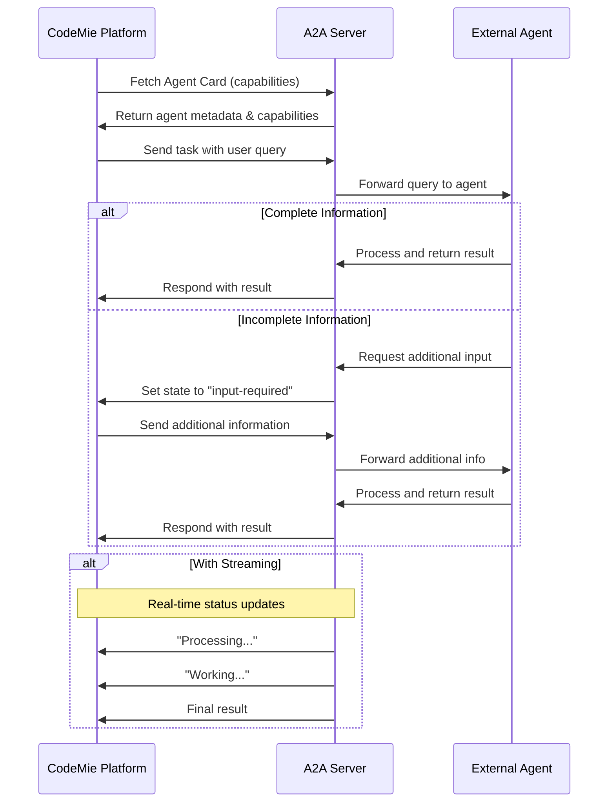
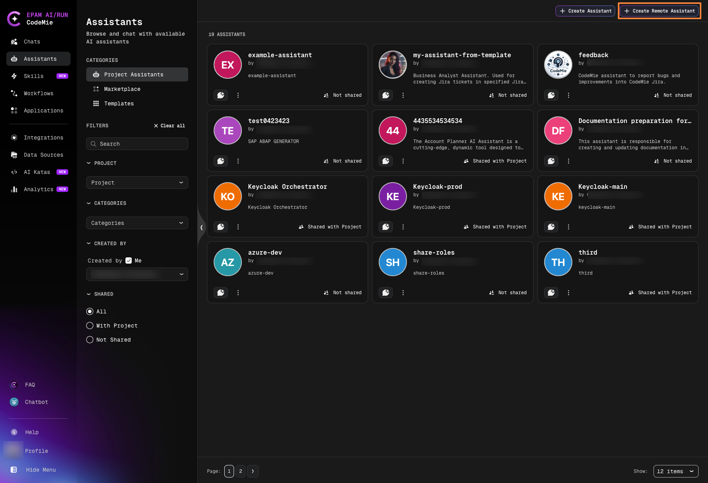
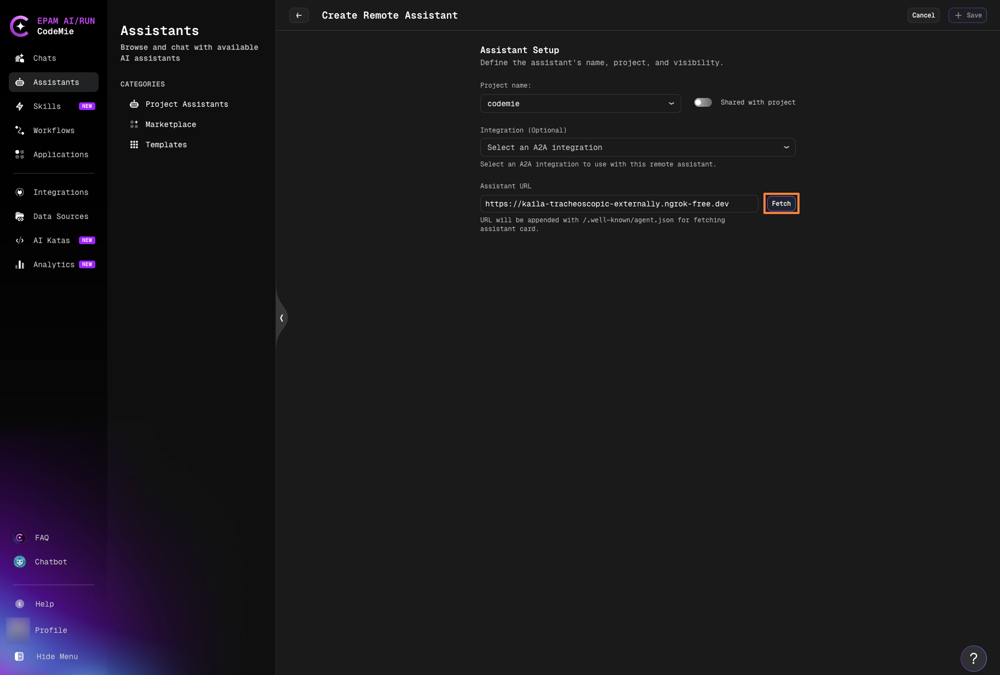
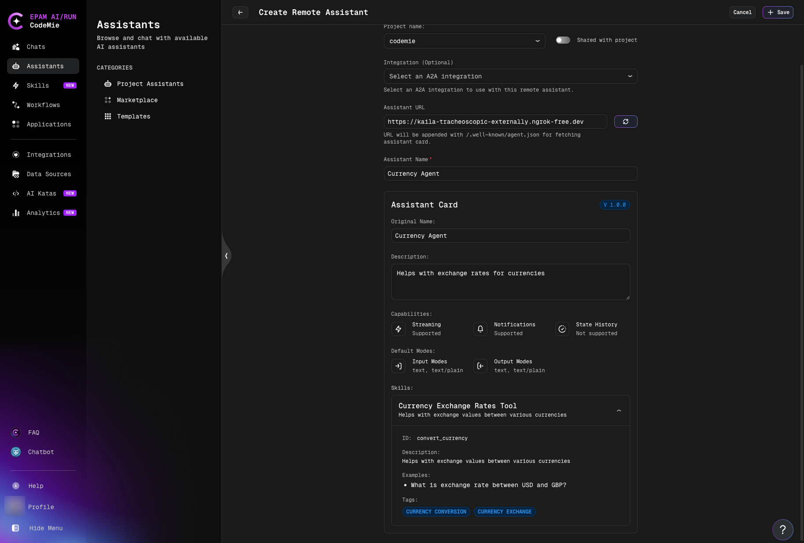
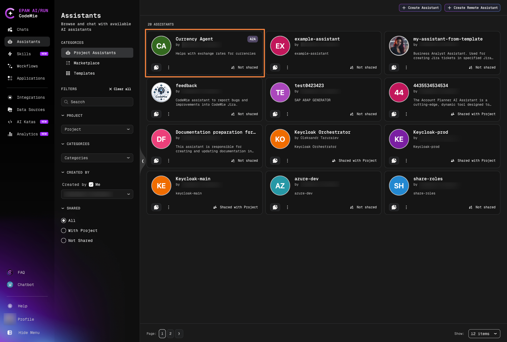
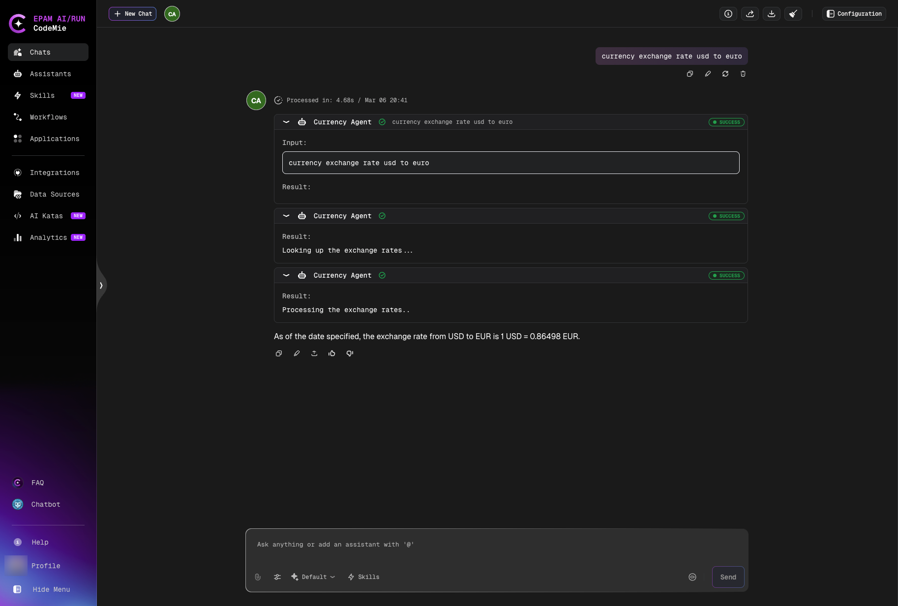
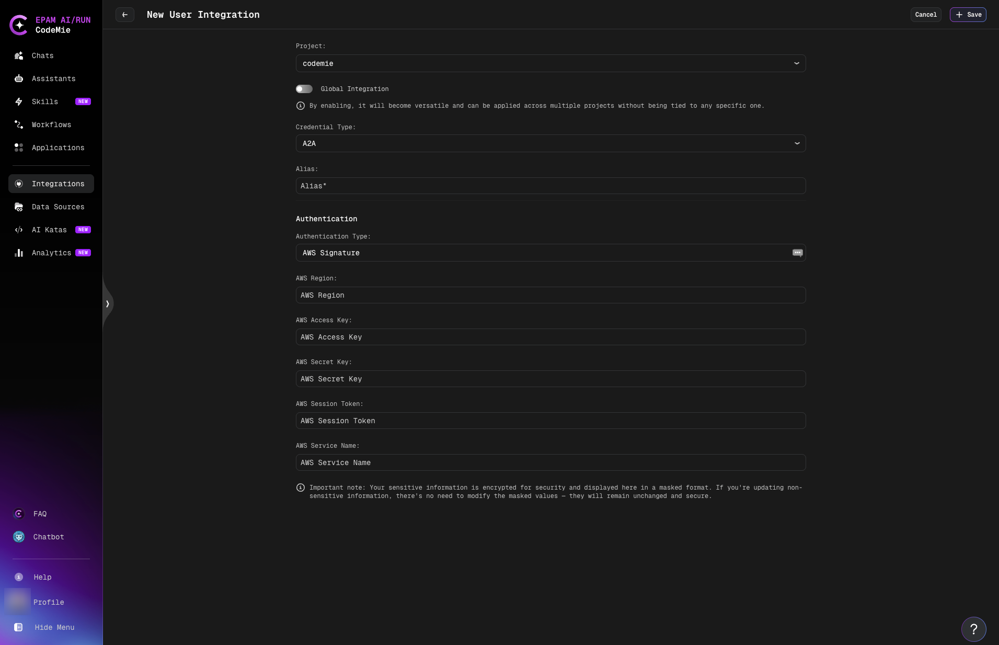
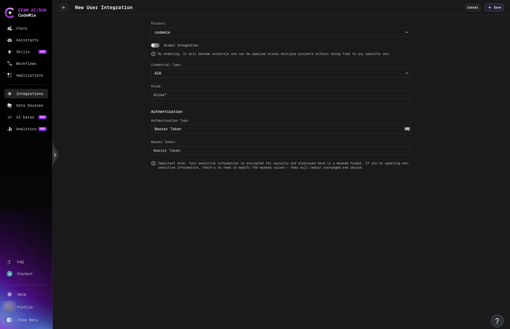
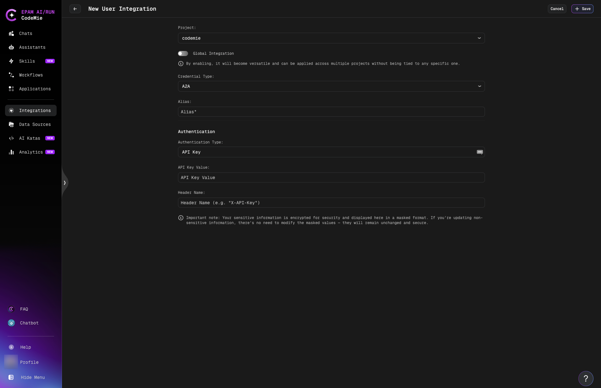
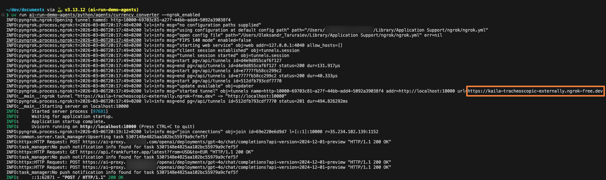

import Tabs from '@theme/Tabs';
import TabItem from '@theme/TabItem';

# Agent-to-Agent (A2A) Protocol

CodeMie supports the **Agent-to-Agent (A2A) Protocol**, an open-standard protocol designed to enable seamless communication and collaboration between AI agents built with different frameworks and by different vendors.
A2A provides a common language that breaks down silos and fosters interoperability across the AI ecosystem.

With A2A integration, you can connect CodeMie to external AI agents—regardless of their framework or origin—allowing them to communicate effortlessly and work together on complex tasks.

## Key Features

- **Framework-Agnostic**: Connect agents built with LangGraph, LangChain, CrewAI, or any framework supporting A2A
- **Vendor-Independent**: Integrate agents from different providers and platforms
- **Remote Assistants**: Add external agents as assistants within CodeMie
- **Standardized Communication**: JSON-RPC 2.0 protocol for reliable agent interactions
- **Multi-turn Conversations**: Support for conversational flows with state management
- **Real-time Streaming**: Get status updates and results as they're processed
- **Secure Integration**: Optional authentication and authorization support

## How It Works

A2A enables standardized interaction between CodeMie and external agents through a client-server model:



## Prerequisites

To integrate an external agent with CodeMie via A2A:

- **Agent URL**: The external agent must expose an A2A-compatible endpoint
- **Agent Card**: The agent should provide a card describing its capabilities
- **Network Access**: CodeMie must be able to reach the agent's URL

:::info Authentication
Most A2A agents are publicly accessible and don't require authentication.
If your agent requires authorization, see [Authentication](#authentication-optional) section below.
:::

## Create Remote Assistant

1. Navigate to **Assistants** and click the **Create Remote Assistant** button in the top-right corner:

   

2. On the **Create Remote Assistant** page, configure the basic settings:
   - **Project**: Select the project where the assistant will be created.
   - **Share with project**: Toggle on to make the assistant available to project team members.
   - **Integration (Optional)**: Leave empty for public agents. See [Authentication](#authentication-optional) section if your agent requires credentials.

   

3. Enter the **Assistant URL** and click **Fetch**:

   The assistant URL should point to your A2A agent's endpoint. For example:
   - `https://example.com/agent`
   - `https://example.ngrok-free.dev`

   After clicking **Fetch**, CodeMie will send a request to retrieve the agent card.

4. Review the fetched agent card details:

   

   The agent card contains:
   - **Assistant name**: Pre-populated from the agent. You can customize it if desired.
   - **Description**: Agent's purpose and capabilities
   - **Skills**: Available tools and functions
   - **Other metadata**: Version, supported modes, etc.

   :::tip
   The assistant card provides transparency about what the remote agent can do. Review it carefully to understand the agent's capabilities before saving.
   :::

5. Click **Save** to create the remote assistant.

## Work with Remote Assistants

Remote assistants are marked with an **A2A** label to differentiate them from regular CodeMie assistants.



### Start a Conversation

Click on the remote assistant card to open the chat interface. The conversation works just like with regular CodeMie assistants:



- Type your questions or requests
- Receive real-time status updates during processing
- View results directly in the chat
- Continue multi-turn conversations with context

### View Agent Card

Click the assistant icon in the chat to view the agent card and detailed capabilities at any time.

### Edit Remote Assistant

Remote assistants support limited editing to maintain integrity:

- **Editable**: Assistant name, project assignment, sharing settings
- **Read-only**: All agent-specific fields (description, tools, capabilities)

This ensures that the remote agent's configuration remains consistent with its actual implementation.

### Delete Remote Assistant

Remote assistants can be deleted like regular assistants. This only removes the reference in CodeMie—the external agent continues to run independently.

## Authentication (Optional)

:::info
Most A2A agents are publicly accessible and don't require authentication. Only configure this if your external agent requires credentials.
:::

If your external agent requires authentication, CodeMie supports multiple authentication types:

### Configure A2A Integration

1. Navigate to **Integrations** → **User** or **Project** → **+ Create**.

2. Select basic parameters:
   - **Project**: Select your CodeMie project name.
   - **Global Integration**: Toggle on to use across multiple projects.
   - **Credential Type**: Select **A2A**.
   - **Alias**: Enter integration name (e.g., "my-agent-auth").

3. Choose **Authentication Type** and configure credentials:

<Tabs groupId="auth-type">
  <TabItem value="aws" label="AWS Signature" default>

Use for agents deployed on AWS that require AWS Signature Version 4 authentication.



**Required fields:**

<ul>
<li><strong>AWS Region</strong>: AWS region where your agent is deployed (e.g., <code>us-east-1</code>)</li>
<li><strong>AWS Access Key</strong>: Your AWS access key ID</li>
<li><strong>AWS Secret Key</strong>: Your AWS secret access key</li>
<li><strong>AWS Session Token</strong> (optional): Temporary session token for role-based access</li>
<li><strong>AWS Service Name</strong> (optional): AWS service name for signature (e.g., <code>execute-api</code>)</li>
</ul>

  </TabItem>
  <TabItem value="bearer" label="Bearer Token">

Use for agents that require bearer token authentication.



**Required fields:**

<ul>
<li><strong>Bearer Token</strong>: The authentication token provided by your agent</li>
</ul>

  </TabItem>
  <TabItem value="basic" label="Basic Auth">

Use for agents that require username/password authentication.


**Required fields:**

<ul>
<li><strong>Username</strong>: Your username</li>
<li><strong>Password</strong>: Your password</li>
</ul>

  </TabItem>
  <TabItem value="api-key" label="API Key">

Use for agents that require API key authentication via custom headers.



**Required fields:**

<ul>
<li><strong>API Key Value</strong>: Your API key</li>
<li><strong>Header Name</strong>: Custom header name (e.g., <code>X-API-Key</code>, <code>Authorization</code>)</li>
</ul>

  </TabItem>
</Tabs>

### Using the Integration

After creating the integration:

1. Click **Save**.
2. When creating a remote assistant, select this integration in the **Integration (Optional)** dropdown.
3. CodeMie will automatically include the authentication credentials when communicating with the agent.

## Example: Currency Conversion Agent

A sample currency conversion agent built with LangGraph demonstrates A2A capabilities:

**Repository**: [ai-run-demo-agents](https://github.com/epam-gen-ai-run/ai-run-demo-agents)

**Sample Agent**: `/python/agents/currency_converter`

### Agent Capabilities

- Real-time currency conversion using Frankfurter API
- Multi-turn conversations with follow-up questions
- Streaming status updates during processing
- Conversational memory across interactions

### Example Queries

```
"How much is 100 USD in EUR?"
"What's the exchange rate for USD to JPY?"
"Convert 50 EUR to GBP"
```

### Try It Yourself

1. Clone the [ai-run-demo-agents](https://github.com/epam-gen-ai-run/ai-run-demo-agents) repository:

   ```bash
   git clone https://github.com/epam-gen-ai-run/ai-run-demo-agents.git
   cd ai-run-demo-agents/python/agents/currency_converter
   ```

2. Set up your environment variables:

   ```bash
   echo "CHAT_MODEL_PROVIDER=azure" > .env
   echo "AZURE_OPENAI_API_KEY=your_api_key_here" >> .env
   echo "AZURE_OPENAI_ENDPOINT=your_endpoint_url" >> .env
   echo "AZURE_OPENAI_API_VERSION=2024-12-01-preview" >> .env
   ```

3. Run the agent with ngrok to expose it publicly:

   ```bash
   uv run . --ngrok_enabled
   ```

   The agent will start and ngrok will provide a public URL:

   

4. Copy the ngrok URL from the terminal output (e.g., `https://easily-trasnocheoic-externally.ngrok-free.dev`)

5. In CodeMie, create a remote assistant using this URL as described in the [Create Remote Assistant](#create-remote-assistant) section

:::tip Developer Community
We encourage developers to create their own A2A-compatible agents and share them with the community. Check the [ai-run-demo-agents](https://github.com/epam-gen-ai-run/ai-run-demo-agents) repository for examples and contribution guidelines.
:::

## Important Notes

### Agent Compatibility

- External agents must implement the A2A protocol specification
- Supported communication: JSON-RPC 2.0 over HTTP/HTTPS
- Required endpoints: agent card fetch, task send, task subscribe (for streaming)

### Network Requirements

- CodeMie must have network access to the agent URL
- For local development, use tools like ngrok to expose agents
- Production agents should use HTTPS with valid SSL certificates

### Security Considerations

:::warning Agent Trust
Only add agents from trusted sources. Remote agents have access to conversation context and can process sensitive information shared in chats.
:::

- Use A2A integration with authentication for production agents
- Review agent cards to understand what data the agent accesses
- Consider using project-level assistants to limit scope

### Timeout Configuration

Administrators can configure A2A timeout settings in the platform configuration:

- `A2A_AGENT_CARD_FETCH_TIMEOUT`: Maximum seconds to fetch agent capability cards (default: 30s)
- `A2A_AGENT_REQUEST_TIMEOUT`: Maximum seconds to wait for agent responses (default: 30s)

See [API Configuration](../../../admin/configuration/codemie/api-configuration.md#agent-to-agent-a2a-communication) for details.

## Learn More

- **[A2A Protocol Documentation](https://google.github.io/A2A/#/documentation)** - Official A2A protocol specification
- **[Demo Agents Repository](https://github.com/epam-gen-ai-run/ai-run-demo-agents)** - Example agents and implementation guides
- **[Sub-Assistants and Orchestration](../../assistants/sub-assistants-multi-assistant-orchestrator.md)** - Learn about agent-to-agent communication within CodeMie
- **[API Configuration](../../../admin/configuration/codemie/api-configuration.md)** - Platform-level A2A settings
