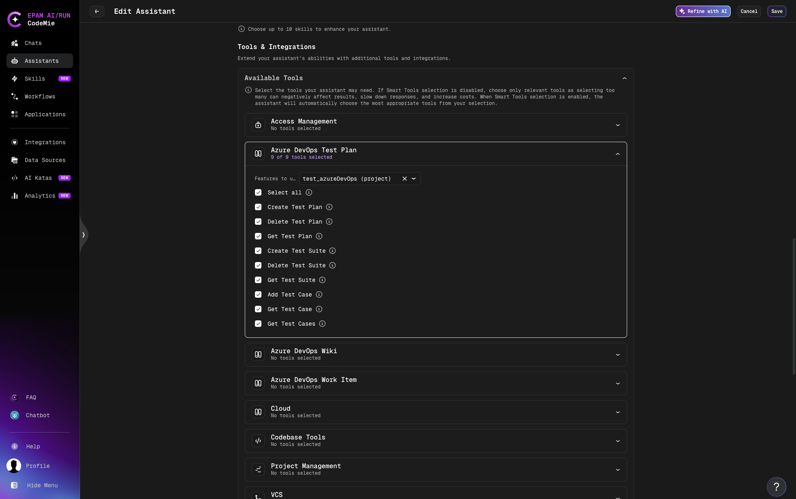

# Azure DevOps Test Plans

The **Azure DevOps Test Plan** tool lets your CodeMie assistant create and manage test plans, test suites, and test cases in your Azure DevOps project using natural language.

## Prerequisites

Before adding the Test Plans tool to an assistant, set up an AzureDevOps integration in CodeMie. See [Azure DevOps — Configure Integration](./index.md#configure-integration-in-codemie).

## Add Test Plans Tool to an Assistant

1. Open **Explore Assistant** and click **Create Assistant** (or edit an existing one).
2. Fill in the assistant details: project, name, description, and system instructions.
3. In the **Tools & Integrations** section, expand **Azure DevOps Test Plan**.
4. Select the tools you want to enable (or check **Select all**).
5. In the **Connected to** dropdown, select your AzureDevOps integration alias.
6. Click **Create** or **Save**.



## Available Operations

| Operation             | Description                                                                      |
| --------------------- | -------------------------------------------------------------------------------- |
| **Create Test Plan**  | Create a new test plan in the project                                            |
| **Delete Test Plan**  | Delete an existing test plan by ID                                               |
| **Get Test Plan**     | Retrieve a specific test plan by ID, or list all test plans if no ID is provided |
| **Create Test Suite** | Create a new test suite within a test plan                                       |
| **Delete Test Suite** | Delete a test suite from a test plan                                             |
| **Get Test Suite**    | Retrieve a specific suite by ID, or list all suites in a plan                    |
| **Get Test Case**     | Retrieve a specific test case from a suite                                       |
| **Get Test Cases**    | List all test cases in a test suite                                              |

## Test Structure Overview

Azure DevOps organizes tests in a three-level hierarchy:

```
Test Plan
└── Test Suite
    └── Test Case (linked Work Item)
```

- **Test Plan** — top-level container, typically one per release or sprint
- **Test Suite** — groups related test cases (static, requirement-based, or query-based)
- **Test Case** — an individual test, stored as a Work Item of type "Test Case"

## Usage Examples

Once the assistant is set up, interact with it using natural language:

**Create a test plan:**

> "Create a test plan called 'Release 2.4 Regression' for the MyProject project"

**Get all test plans:**

> "List all test plans in the project"

**Create a test suite:**

> "Create a test suite called 'Login Flow' under test plan 12"

**List test cases in a suite:**

> "Show all test cases in suite 45 of test plan 12"

**Add a test case to a suite:**

> "Add work item 1080 as a test case to suite 45 in test plan 12"
