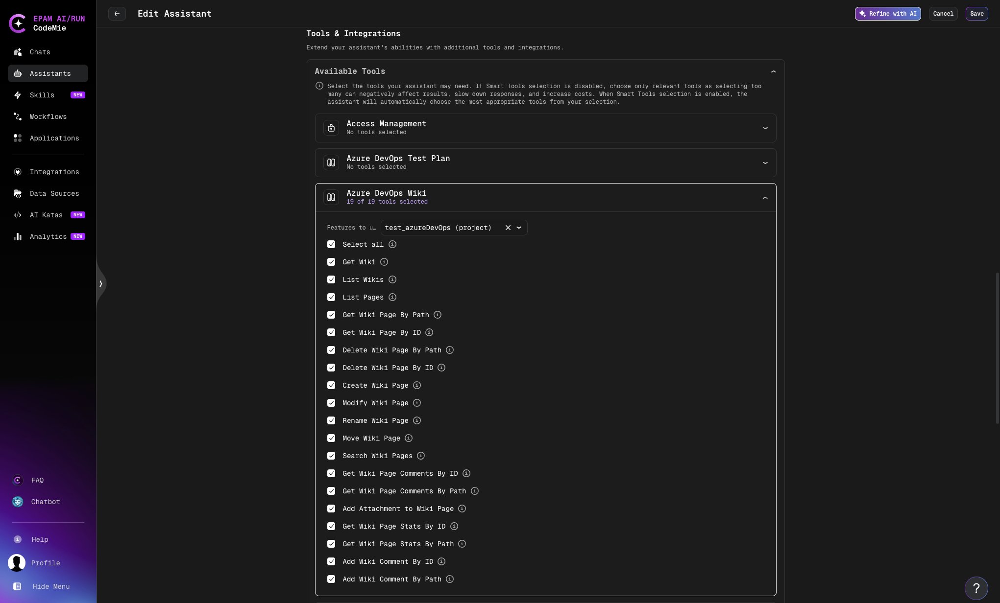

# Azure DevOps Wiki

The **Azure DevOps Wiki** tool lets your CodeMie assistant read, create, modify, search, and manage wiki pages in your Azure DevOps project using natural language.

## Prerequisites

Before adding the Wiki tool to an assistant, set up an AzureDevOps integration in CodeMie. See [Azure DevOps — Configure Integration](./azure-devops.md#configure-integration-in-codemie).

## Add Wiki Tool to an Assistant

1. Open **Explore Assistant** and click **Create Assistant** (or edit an existing one).
2. Fill in the assistant details: project, name, description, and system instructions.
3. In the **Tools & Integrations** section, expand **Azure DevOps Wiki**.
4. Select the tools you want to enable (or check **Select all**).
5. In the dropdown, select your AzureDevOps integration alias.
6. Click **Create** or **Save**.



## Available Operations

| Operation                          | Description                                                         |
| ---------------------------------- | ------------------------------------------------------------------- |
| **Get Wiki**                       | Retrieve metadata for a specific wiki by ID or name                 |
| **List Wikis**                     | List all wikis in the project                                       |
| **List Pages**                     | List pages under a given path with pagination support               |
| **Get Wiki Page By Path**          | Retrieve wiki page content by its path (e.g., `/Parent/Child/Page`) |
| **Get Wiki Page By ID**            | Retrieve wiki page content by its numeric ID                        |
| **Delete Wiki Page By Path**       | Delete a page identified by path                                    |
| **Delete Wiki Page By ID**         | Delete a page identified by numeric ID                              |
| **Create Wiki Page**               | Create a new page under a specified parent path                     |
| **Modify Wiki Page**               | Update the content of an existing page                              |
| **Rename Wiki Page**               | Rename a page while preserving its content and history              |
| **Move Wiki Page**                 | Move a page to a different location in the hierarchy                |
| **Search Wiki Pages**              | Full-text search across all wiki pages (up to 100 results)          |
| **Get Wiki Page Comments By ID**   | Retrieve comments for a page by its numeric ID                      |
| **Get Wiki Page Comments By Path** | Retrieve comments for a page by its path                            |
| **Add Attachment to Wiki Page**    | Upload a file attachment to a wiki page (max 19 MB)                 |
| **Get Wiki Page Stats By ID**      | Get view statistics for a page by ID (up to 30 days)                |
| **Get Wiki Page Stats By Path**    | Get view statistics for a page by path (up to 30 days)              |

:::tip
Wiki identifiers can be either the wiki ID or the wiki name (e.g., `MyProject.wiki`). Page paths must start from the page level — do not include the `/Overview/Wiki` prefix shown in Azure DevOps breadcrumbs.
:::

## Page Path Format

Azure DevOps wiki page paths follow a hierarchical structure. Use the page hierarchy from your wiki, not the URL:

```
# ✅ Correct — page path
/Architecture/Backend/API-Design

# ❌ Incorrect — includes breadcrumb prefix
/Overview/Wiki/Architecture/Backend/API-Design
```

Use `"/"` as the path for the root page or to list top-level pages.

## Usage Examples

Once the assistant is set up, interact with it using natural language:

**Find a wiki page:**

> "Show me the content of the API Design wiki page under Architecture/Backend"

**Create a new page:**

> "Create a new wiki page called 'Deployment Checklist' under /Operations with the following content: ..."

**Search the wiki:**

> "Search the wiki for pages about authentication"

**Update an existing page:**

> "Update the Onboarding page — add a section about the new SSO setup"

**Move a page:**

> "Move the 'Old Processes' page to the /Archive section"
