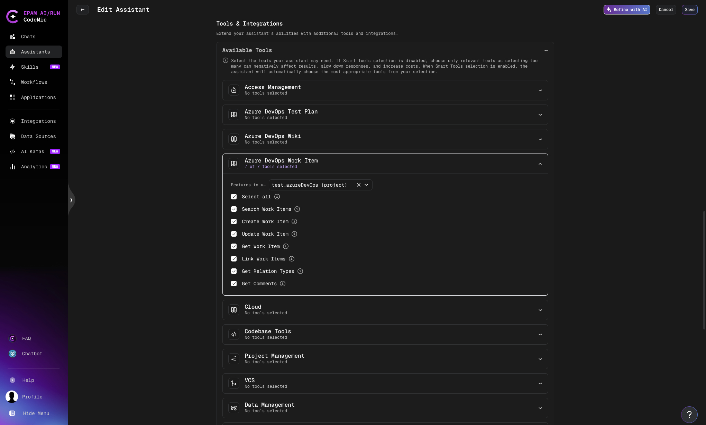

# Azure DevOps Work Items

The **Azure DevOps Work Item** tool lets your CodeMie assistant create, update, search, and link work items in your Azure DevOps project using natural language.

## Prerequisites

Before adding the Work Items tool to an assistant, set up an AzureDevOps integration in CodeMie. See [Azure DevOps — Configure Integration](./index.md#configure-integration-in-codemie).

## Add Work Items Tool to an Assistant

1. Open **Explore Assistant** and click **Create Assistant** (or edit an existing one).
2. Fill in the assistant details: project, name, description, and system instructions.
3. In the **Tools & Integrations** section, expand **Azure DevOps Work Item**.
4. Select the tools you want to enable (or check **Select all**).
5. In the dropdown, select your AzureDevOps integration alias.
6. Click **Create** or **Save**.

## Available Operations

| Operation              | Description                                                                         |
| ---------------------- | ----------------------------------------------------------------------------------- |
| **Create Work Item**   | Create a new work item of type Task, Bug, Issue, or Epic; supports file attachments |
| **Update Work Item**   | Update fields on an existing work item by ID; supports adding file attachments      |
| **Get Work Item**      | Retrieve a work item by ID, optionally including relations and attachments          |
| **Search Work Items**  | Search work items using a WIQL query                                                |
| **Link Work Items**    | Create a relationship link between two work items                                   |
| **Get Relation Types** | List all available relation type names and reference names                          |
| **Get Comments**       | Retrieve comments for a specific work item                                          |

## Usage Examples

Once the assistant is set up, interact with it using natural language:

**Create a work item:**

> "Create a Bug titled 'Login page crashes on Safari' in the current sprint"

**Search for work items:**

> "Find all open Tasks assigned to me in project MyProject"

**Update a work item:**

> "Update work item 1042 — set status to In Progress and add a comment: started implementation"

**Attach a file to an existing work item:**

> "Attach the file report.pdf to work item 1042"

**Link work items:**

> "Link work item 1042 as a dependency of work item 1050"
