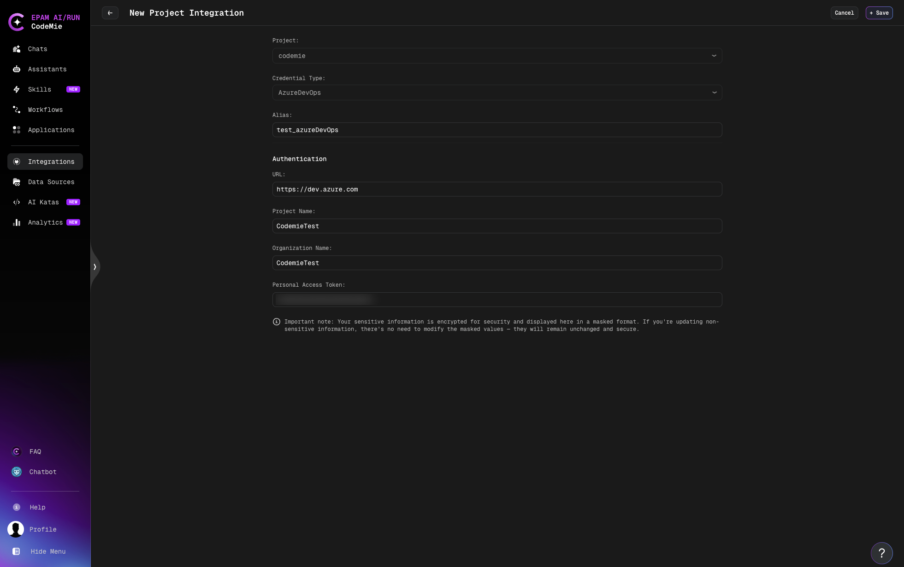

# Azure DevOps

AI/Run CodeMie integrates with Microsoft Azure DevOps to enable automated project management, knowledge base operations, and quality assurance workflows directly from your assistants.

## Available Tools

| Tool                                                 | Description                                                                  |
| ---------------------------------------------------- | ---------------------------------------------------------------------------- |
| [Azure DevOps Work Items](./azure-devops-work-items) | Create, update, search, and link work items across your Azure DevOps project |
| [Azure DevOps Wiki](./azure-devops-wiki)             | Read, create, modify, and search wiki pages in your Azure DevOps project     |
| [Azure DevOps Test Plans](./azure-devops-test-plans) | Manage test plans, test suites, and test cases in your Azure DevOps project  |

All three tools share the same **AzureDevOps** credential type and integration setup described below.

## Prerequisites: Generate a Personal Access Token

All Azure DevOps tools authenticate with a Personal Access Token (PAT).

### 1.1 Navigate to Personal Access Tokens

1. Log in to your Azure DevOps account at `https://dev.azure.com`.
2. Click on your **user icon** in the top-right corner.
3. Select **Personal Access Tokens**.

### 1.2 Create a New Token

1. Click **+ New Token**.
2. Fill in the token creation form:
   - **Name**: Enter a descriptive name (e.g., `CodeMie Integration`).
   - **Organization**: Select your organization from the dropdown.
   - **Expiration**: Set an appropriate expiration date.
   - **Scopes**: Select **Full access** or grant the following minimum scopes:
     - **Work Items**: Read & write
     - **Wiki**: Read & write
     - **Test Management**: Read & write
3. Click **Create**.

:::warning
Copy the generated token immediately — it will not be displayed again. Store it securely.
:::

## Configure Integration in CodeMie

### 2.1 Open Integrations

In the CodeMie main menu, click **Integrations**.

### 2.2 Create a New Integration

1. Select integration type: **User** or **Project**.
2. Click **+ Create**.
3. Fill in the integration form:
   - **Project**: Select your CodeMie project.
   - **Credential Type**: Select **AzureDevOps**.
   - **Alias**: Enter a recognizable name (e.g., `azure-devops-prod`).
   - **URL**: Enter your Azure DevOps organization URL (e.g., `https://dev.azure.com`).
   - **Project Name**: Enter your Azure DevOps project name (e.g., `MyProject`).
   - **Organization Name**: Enter your Azure DevOps organization name.
   - **Personal Access Token**: Paste the PAT created in the previous step.
4. Click **Save**.

:::tip
Enable **Global Integration** if you want to reuse this integration across multiple CodeMie projects without creating separate credentials for each one.
:::

:::note
Sensitive fields (PAT) are encrypted and displayed in masked format. When updating non-sensitive fields, leave the masked values unchanged — they will remain secure.
:::

Once saved, this integration is available for selection when configuring any of the Azure DevOps tools in your assistant.
