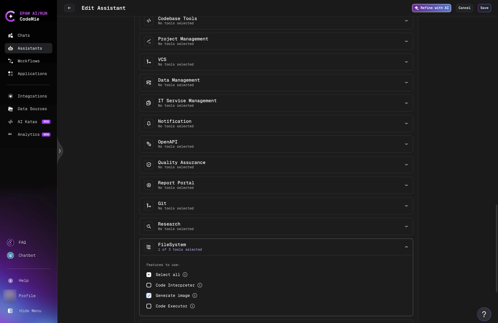

# FileSystem Tools

## Overview

FileSystem tools provide AI/Run CodeMie assistants with powerful capabilities for code execution, data analysis, and image generation.
These tools enable assistants to process files, execute Python code, generate visualizations, and create images directly within conversations.

The FileSystem toolset includes three distinct capabilities:

- **Code Interpreter**: Execute Python code for data analysis, calculations, and file processing
- **Code Executor**: Execute Python code with file upload support for advanced data processing and visualization
- **Generate Image**: Create images using AI image generation models

---

## Code Interpreter

Code Interpreter provides access to a Python shell environment, allowing AI assistants to execute Python commands for various computational tasks, data analysis, and visualization purposes.

**Key Capabilities:**

- Complex mathematical operations and calculations
- Data manipulation and analysis using Python libraries
- Generate diagrams, plots, and charts
- Create flowcharts using mermaid-py
- Produce graphs and visualizations with matplotlib
- Sequence diagrams with python-mermaid

**Use Cases:**

- Perform calculations and computations
- Analyze data without file uploads
- Generate visual representations of data
- Create flowcharts and diagrams programmatically
- Execute Python code for quick computational tasks

---

## Code Executor

Code Executor is an advanced tool that executes Python code to analyze data, generate visualizations, process documents, and perform calculations.
It provides enhanced capabilities with file upload support and a secure sandbox environment.

**Key Capabilities:**

- Upload files to sandbox environment for processing
- Data analysis using pandas and numpy
- Create charts, graphs, and plots with matplotlib
- Process Excel, Word, PowerPoint, and PDF files
- Perform mathematical calculations and data transformations
- Image processing and manipulation
- Export generated files for download

**Use Cases:**

- Upload and process CSV or Excel files
- Generate insights from uploaded datasets
- Process uploaded images and create visualizations
- Extract information from documents (PDF, Word, Excel, PowerPoint)
- Perform complex calculations on uploaded data
- Transform data between different formats

**Workflow:**

1. **Upload Files**: Files are automatically uploaded to the sandbox
2. **Execute Code**: Code processes the uploaded files
3. **Generate Results**: New files or visualizations are created
4. **Export Results**: Download results using the export_files parameter

:::info Sandbox Environment
Code Executor runs in a secure sandbox environment where all files are isolated, ensuring safe execution of code and file operations.
:::

---

## Generate Image

Generate Image enables AI assistants to create images based on textual descriptions.
This tool utilizes the DALL-E model to generate visual content from text prompts.
It does not require integration setup and is available out of the box.

**Key Capabilities:**

- Text-to-image generation using DALL-E
- Generate artwork, illustrations, and visual content
- Produce images for presentations, documents, and marketing materials
- Create unique images tailored to specific requirements

**Use Cases:**

- Generate custom images from descriptions
- Create visual content for documentation
- Produce illustrations for presentations
- Generate design concepts and mockups

---

## Using FileSystem Tools in Assistants

When creating or editing an assistant:

1. Navigate to **Assistants** section
2. Click **+ Create Assistant** or edit an existing one
3. Scroll to **Available Tools** section
4. Locate the **FileSystem** category



5. **Select Tools**: Choose the tools you need:
   - Check **Select all** to enable all FileSystem tools
   - Or individually select:
     - ☑️ **Code Interpreter** - For Python code execution and analysis
     - ☑️ **Code Executor** - For advanced file processing with uploads
     - ☑️ **Generate Image** - For AI image generation

---

## Usage Examples

### Example 1: Data Analysis with Code Interpreter

**Scenario**: Perform statistical analysis on sales data

**User**: "Calculate the mean, median, and standard deviation of these sales numbers: 45, 67, 89, 34, 56, 78, 90, 23, 45, 67"

**Assistant** (using Code Interpreter):

```python
import statistics

sales = [45, 67, 89, 34, 56, 78, 90, 23, 45, 67]
mean = statistics.mean(sales)
median = statistics.median(sales)
stdev = statistics.stdev(sales)

print(f"Mean: {mean}")
print(f"Median: {median}")
print(f"Standard Deviation: {stdev}")
```

### Example 2: File Processing with Code Executor

**Scenario**: Upload a CSV file and generate visualization

**User**: "Analyze this sales data CSV and create a bar chart showing monthly revenue"

**Assistant** (using Code Executor):

1. Uploads the CSV file to sandbox
2. Executes Python code to read and process data with pandas
3. Generates a bar chart using matplotlib
4. Exports the visualization for download

### Example 3: Creating Flowcharts

**Scenario**: Generate a workflow diagram

**User**: "Create a flowchart showing the order processing workflow"

**Assistant** (using Code Interpreter with mermaid-py):

```python
from mermaid import Mermaid

flowchart = """
graph TD
    A[Order Received] --> B{Payment OK?}
    B -->|Yes| C[Process Order]
    B -->|No| D[Cancel Order]
    C --> E[Ship Product]
    E --> F[Order Complete]
    D --> F
"""

Mermaid(flowchart).to_png("workflow.png")
```

### Example 4: Image Generation

**Scenario**: Create a logo concept

**User**: "Generate an image of a modern tech company logo with blue and silver colors"

**Assistant** (using Generate Image):

- Processes the description
- Generates an AI-created image based on the prompt
- Returns the generated image

---

## Comparison: Code Interpreter vs Code Executor

| Feature                 | Code Interpreter             | Code Executor                         |
| ----------------------- | ---------------------------- | ------------------------------------- | --- |
| **File Upload**         | ❌ No                        | ✅ Yes                                |
| **Python Execution**    | ✅ Yes                       | ✅ Yes                                |
| **Data Analysis**       | ✅ Basic                     | ✅ Advanced                           |
| **Visualizations**      | ✅ Yes                       | ✅ Yes                                |
| **Document Processing** | ❌ No                        | ✅ Yes (Excel, PDF, Word, PowerPoint) |
| **Sandbox Environment** | ✅ Yes                       | ✅ Yes (Enhanced)                     |
| **File Export**         | ❌ Limited                   | ✅ Yes                                |     |
| **Best For**            | Quick computations, diagrams | File processing, complex analysis     |

---

## Best Practices

**Use Code Interpreter for:**

- Quick calculations without file uploads
- Generating flowcharts and diagrams
- Simple data analysis from user-provided values
- Creating visualizations from inline data

**Use Code Executor for:**

- Processing uploaded files (CSV, Excel, PDF, images)
- Complex data analysis requiring external datasets
- Document processing and transformation
- Multi-step workflows with file exports

**Use Generate Image for:**

- Creating custom images from descriptions
- Generating visual content for presentations
- Producing illustrations and artwork
- Design concepts and mockups

:::warning Sandbox Execution
Both Code Interpreter and Code Executor run in isolated sandbox environments.
Ensure you only upload trusted files and review generated code before execution.
:::

**Performance Tips:**

- **Code Interpreter**: Best for lightweight computations; avoid large dataset processing
- **Code Executor**: Optimized for file processing; use for datasets requiring pandas/numpy
- **Generate Image**: Results vary based on prompt quality; be specific in descriptions

---

## Troubleshooting

**Problem: File Upload Fails in Code Executor**

**Cause**: File size or format restrictions

**Solution**:

- Check file size limits (typically 10MB per file)
- Verify file format is supported
- Ensure file is not corrupted

**Problem: Generated Images Not as Expected**

**Cause**: Prompt unclear or too vague

**Solution**:

- Provide detailed, specific descriptions
- Include style, colors, composition details
- Refine prompt based on initial results

---

## Related Tools

- **[Plugin](./plugin.md)**: For custom plugin integrations and file system operations via Plugin Engine
- **[Codebase Tools](./codebase-tools.md)**: For repository analysis and code operations

---

## Need Help?

For additional support with FileSystem tools:

- Check the [Integrations Overview](../integrations/index.md) for integration setup guidance
- Review the [Assistants Guide](../../assistants/index.md) for assistant configuration
