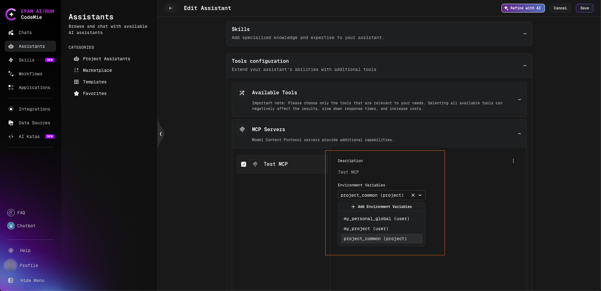
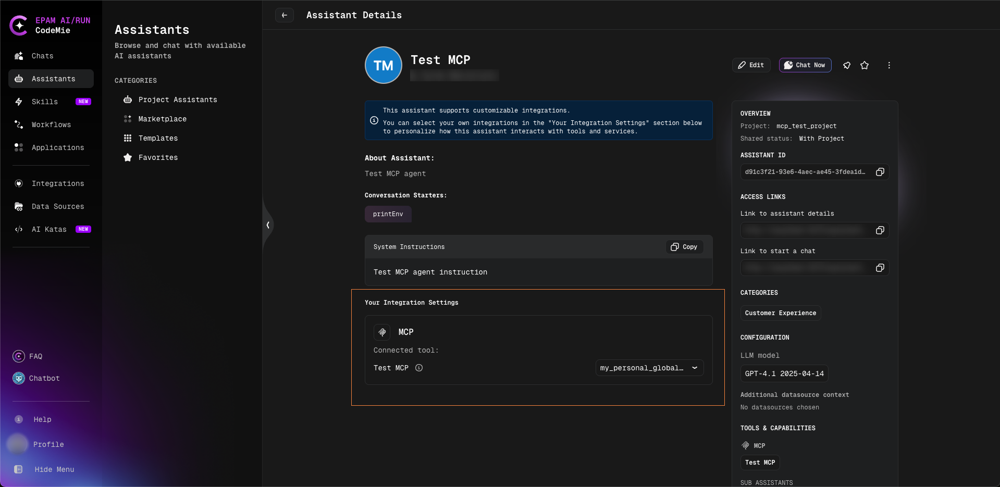
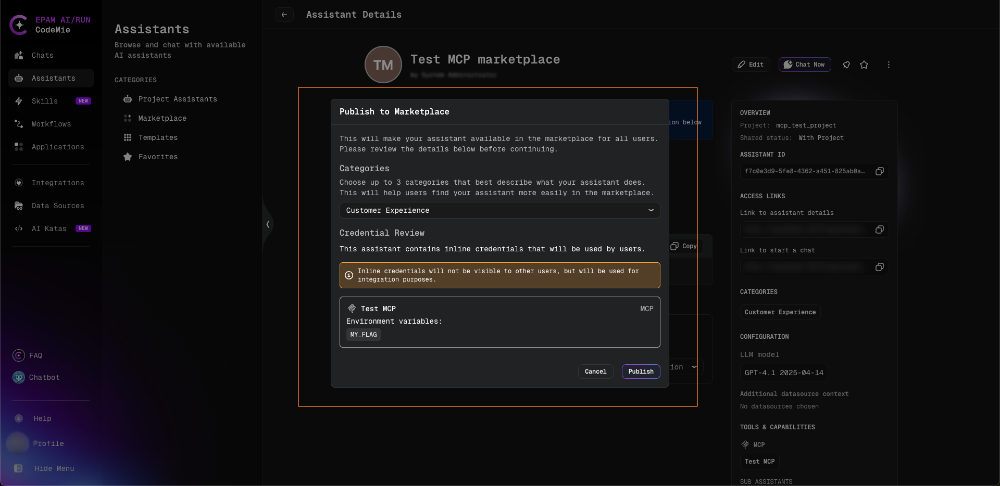

# MCP Integration Credentials

Many MCP servers need credentials — such as API keys or tokens — supplied as environment variables. When an MCP server is added to an assistant that other people use, AI/Run CodeMie decides **whose credentials each person runs under**, and always resolves them **per user at run time**: a user's own secrets are never exposed to other users of the same assistant, and if a user selects no integration the server still runs on its base configuration instead of failing.

## How credentials are resolved

For any MCP server, the credentials a given user runs under come from one of three sources. Which one applies is decided first by the assistant author (did they pin an integration?), then, for non-pinned servers, by the user's own selection.

| Source       | Set by | Whose credentials are used                                                          |
| ------------ | ------ | ----------------------------------------------------------------------------------- |
| **Pinned**   | Author | The author's chosen integration — shared by everyone using the assistant            |
| **Explicit** | User   | The integration the user selected for themselves                                    |
| **Default**  | User   | None — the server runs on its clean base configuration (no integration credentials) |

The rest of this page explains how to configure each source and what it guarantees.

## Pinned — one shared integration for everyone

_Set by the author. Every user of the assistant runs the MCP server under the author's chosen integration._

Pin an integration when a single, shared account should back the MCP server for all users. This is the long-standing behavior for MCP servers and keeps existing assistants working without any changes.

### Pin an integration

1. Open the **Create Assistant** or **Edit Assistant** page and add or expand the MCP server (see [Adding an MCP Server](./adding-an-mcp-server.md)).
2. In the assistant form, select an integration for the server. Any integration available to the author can be pinned — a personal integration, a project integration, or a global integration.
3. Save the assistant.

Once pinned, those credentials are applied to **every** user of the assistant when its MCP tools run. A pinned integration is **not** shown to other users in their own selection, and its secret values are never exposed to them — the integration is simply used on their behalf. The server therefore does **not** appear in each user's per-user integration settings: there is nothing for consumers to choose.

:::tip
Pin an integration when everyone should connect through the same shared account. Leave it unpinned when each person should connect with their own credentials.
:::

## Explicit — each user brings their own integration

_Set by each user. Applies only to that user and is remembered across chats._

When the author does **not** pin an integration, the MCP server becomes available for per-user selection.

### Select an integration

1. Open the assistant and go to its **Your Integration Settings** section.
2. Find the MCP server in the list.
3. Choose one of the integrations offered for the server from the dropdown.

The choice is stored **per user** and applied automatically in every chat with the assistant — no other user is affected.

### Which integrations are offered

The integrations offered depend on **how the assistant is shared**:

- **Project-shared assistant** (the user is a member of its project): the user's **personal (USER) integrations of that project**, their **global integrations**, and the **project (PROJECT) integrations of that project**.
- **Marketplace or global assistant**: **all of the user's MCP integrations** — personal integrations from **any** project, global integrations, and the project integrations of **any** project. The project-membership restriction is lifted, because a consumer is usually not a member of the author's project and still needs to bring their own credentials.

A user only ever sees and selects **their own** integrations (or integrations they are otherwise allowed to use). Another user's personal integrations are never shown and can never be selected.

## Default — "No integration"

_The fallback when no integration is pinned and the user has not selected one._

The **Your Integration Settings** dropdown includes an explicit **No integration** option. Selecting it — or leaving the selection untouched — means the MCP server runs on its **base configuration**: the inline configuration defined on the server itself, with no integration credentials applied. The server keeps working; it simply does not carry any per-user credentials.

There is no automatic guessing: the platform never silently picks one of the user's other integrations. To run under personal credentials, the integration must be selected explicitly.

## For authors: Credential Review when publishing to the marketplace

When an assistant is published to the marketplace, AI/Run CodeMie checks whether it carries any inline credentials — for example a pinned MCP integration or inline environment values that will be used by everyone who runs the assistant. If it does, a **Credential Review** step is shown before publishing:

> This assistant contains inline credentials that will be used by users.

:::info
Inline credentials will not be visible to other users, but will be used for integration purposes.
:::

This is a deliberate confirmation, not an error. It reminds the author that consumers of the published assistant will run the MCP server under the author's pinned/inline credentials (without ever seeing the secret values), so the author can decide whether that is the intent — or whether the server should instead be left unpinned so each user brings their own integration.

## Privacy and isolation

Beyond the per-user resolution described above, a few guarantees are enforced at run time:

:::info

- **Access is enforced on save and at run time.** Saving an integration the user cannot access is rejected, and an inaccessible integration is never applied when the server runs. On a **project-shared** assistant, project integrations are limited to the assistant's own project and its members; on a **marketplace or global** assistant the project-membership restriction is relaxed — but every credential still resolves under the current user.
- **Per-user cache isolation.** Each user's MCP tools run in an isolated per-user cache, so a result produced under one user's credentials is never reused for another user.

:::

## In workflows

When an assistant is used as a node inside a workflow, the same per-assistant credential source applies: the assistant node runs under the current user with the same pinned, explicit, or "No integration" behavior it would use in a direct chat. Project-scoped integrations resolve against the running user's access just as they do in chat.
