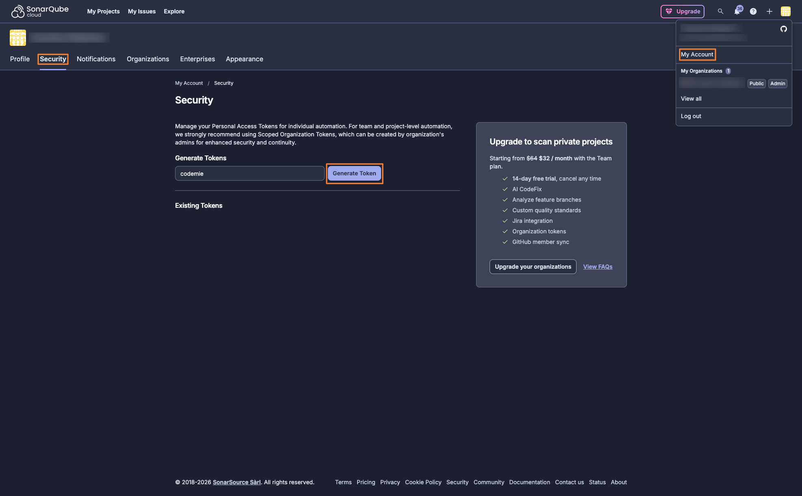
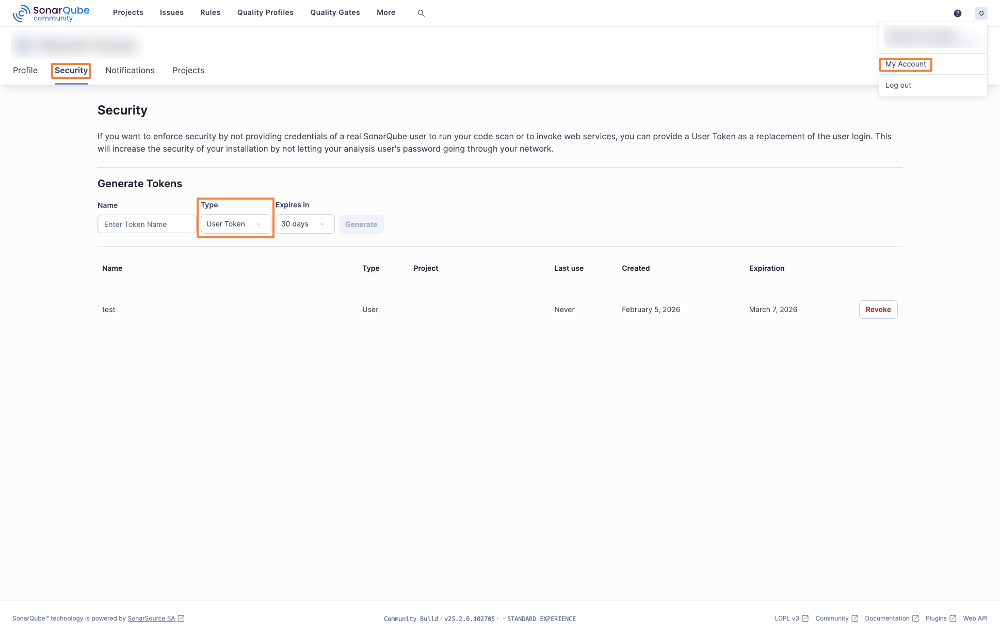
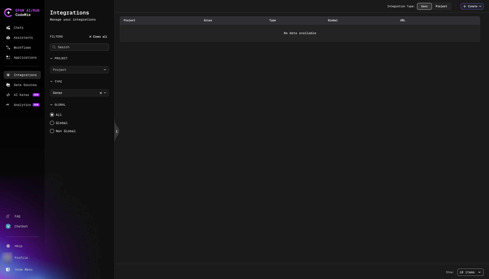
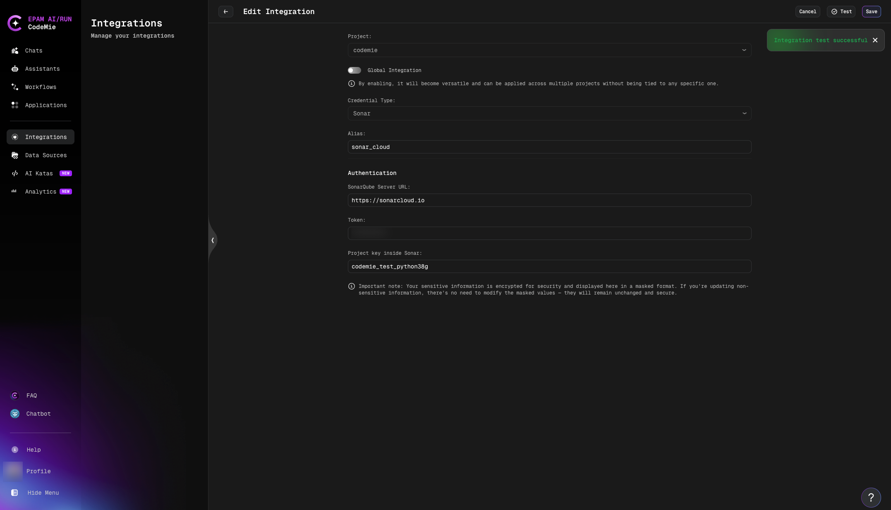
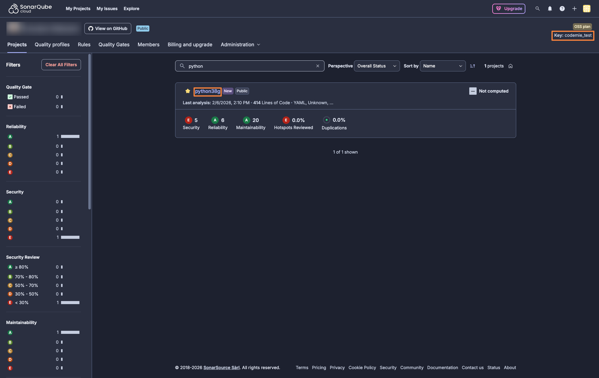
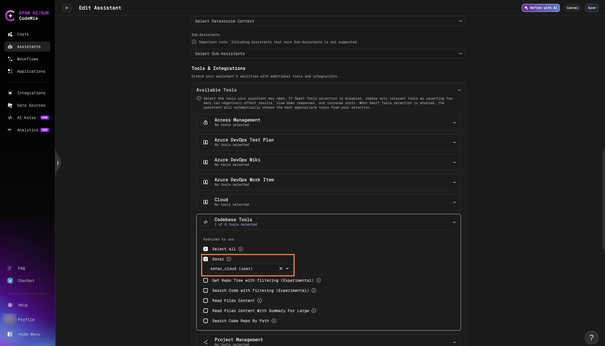
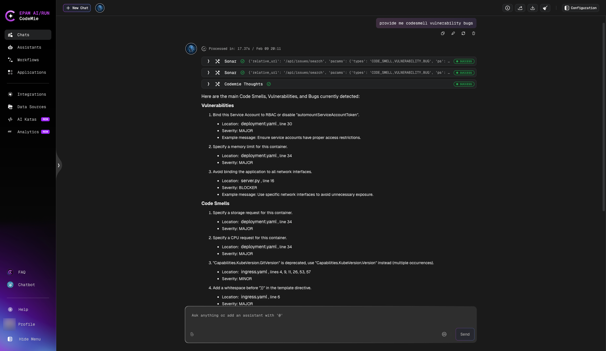
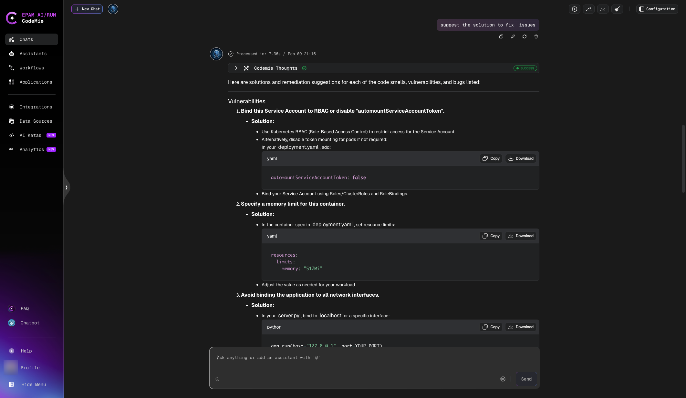

import Tabs from '@theme/Tabs';
import TabItem from '@theme/TabItem';

# SonarQube

AI/Run CodeMie supports SonarQube integration mainly for retrieving data through a generic approach, focusing on API requests (GET requests, specifically). This will allow users to get SonarQube projects' data directly from AI/Run CodeMie. Consider the case when you ask an AI/Run CodeMie assistant to pull information about bugs in a particular project. It displays all the bugs, code vulnerabilities, code smells and suggests solutions to remediate the issues.

Both **SonarQube Cloud** and **SonarQube Self-hosted** instances are supported. To integrate SonarQube with AI/Run CodeMie, follow the steps below:

## 1. Generate SonarQube Token

<Tabs groupId="sonarqube-version">
  <TabItem value="cloud" label="SonarQube Cloud" default>

1.1. Log in to [SonarQube Cloud](https://sonarcloud.io), click your user icon and select **My Account**. Navigate to the **Security** tab. In the **Generate Tokens** section, specify a token name (e.g., "codemie") and click **Generate Token**:

1.2. Copy the generated token and navigate to the Integrations tab.

  </TabItem>
  <TabItem value="self-hosted" label="SonarQube Self-hosted">

1.1. Open your SonarQube instance. Click your user account icon and select **My account**. In the account menu, select the **Security** tab. Specify token parameters and click **Generate**:

- **Name**: Specify your token's name.
- **Type**: User
- **Expires**: Set appropriate expiry date.

1.2. Copy the generated token and navigate to the Integrations tab.

  </TabItem>
</Tabs>

## 2. Configure Integration in AI/Run CodeMie

2.1. In the **User/Project** tab, click **+ Create**:

2.2. Specify the integration parameters and click **+ Save**:

- **Project**: enter your AI/Run CodeMie project name.
- **Credential tool**: Sonar
- **Alias**: Enter integration name
- **SonarQube Server URL**: Specify the URL of your public SonarQube endpoint.
- **Token**: Enter the token data copied earlier.
- **Project name inside Sonar**: Enter the SonarQube project key you want your assistant to analyze.

:::tip
The **SonarQube Server URL** depends on your setup:

- **SonarQube Cloud**: `https://sonarcloud.io`
- **SonarQube Self-hosted**: your own SonarQube server URL (e.g., `https://sonarqube.example.com`)

:::

:::tip
For **SonarQube Cloud**, the **Project name inside Sonar** is composed as `<organization-key>_<project-name>`. You can find both values on the **Projects** page of your organization — the organization **key** is displayed in the top-right corner, and the **project name** is shown in the project list:

For example, if your organization key is `codemie_test` and the project name is `python38g`, the value should be `codemie_test_python38g`.
:::

## 3. Enable Sonar Tool in Assistant

3.1. Edit your assistant by enabling the Sonar tool integration and click **Save** button:

## 4. Verify Integration

4.1. Verify that your assistant can work with your SonarQube project:

