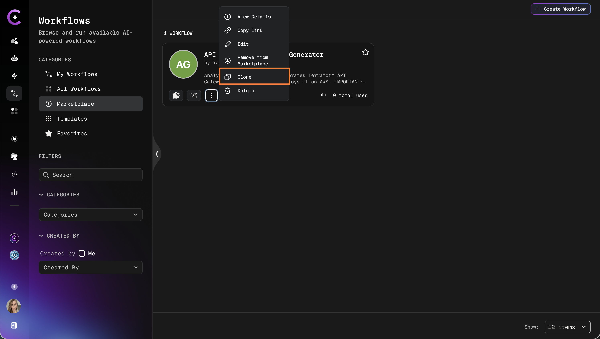
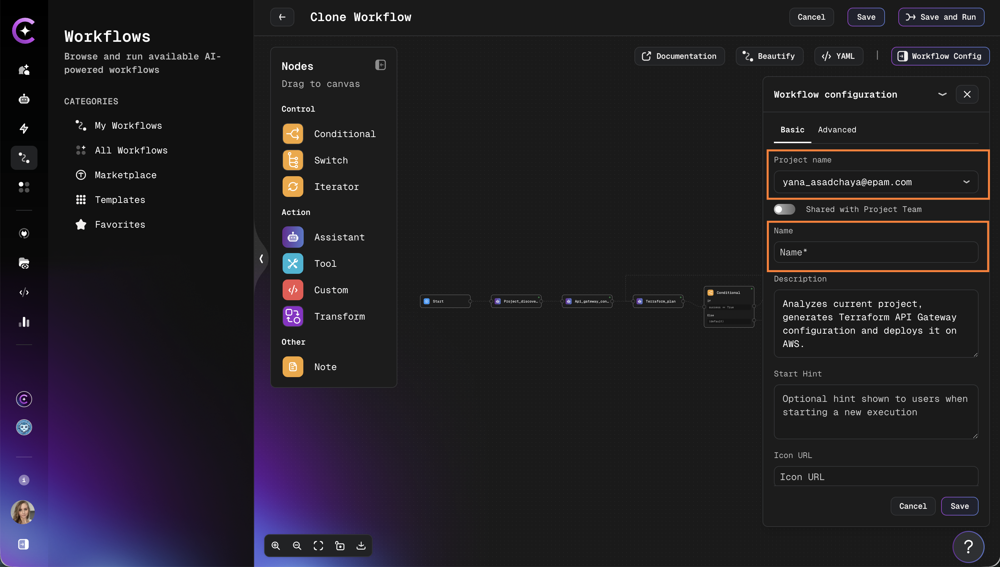

# Clone Workflow from Marketplace

Clone a marketplace workflow to a personal project to customize it or adapt it for a specific use case. All authenticated users can clone any marketplace workflow. The clone is a fully independent copy — changes to it do not affect the original.

## Clone a Workflow

### 1. Navigate to Marketplace

1. Go to **Workflows** → **Marketplace**.
2. Browse the catalog or use search and filters to find the workflow to clone.

### 2. Select a Workflow

1. Click on the workflow card to open its details page.
2. Review the workflow description, categories, and usage metrics.
3. Click the **Clone** button:

   

### 3. Configure Clone Settings

1. Select the target project from the dropdown.
   - Only projects with access are listed.

2. Enter a name for the cloned workflow:

   

3. Confirm the slug is unique within the target project.

:::info Slug requirements
The slug must be unique within the selected project. If a conflict exists, a different name must be chosen before proceeding.
:::

### 4. Complete Cloning

1. Click **Clone Workflow** to start the process.
2. The system creates a copy with all configuration preserved.
3. A confirmation is displayed when cloning is complete.

## After Cloning

The cloned workflow appears in the target project's workflow list, where it can be:

- Edited and reconfigured freely
- Connected to different datasources or assistants
- Published to the Marketplace as a new entry

:::tip Fully independent copy
The cloned workflow is independent from the original. Modifications do not affect the marketplace version, and updates to the original are not reflected in the clone.
:::
