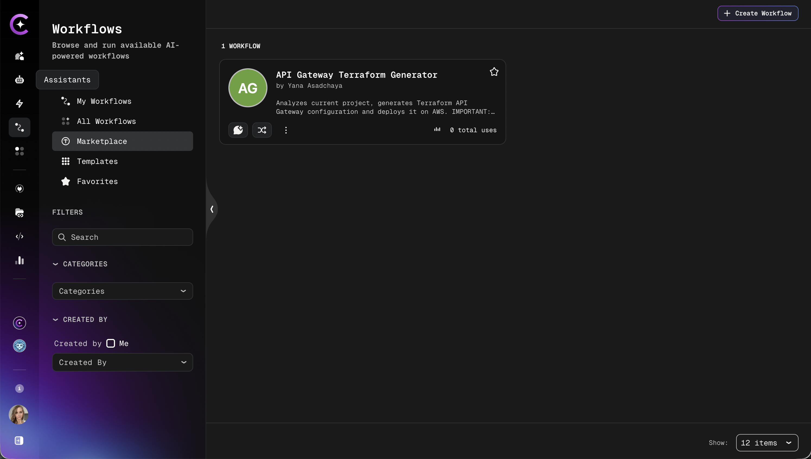

# Workflow Marketplace Overview

The Workflow Marketplace is a centralized hub where authenticated users can discover and execute workflows published by the community. Each marketplace workflow runs using the publisher's project resources — datasources and assistants — so no additional configuration is required to get started.

## Accessing the Marketplace

Navigate to **Workflows** → **Marketplace**.

## Key Features

### Community Catalog

Browse a catalog of globally published workflows, each designed for specific use cases and built using the publisher's configured datasources and assistants.

### Usage Metrics

Each workflow card displays the number of unique users who have executed it. Workflows with higher adoption appear more prominently, helping identify the most trusted and widely used solutions.

### Filtering and Search

- Filter workflows by category to narrow results to a specific domain
- Search by name to find a workflow directly

## Executing a Marketplace Workflow

Any authenticated user can execute a marketplace workflow without additional permissions or configuration:

1. Navigate to **Workflows** → **Marketplace**.
2. Browse the catalog or use search and filters to find a workflow.
3. Click the workflow card to open its details page.
4. Click **Run workflow** to start an execution.

The workflow runs using the **publisher's project context** — their configured datasources and assistants are used automatically. No personal integrations are required unless the workflow explicitly relies on user-level credentials.

:::info Execution context
Because marketplace workflows use the publisher's resources, the results and data access reflect the publisher's project configuration, not the executing user's project.
:::

## Cloning a Marketplace Workflow

To customize a marketplace workflow or adapt it for a specific project, clone it to a personal workspace. Cloning creates a fully independent copy that can be modified without affecting the original.

See [Clone Workflow from Marketplace](./clone-workflow-from-marketplace.md) for step-by-step instructions.

:::tip Publishing a Workflow
To share a workflow with the community, see [Publish to Marketplace](./marketplace-publishing.md) for publishing requirements and the credential review process.
:::
