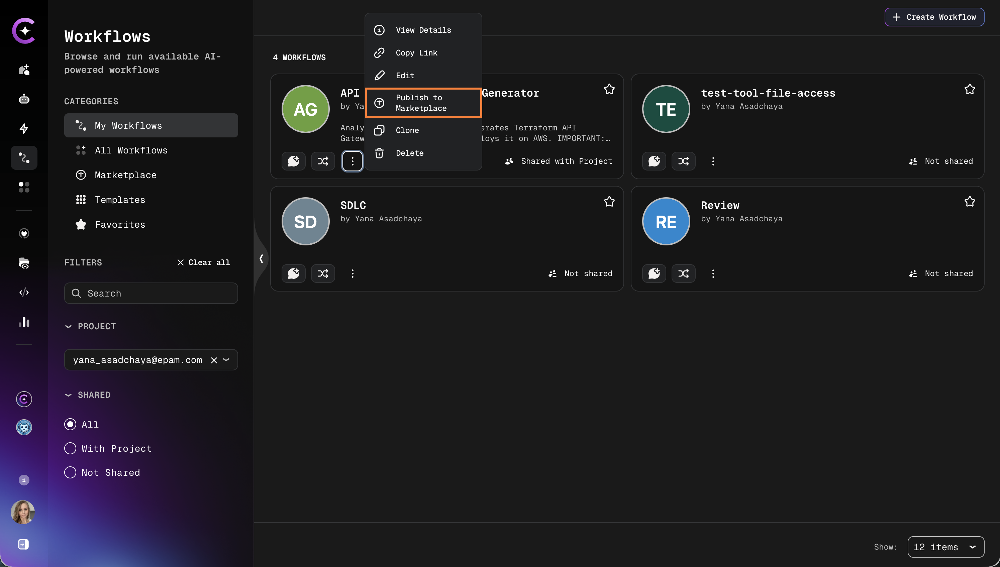
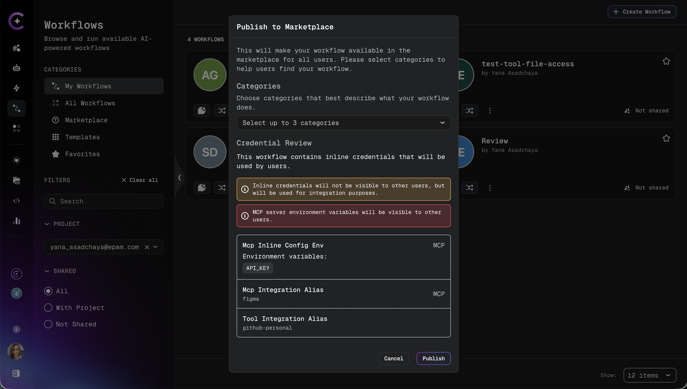
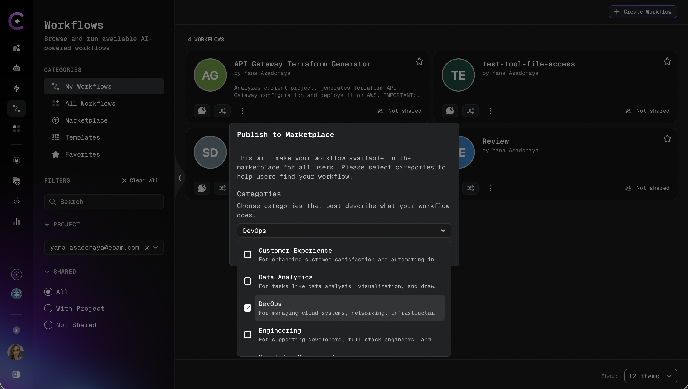
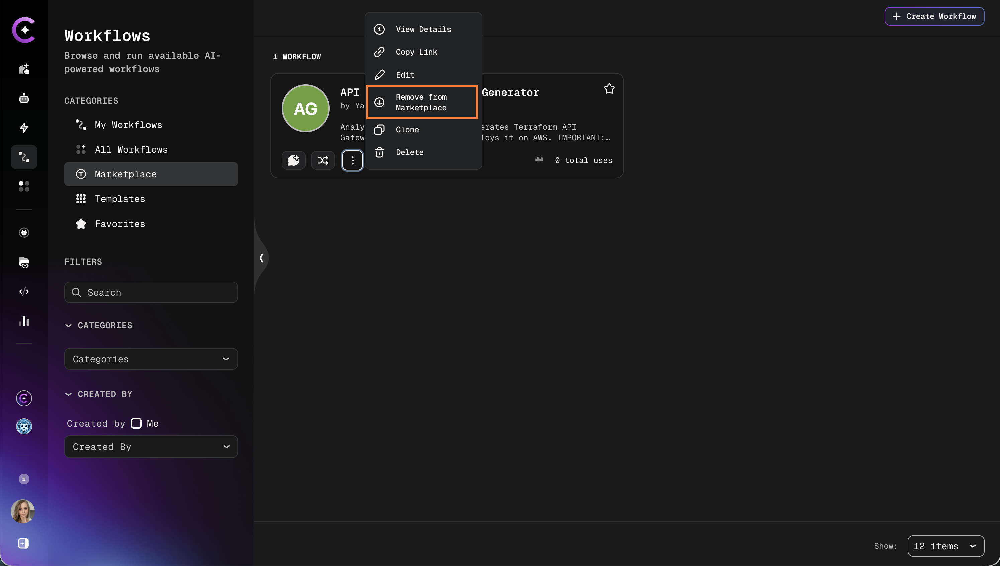

# Publish Workflow to Marketplace

Share a workflow with all authenticated users by publishing it to the Workflow Marketplace. Published workflows are globally discoverable and executable by anyone, using the publisher's project resources.

## Prerequisites

Before publishing, ensure the following:

- Edit rights on the workflow are available.
- The workflow is fully configured and tested.
- The workflow references only datasources — **no external assistants or skills**.

## Publishing Process

1. Open the workflow for which publishing is intended.

2. Click the **Publish to Marketplace** button (available from the workflow card actions menu or the workflow details page):

   

3. The system runs a validation check:
   - If the workflow references any external assistants or skills, publishing is **blocked**. Remove those references before proceeding.
   - If the workflow contains inline credentials (MCP environment variables or integration aliases), a warning is displayed.

4. Review the credential warning if present (see [Credential Review](#credential-review) below).

5. Select **1 to 3 categories** to help users discover the workflow.

6. Confirm to publish.

## Credential Review

If the workflow contains inline credentials — such as MCP environment variable values or integration aliases — a warning modal appears before publishing.

:::warning Inline Credentials
Inline credentials embedded in the workflow configuration will be accessible to all users who execute the marketplace workflow. Review carefully before confirming.
:::

The warning lists the detected credentials and requires explicit confirmation to proceed. Publishing is only completed after confirmation.

If no inline credentials are detected, the warning step is skipped.

## Selecting Categories

Choose 1 to 3 categories that best describe the workflow's purpose. Categories help users filter and discover relevant workflows in the Marketplace.

:::info
At least one category is required. Attempting to publish without a category selection results in a validation error.
:::

## After Publishing

Once published, the workflow becomes globally visible in the **Marketplace** tab of the Workflows section. Any authenticated user can view and execute it.

The workflow remains editable by the owner and admins. The following management actions are available from the workflow card:

| Action                      | Description                                           |
| --------------------------- | ----------------------------------------------------- |
| **Edit**                    | Update the workflow configuration and settings        |
| **Delete**                  | Permanently remove the workflow (also unpublishes it) |
| **Remove from Marketplace** | Unpublish the workflow without deleting it            |

:::note External assistant and skill restriction on edit
After a workflow is published to the Marketplace, saving changes that introduce references to external assistants or skills is blocked by validation.
:::

## Unpublishing

To remove a workflow from the Marketplace without deleting it:

1. Locate the workflow in the Marketplace or in the project workflows list.
2. Open the actions menu and select **Remove from Marketplace**:

   

3. Confirm the action.

The workflow is removed from the Marketplace immediately and returns to the project-scoped state. Existing executions are not affected.

:::info Deletion and unpublishing
Deleting a workflow automatically unpublishes it from the Marketplace.
:::
